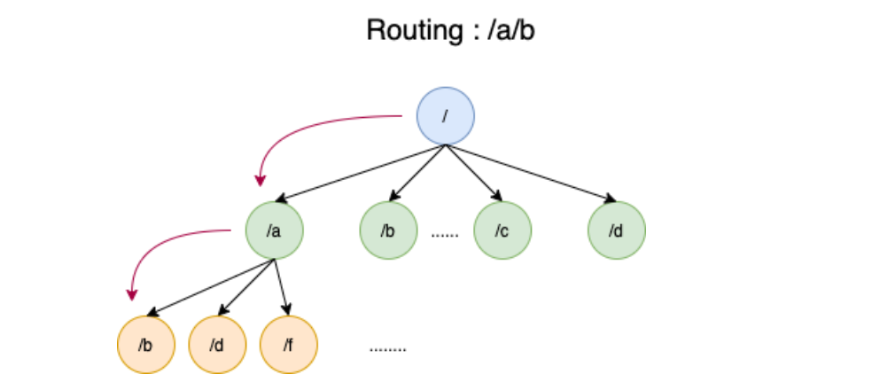

# 路由实现

## 1. 不用框架

> 先来写一个不用框架的代码

版本：go 1.18.1

~~~go
package main

import (
	"fmt"
	"log"
	"net/http"
)

func main() {
	http.HandleFunc("/hello", func(writer http.ResponseWriter, request *http.Request) {
		fmt.Fprintln(writer, "hello mszlu.com")
	})
	err := http.ListenAndServe(":8111", nil)
	if err != nil {
		log.Fatal(err)
	}
}

~~~

上述是原生Go的实现，其实原生Go已经为我们提供了路由功能，但是在使用起来并不灵活，我们需要对它进行封装。

## 2. 路由实现

~~~go
package msgo

import (
	"log"
	"net/http"
)

type HandlerFunc func(w http.ResponseWriter, r *http.Request)

type router struct {
	handlerMap map[string]HandlerFunc
}

func (r *router) Add(name string, handlerFunc HandlerFunc) {
	r.handlerMap[name] = handlerFunc
}

type Engine struct {
	router
}

func New() *Engine {
	return &Engine{
		router{handlerMap: make(map[string]HandlerFunc)},
	}
}

func (e *Engine) Run() {
	for key, value := range e.handlerMap {
		http.HandleFunc(key, value)
	}
	err := http.ListenAndServe(":8111", nil)
	if err != nil {
		log.Fatal(err)
	}
}

~~~

~~~go
package main

import (
	"fmt"
	"github.com/mszlu521/msgo"
	"net/http"
)

func main() {
	//http.HandleFunc("/hello", func(writer http.ResponseWriter, request *http.Request) {
	//	fmt.Fprintln(writer, "hello mszlu.com")
	//})
	//err := http.ListenAndServe(":8111", nil)
	//if err != nil {
	//	log.Fatal(err)
	//}
	engine := msgo.New()
	engine.Add("/hello", func(w http.ResponseWriter, r *http.Request) {
		fmt.Fprintln(w, "hello mszlu.com")
	})
	engine.Run()
}
~~~

**现在我们初步实现了一个路由功能，但是远远达不到我们的要求，我们来完善它**

## 3. 实现分组路由

> 在大多数情况下，我们希望写的接口归属于某一个模块，这样便于管理以及维护，代码也更为清晰

比如：`/user/getUser` `/user/createUser` 都同属于user模块

~~~go
package msgo

import (
	"log"
	"net/http"
)

type HandlerFunc func(w http.ResponseWriter, r *http.Request)

type router struct {
	groups []*routerGroup
}

func (r *router) Group(name string) *routerGroup {
	g := &routerGroup{groupName: name, handlerMap: make(map[string]HandlerFunc)}
	r.groups = append(r.groups, g)
	return g
}

func (r *routerGroup) Add(name string, handlerFunc HandlerFunc) {
	r.handlerMap[name] = handlerFunc
}

type routerGroup struct {
	groupName  string
	handlerMap map[string]HandlerFunc
}

type Engine struct {
	*router
}

func New() *Engine {
	return &Engine{
		&router{},
	}
}

func (e *Engine) Run() {
	groups := e.router.groups
	for _, g := range groups {
		for name, handle := range g.handlerMap {
			http.HandleFunc("/"+g.groupName+name, handle)
		}
	}
	err := http.ListenAndServe(":8111", nil)
	if err != nil {
		log.Fatal(err)
	}
}

~~~

 

~~~go
engine := msgo.New()
	g := engine.Group("user")
	g.Add("/hello", func(w http.ResponseWriter, r *http.Request) {
		fmt.Fprintln(w, "hello mszlu.com")
	})
	engine.Run()
~~~

## 4. 支持不同的请求方式

> net/http下的路由，只要路径匹配，就可以进入处理方法，但实际应用中，比如我们使用restful风格的接口，同一个路径下，会使用`GET`,`POST`,`DELETE`,`PUT`来代替增删改查，所以我们需要对齐做支持

~~~go
package msgo

import (
	"fmt"
	"log"
	"net/http"
)

type HandlerFunc func(ctx *Context)

type Context struct {
	W http.ResponseWriter
	R *http.Request
}
type router struct {
	groups []*routerGroup
}

func (r *router) Group(name string) *routerGroup {
	g := &routerGroup{
		groupName:        name,
		handlerMap:       make(map[string]HandlerFunc),
		handlerMethodMap: make(map[string][]string),
	}
	r.groups = append(r.groups, g)
	return g
}

func (r *routerGroup) Any(name string, handlerFunc HandlerFunc) {
	r.handlerMap[name] = handlerFunc
	r.handlerMethodMap["ANY"] = append(r.handlerMethodMap["ANY"], name)
}

func (r *routerGroup) Get(name string, handlerFunc HandlerFunc) {
	r.handlerMap[name] = handlerFunc
	r.handlerMethodMap["GET"] = append(r.handlerMethodMap["GET"], name)
}

func (r *routerGroup) Post(name string, handlerFunc HandlerFunc) {
	r.handlerMap[name] = handlerFunc
	r.handlerMethodMap["POST"] = append(r.handlerMethodMap["POST"], name)
}

type routerGroup struct {
	groupName        string
	handlerMap       map[string]HandlerFunc
	handlerMethodMap map[string][]string
}

type Engine struct {
	*router
}

func New() *Engine {
	return &Engine{
		&router{},
	}
}

func (e *Engine) ServeHTTP(w http.ResponseWriter, r *http.Request) {
	groups := e.router.groups
	for _, g := range groups {
		for name, handle := range g.handlerMap {
			url := "/" + g.groupName + name
			if r.RequestURI == url {
				ctx := &Context{
					W: w,
					R: r,
				}
				if g.handlerMethodMap["ANY"] != nil {
					for _, v := range g.handlerMethodMap["ANY"] {
						if name == v {
							handle(ctx)
							return
						}
					}
				}
				method := r.Method
				fmt.Println(method)
				routers := g.handlerMethodMap[method]
				if routers != nil {
					for _, v := range routers {
						if name == v {
							handle(ctx)
							return
						}
					}
				}
				w.WriteHeader(405)
				fmt.Fprintln(w, method+" not allowed")
				return
			}
		}
	}

}
func (e *Engine) Run() {
	//groups := e.router.groups
	//for _, g := range groups {
	//	for name, handle := range g.handlerMap {
	//		http.HandleFunc("/"+g.groupName+name, handle)
	//	}
	//}
	http.Handle("/", e)
	err := http.ListenAndServe(":8111", nil)
	if err != nil {
		log.Fatal(err)
	}
}

~~~

## 5. 支持同一个路径不同请求方式

~~~go
package msgo

import (
	"fmt"
	"log"
	"net/http"
)

const ANY = "ANY"

type HandlerFunc func(ctx *Context)

type Context struct {
	W http.ResponseWriter
	R *http.Request
}
type router struct {
	groups []*routerGroup
}

func (r *router) Group(name string) *routerGroup {
	g := &routerGroup{
		groupName:        name,
		handlerMap:       make(map[string]map[string]HandlerFunc),
		handlerMethodMap: make(map[string][]string),
	}
	r.groups = append(r.groups, g)
	return g
}

func (r *routerGroup) handle(name string, method string, handlerFunc HandlerFunc) {
	_, ok := r.handlerMap[name]
	if !ok {
		r.handlerMap[name] = make(map[string]HandlerFunc)
	}
	r.handlerMap[name][method] = handlerFunc

	r.handlerMethodMap[method] = append(r.handlerMethodMap[method], name)
}

func (r *routerGroup) Any(name string, handlerFunc HandlerFunc) {
	r.handle(name, "ANY", handlerFunc)
}

func (r *routerGroup) Handle(name string, method string, handlerFunc HandlerFunc) {
	//method有效性做校验
	r.handle(name, method, handlerFunc)
}

func (r *routerGroup) Get(name string, handlerFunc HandlerFunc) {
	r.handle(name, http.MethodGet, handlerFunc)
}
func (r *routerGroup) Post(name string, handlerFunc HandlerFunc) {
	r.handle(name, http.MethodPost, handlerFunc)
}
func (r *routerGroup) Delete(name string, handlerFunc HandlerFunc) {
	r.handle(name, http.MethodDelete, handlerFunc)
}
func (r *routerGroup) Put(name string, handlerFunc HandlerFunc) {
	r.handle(name, http.MethodPut, handlerFunc)
}
func (r *routerGroup) Patch(name string, handlerFunc HandlerFunc) {
	r.handle(name, http.MethodPatch, handlerFunc)
}
func (r *routerGroup) Options(name string, handlerFunc HandlerFunc) {
	r.handle(name, http.MethodOptions, handlerFunc)
}
func (r *routerGroup) Head(name string, handlerFunc HandlerFunc) {
	r.handle(name, http.MethodHead, handlerFunc)
}

type routerGroup struct {
	groupName        string
	handlerMap       map[string]map[string]HandlerFunc
	handlerMethodMap map[string][]string
}

type Engine struct {
	*router
}

func New() *Engine {
	return &Engine{
		&router{},
	}
}

func (e *Engine) ServeHTTP(w http.ResponseWriter, r *http.Request) {
	groups := e.router.groups
	for _, g := range groups {
		for name, methodHandle := range g.handlerMap {
			url := "/" + g.groupName + name
			if r.RequestURI == url {
				ctx := &Context{
					W: w,
					R: r,
				}
				_, ok := methodHandle[ANY]
				if ok {
					methodHandle[ANY](ctx)
					return
				}
				method := r.Method
				fmt.Println(method)
				handler, ok := methodHandle[method]
				if ok {
					handler(ctx)
					return
				}
				w.WriteHeader(http.StatusMethodNotAllowed)
				fmt.Fprintln(w, method+" not allowed")
				return
			} else {
				w.WriteHeader(http.StatusNotFound)
				fmt.Fprintln(w, r.RequestURI+" not found")
				return
			}
		}
	}

}
func (e *Engine) Run() {
	//groups := e.router.groups
	//for _, g := range groups {
	//	for name, handle := range g.handlerMap {
	//		http.HandleFunc("/"+g.groupName+name, handle)
	//	}
	//}
	http.Handle("/", e)
	err := http.ListenAndServe(":8111", nil)
	if err != nil {
		log.Fatal(err)
	}
}

~~~

## 6. 前缀树

> 在前面实现的时候，我们的路径匹配实现的很简陋，不能实现更为复杂的需求，比如/user/get/:id 这种带有参数的，这种带有参数的路径，我们称之为`动态路由`。
>

除了带有参数的，一般情况下，我们可能还希望支持通配符`**`,比如`/static/**`, 可以匹配`/static/vue.js`或者`/static/css/index.css`这些。

定义前缀树结构：

~~~go
type treeNode struct {
    name string //节点名称  比如 /user
	children []*treeNode // 子节点
}
~~~

~~~go
package msgo

import "strings"

type treeNode struct {
	name       string
	children   []*treeNode
	routerName string
}

//put path: /user/get/:id

func (t *treeNode) Put(path string) {
	root := t
	strs := strings.Split(path, "/")
	for index, name := range strs {
		if index == 0 {
			continue
		}
		children := t.children
		isMatch := false
		for _, node := range children {
			if node.name == name {
				isMatch = true
				t = node
				break
			}
		}
		if !isMatch {
			node := &treeNode{name: name, children: make([]*treeNode, 0)}
			children = append(children, node)
			t.children = children
			t = node
		}
	}
	t = root
}

//get path: /user/get/1
func (t *treeNode) Get(path string) *treeNode {
	strs := strings.Split(path, "/")
	routerName := ""
	for index, name := range strs {
		if index == 0 {
			continue
		}
		children := t.children
		isMatch := false
		for _, node := range children {
			if node.name == name ||
				node.name == "*" ||
				strings.Contains(node.name, ":") {
				isMatch = true
				routerName += "/" + node.name
				node.routerName = routerName
				t = node
				if index == len(strs)-1 {
					return node
				}
				break
			}
		}
		if !isMatch {
			for _, node := range children {
				// /user/**
				// /user/get/userInfo
				// /user/aa/bb
				if node.name == "**" {
					return node
				}
			}

		}
	}
	return nil
}

~~~

### 6.1 适配前缀树

~~~go

func (e *Engine) ServeHTTP(w http.ResponseWriter, r *http.Request) {
	method := r.Method
	for _, group := range e.routerGroups {
		routerName := SubStringLast(r.RequestURI, "/"+group.name)
		// get/1
		node := group.treeNode.Get(routerName)
		if node != nil {
			//路由匹配上了
			ctx := &Context{
				W: w,
				R: r,
			}
			handle, ok := group.handleFuncMap[node.routerName][ANY]
			if ok {
				handle(ctx)
				return
			}
			handle, ok = group.handleFuncMap[node.routerName][method]
			if ok {
				handle(ctx)
				return
			}
			w.WriteHeader(http.StatusMethodNotAllowed)
			fmt.Fprintf(w, "%s %s not allowed \n", r.RequestURI, method)
			return
		}
		//for name, methodHandle := range group.handleFuncMap {
		//	url := "/" + group.name + name
		//	if r.RequestURI == url {
		//
		//	}
		//}
	}
	w.WriteHeader(http.StatusNotFound)
	fmt.Fprintf(w, "%s  not found \n", r.RequestURI)
}

type routerGroup struct {
	groupName        string
	handlerMap       map[string]map[string]HandlerFunc
	handlerMethodMap map[string][]string
	treeNode         *treeNode
}

func (r *routerGroup) handle(name string, method string, handlerFunc HandlerFunc) {
	_, ok := r.handlerMap[name]
	if !ok {
		r.handlerMap[name] = make(map[string]HandlerFunc)
	}
	r.handlerMap[name][method] = handlerFunc
	r.handlerMethodMap[method] = append(r.handlerMethodMap[method], name)
	methodMap := make(map[string]HandlerFunc)
	methodMap[method] = handlerFunc

	r.treeNode.Put(name)
}
~~~

~~~go
func SubStringLast(str string, substr string) string {
	//先查找有没有
	index := strings.Index(str, substr)
	if index == -1 {
		return ""
	}
	len := len(substr)
	return str[index+len:]
}

~~~

### 6.2 修正一个bug

> 经过测试我们发现 `/user/hello/xx` 这样的路由 `/user/hello`访问这个路径也一样能从前缀树查找出来，并不会报404

~~~go
package msgo

import "strings"

type treeNode struct {
	name       string
	children   []*treeNode
	routerName string
	isEnd      bool
}

//put path: /user/get/:id

func (t *treeNode) Put(path string) {
	root := t
	strs := strings.Split(path, "/")
	for index, name := range strs {
		if index == 0 {
			continue
		}
		children := t.children
		isMatch := false
		for _, node := range children {
			if node.name == name {
				isMatch = true
				t = node
				break
			}
		}
		if !isMatch {
			isEnd := false
			if index == len(strs)-1 {
				isEnd = true
			}
			node := &treeNode{name: name, children: make([]*treeNode, 0), isEnd: isEnd}
			children = append(children, node)
			t.children = children
			t = node
		}
	}
	t = root
}

//get path: /user/get/1
// /hello
func (t *treeNode) Get(path string) *treeNode {
	strs := strings.Split(path, "/")
	routerName := ""
	for index, name := range strs {
		if index == 0 {
			continue
		}
		children := t.children
		isMatch := false
		for _, node := range children {
			if node.name == name ||
				node.name == "*" ||
				strings.Contains(node.name, ":") {
				isMatch = true
				routerName += "/" + node.name
				node.routerName = routerName
				t = node
				if index == len(strs)-1 {
					return node
				}
				break
			}
		}
		if !isMatch {
			for _, node := range children {
				// /user/**
				// /user/get/userInfo
				// /user/aa/bb
				if node.name == "**" {
					routerName += "/" + node.name
					node.routerName = routerName
					return node
				}
			}

		}
	}
	return nil
}

~~~

~~~go
if node == nil || !node.isEnd {
			w.WriteHeader(http.StatusNotFound)
			fmt.Fprintln(w, r.RequestURI+" not found")
			return
		}
~~~

