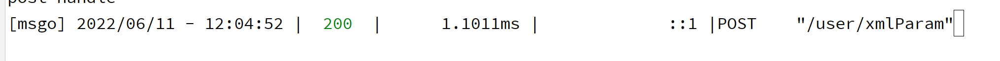
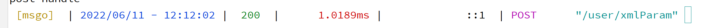
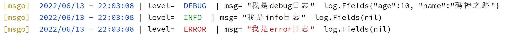

# 日志处理

Golang标准日志库提供的日志输出方法有Print、Fatal、Panic

- Print用于记录一个普通的程序日志，开发者想记点什么都可以。
- Fatal用于记录一个导致程序崩溃的日志，并会退出程序。
- Panic用于记录一个异常日志，并触发panic。

> 标准日志库，一般是够使用，但是输出日志的时候，如果能带点颜色，那么就更好区分日志，便于查看

## 1. 日志中间件

> 先实现一个日志中间件，用于打印一些请求信息，比如ip，uri，method等等的

~~~go
package msgo

import (
	"log"
	"net"
	"strings"
	"time"
)

type LoggerConfig struct {
}

func LoggerWithConfig(conf LoggerConfig, next HandlerFunc) HandlerFunc {

	return func(ctx *Context) {
		log.Println("log....")
		// Start timer
		start := time.Now()
		path := ctx.R.URL.Path
		raw := ctx.R.URL.RawQuery
		//执行业务
		next(ctx)
		// stop timer
		stop := time.Now()
		latency := stop.Sub(start)
		ip, _, _ := net.SplitHostPort(strings.TrimSpace(ctx.R.RemoteAddr))
		clientIP := net.ParseIP(ip)
		method := ctx.R.Method
		statusCode := ctx.StatusCode

		if raw != "" {
			path = path + "?" + raw
		}

		log.Printf("[msgo] %v | %3d | %13v | %15s |%-7s %#v",
			stop.Format("2006/01/02 - 15:04:05"),
			statusCode,
			latency, clientIP, method, path,
		)
	}
}
func Logging(next HandlerFunc) HandlerFunc {
	return LoggerWithConfig(LoggerConfig{}, next)
}

~~~

~~~go
g.Use(msgo.Logging)
~~~

## 2. 让日志带颜色

> 在控制台打印上述日志，并不好查看，如何能带上颜色，看起来就更加明显和明确一些了

比如上述的statusCode，我们想要让200为绿色，其他的为红色，怎么做到呢？

**只需要在其前后加上颜色的样式即可**

参考：https://www.jb51.net/article/211317.htm

~~~go
const (
	greenBg   = "\033[97;42m"
	whiteBg   = "\033[90;47m"
	yellowBg  = "\033[90;43m"
	redBg     = "\033[97;41m"
	blueBg    = "\033[97;44m"
	magentaBg = "\033[97;45m"
	cyanBg    = "\033[97;46m"
	green     = "\033[32m"
	white     = "\033[37m"
	yellow    = "\033[33m"
	red       = "\033[31m"
	blue      = "\033[34m"
	magenta   = "\033[35m"
	cyan      = "\033[36m"
	reset     = "\033[0m"
)
~~~

### 2.1 格式化日志

~~~go
package msgo

import (
	"fmt"
	"io"
	"net"
	"net/http"
	"os"
	"strings"
	"time"
)

const (
	greenBg   = "\033[97;42m"
	whiteBg   = "\033[90;47m"
	yellowBg  = "\033[90;43m"
	redBg     = "\033[97;41m"
	blueBg    = "\033[97;44m"
	magentaBg = "\033[97;45m"
	cyanBg    = "\033[97;46m"
	green     = "\033[32m"
	white     = "\033[37m"
	yellow    = "\033[33m"
	red       = "\033[31m"
	blue      = "\033[34m"
	magenta   = "\033[35m"
	cyan      = "\033[36m"
	reset     = "\033[0m"
)

var DefaultWriter io.Writer = os.Stdout

type LoggerConfig struct {
	Formatter LoggerFormatter
	out       io.Writer
}

type LoggerFormatter func(params LogFormatterParams) string

type LogFormatterParams struct {
	Request    *http.Request
	TimeStamp  time.Time
	StatusCode int
	Latency    time.Duration
	ClientIP   net.IP
	Method     string
	Path       string
}

func LoggerWithConfig(conf LoggerConfig, next HandlerFunc) HandlerFunc {
	formatter := conf.Formatter
	if formatter == nil {
		formatter = defaultLogFormatter
	}
	out := conf.out
	if out == nil {
		out = DefaultWriter
	}
	return func(ctx *Context) {
		param := LogFormatterParams{
			Request: ctx.R,
		}
		// Start timer
		start := time.Now()
		path := ctx.R.URL.Path
		raw := ctx.R.URL.RawQuery
		//执行业务
		next(ctx)
		// stop timer
		stop := time.Now()
		latency := stop.Sub(start)
		ip, _, _ := net.SplitHostPort(strings.TrimSpace(ctx.R.RemoteAddr))
		clientIP := net.ParseIP(ip)
		method := ctx.R.Method
		statusCode := ctx.StatusCode

		if raw != "" {
			path = path + "?" + raw
		}

		param.ClientIP = clientIP
		param.TimeStamp = stop
		param.Latency = latency
		param.StatusCode = statusCode
		param.Method = method
		param.Path = path
		fmt.Fprint(out, formatter(param))
	}
}
func Logging(next HandlerFunc) HandlerFunc {
	return LoggerWithConfig(LoggerConfig{}, next)
}

var defaultLogFormatter = func(params LogFormatterParams) string {
	if params.Latency > time.Minute {
		params.Latency = params.Latency.Truncate(time.Second)
	}
	return fmt.Sprintf("[msgo] %v | %3d | %13v | %15s |%-7s %#v",
		params.TimeStamp.Format("2006/01/02 - 15:04:05"),
		params.StatusCode,
		params.Latency, params.ClientIP, params.Method, params.Path,
	)
}

~~~

### 2.2 添加颜色

~~~go
package msgo

import (
	"fmt"
	"io"
	"net"
	"net/http"
	"os"
	"strings"
	"time"
)

const (
	greenBg   = "\033[97;42m"
	whiteBg   = "\033[90;47m"
	yellowBg  = "\033[90;43m"
	redBg     = "\033[97;41m"
	blueBg    = "\033[97;44m"
	magentaBg = "\033[97;45m"
	cyanBg    = "\033[97;46m"
	green     = "\033[32m"
	white     = "\033[37m"
	yellow    = "\033[33m"
	red       = "\033[31m"
	blue      = "\033[34m"
	magenta   = "\033[35m"
	cyan      = "\033[36m"
	reset     = "\033[0m"
)

var DefaultWriter io.Writer = os.Stdout

type LoggerConfig struct {
	Formatter LoggerFormatter
	out       io.Writer
}

type LoggerFormatter func(params LogFormatterParams) string

type LogFormatterParams struct {
	Request    *http.Request
	TimeStamp  time.Time
	StatusCode int
	Latency    time.Duration
	ClientIP   net.IP
	Method     string
	Path       string
}

func (p *LogFormatterParams) StatusCodeColor() string {
	code := p.StatusCode
	switch code {
	case http.StatusOK:
		return green
	default:
		return red
	}
}

func (p *LogFormatterParams) ResetColor() string {
	return reset
}

func LoggerWithConfig(conf LoggerConfig, next HandlerFunc) HandlerFunc {
	fmt.Sprintf("%#v", red)
	formatter := conf.Formatter
	if formatter == nil {
		formatter = defaultLogFormatter
	}
	out := conf.out
	if out == nil {
		out = DefaultWriter
	}
	return func(ctx *Context) {
		param := LogFormatterParams{
			Request: ctx.R,
		}
		// Start timer
		start := time.Now()
		path := ctx.R.URL.Path
		raw := ctx.R.URL.RawQuery
		//执行业务
		next(ctx)
		// stop timer
		stop := time.Now()
		latency := stop.Sub(start)
		ip, _, _ := net.SplitHostPort(strings.TrimSpace(ctx.R.RemoteAddr))
		clientIP := net.ParseIP(ip)
		method := ctx.R.Method
		statusCode := ctx.StatusCode

		if raw != "" {
			path = path + "?" + raw
		}

		param.ClientIP = clientIP
		param.TimeStamp = stop
		param.Latency = latency
		param.StatusCode = statusCode
		param.Method = method
		param.Path = path
		fmt.Fprint(out, formatter(param))
	}
}
func Logging(next HandlerFunc) HandlerFunc {
	return LoggerWithConfig(LoggerConfig{}, next)
}

var defaultLogFormatter = func(params LogFormatterParams) string {
	statusCodeColor := params.StatusCodeColor()
	resetColor := params.ResetColor()
	if params.Latency > time.Minute {
		params.Latency = params.Latency.Truncate(time.Second)
	}
	return fmt.Sprintf("[msgo] %v | %s %3d %s | %13v | %15s |%-7s %#v",
		params.TimeStamp.Format("2006/01/02 - 15:04:05"),
		statusCodeColor, params.StatusCode, resetColor,
		params.Latency, params.ClientIP, params.Method, params.Path,
	)
}

~~~

> 改造一下，添加多种颜色

~~~go

var defaultLogFormatter = func(params LogFormatterParams) string {
	statusCodeColor := params.StatusCodeColor()
	resetColor := params.ResetColor()
	if params.Latency > time.Minute {
		params.Latency = params.Latency.Truncate(time.Second)
	}
	return fmt.Sprintf("%s [msgo] %s |%s %v %s| %s %3d %s |%s %13v %s| %15s  |%s %-7s %s %s %#v %s",
		yellow, resetColor, blue, params.TimeStamp.Format("2006/01/02 - 15:04:05"), resetColor,
		statusCodeColor, params.StatusCode, resetColor,
		red, params.Latency, resetColor,
		params.ClientIP,
		magenta, params.Method, resetColor,
		cyan, params.Path, resetColor,
	)
}
~~~

**看起来好多了**

### 2.3 标准输出使用颜色

~~~go
if out == nil {
		out = DefaultWriter
		conf.IsColor = true
	}
~~~

## 3. 分级日志

> 在开发中，我们往往需要对日志做分级处理，并将其存放于不同的日志文件中，便于查看，比如info用于记录信息，error用于打印错误异常信息，debug用于打印调试信息等等的

我们来实现日志工具，用于支持，info，error和debug，并且支持日志级别配置。

日志级别从低到高为：

1. debug
2. info
3. error

**如果是debug级别，三者的日志都会打印，如果是info级别，debug日志不会打印，如果是error级别，只会打印error日志**

### 3.1 初始实现

~~~go
	g.Post("/xmlParam", func(ctx *msgo.Context) {
		user := &User{}
		_ = ctx.BindXML(user)
		logger.Debug("我是debug日志")
		logger.Info("我是info日志")
		logger.Error("我是error日志")
		ctx.JSON(http.StatusOK, user)
	})
~~~

~~~go
package log

import (
	"fmt"
	"io"
	"os"
	"time"
)

type LoggerLevel int

const (
	LevelDebug LoggerLevel = iota
	LevelInfo
	LevelError
)

type Logger struct {
	Formatter LoggerFormatter
	Outs      []io.Writer
	Level     LoggerLevel
}

type LoggerFormatter struct {
	Color bool
	Level        LoggerLevel
}

func New() *Logger {
	return &Logger{}
}

func Default() *Logger {
	logger := New()
	out := os.Stdout
	logger.Outs = append(logger.Outs, out)
	logger.Level = LevelDebug
	logger.Formatter = LoggerFormatter{}
	return logger
}

func (l *Logger) Info(msg any) {
	l.Print(LevelInfo, msg)
}

func (l *Logger) Debug(msg any) {
	l.Print(LevelDebug, msg)
}

func (l *Logger) Error(msg any) {
	l.Print(LevelError, msg)
}

func (l *Logger) Print(level LoggerLevel, msg any) {
	if l.Level > level {
		//级别不满足 不打印日志
		return
	}
	l.Formatter.Level = level
	formatter := l.Formatter.formatter(msg)
	for _, out := range l.Outs {
		fmt.Fprint(out, formatter)
	}
}

func (f *LoggerFormatter) formatter(msg any) string {
	now := time.Now()
	return fmt.Sprintf("[msgo] %v | level=%s | msg=%#v \n",
		now.Format("2006/01/02 - 15:04:05"),
		f.Level.Level(), msg,
	)
}

func (level LoggerLevel) Level() string {
	switch level {
	case LevelDebug:
		return "DEBUG"
	case LevelInfo:
		return "INFO"
	case LevelError:
		return "ERROR"
	default:
		return ""
	}
}

~~~

### 3.2 添加颜色

> 和上述方式一致，默认控制台输出颜色，其他方式不输出颜色

  ~~~go
  
  func (l *Logger) Print(level LoggerLevel, msg any) {
  	if l.Level > level {
  		//级别不满足 不打印日志
  		return
  	}
  	l.Formatter.Level = level
  	formatter := l.Formatter.formatter(msg)
  	for _, out := range l.Outs {
  		if out == os.Stdout {
  			l.Formatter.Color = true
  			formatter = l.Formatter.formatter(msg)
  		}
  		fmt.Fprint(out, formatter)
  	}
  }
  
  func (f *LoggerFormatter) formatter(msg any) string {
  	now := time.Now()
  	if f.Color {
  		//要带颜色  error的颜色 为红色 info为绿色 debug为蓝色
  		levelColor := f.LevelColor()
  		msgColor := f.MsgColor()
  		return fmt.Sprintf("%s [msgo] %s %s%v%s | level= %s %s %s | msg=%s %#v %s \n",
  			yellow, reset, blue, now.Format("2006/01/02 - 15:04:05"), reset,
  			levelColor, f.Level.Level(), reset, msgColor, msg, reset,
  		)
  	}
  	return fmt.Sprintf("[msgo] %v | level=%s | msg= %#v \n",
  		now.Format("2006/01/02 - 15:04:05"),
  		f.Level.Level(), msg,
  	)
  }
  
  func (f *LoggerFormatter) LevelColor() string {
  	switch f.Level {
  	case LevelDebug:
  		return blue
  	case LevelInfo:
  		return green
  	case LevelError:
  		return red
  	default:
  		return cyan
  	}
  }
  
  func (f *LoggerFormatter) MsgColor() string {
  	switch f.Level {
  	case LevelDebug:
  		return ""
  	case LevelInfo:
  		return ""
  	case LevelError:
  		return red
  	default:
  		return cyan
  	}
  }
  ~~~

### 3.3 添加字段支持

> 很多时候，我们想要在日志中打印一些字段信息，用于区分msg       

~~~go

type Fields map[string]any

func (l *Logger) WithFields(fields Fields) *Logger {
	return &Logger{
		Formatter:    l.Formatter,
		Outs:         l.Outs,
		Level:        l.Level,
		LoggerFields: fields,
	}
}
func (f *LoggerFormatter) formatter(msg any, fields Fields) string {
	now := time.Now()
	if f.Color {
		//要带颜色  error的颜色 为红色 info为绿色 debug为蓝色
		levelColor := f.LevelColor()
		msgColor := f.MsgColor()
		return fmt.Sprintf("%s [msgo] %s %s%v%s | level= %s %s %s | msg=%s %#v %s %#v\n",
			yellow, reset, blue, now.Format("2006/01/02 - 15:04:05"), reset,
			levelColor, f.Level.Level(), reset, msgColor, msg, reset, fields,
		)
	}
	return fmt.Sprintf("[msgo] %v | level=%s | msg= %#v %#v\n",
		now.Format("2006/01/02 - 15:04:05"),
		f.Level.Level(), msg, fields,
	)
}

~~~

## 4. 多种格式化日志

> 对开发者来说，可能希望打印的日志能有不同的格式，比如普通文本形式，比如json格式（便于日志分析工具使用）

~~~go

type Logger struct {
	Formatter    LoggingFormatter
	Outs         []io.Writer
	Level        LoggerLevel
	LoggerFields Fields
}

type LoggingFormatter interface {
	Formatter(param *LoggingFormatterParam) string
}

type LoggingFormatterParam struct {
	Color        bool
	Level        LoggerLevel
	Msg          any
	LoggerFields Fields
}

func (l *Logger) Print(level LoggerLevel, msg any) {
	if l.Level > level {
		//级别不满足 不打印日志
		return
	}
	param := &LoggingFormatterParam{
		Level:        level,
		Msg:          msg,
		LoggerFields: l.LoggerFields,
	}
	formatter := l.Formatter.Formatter(param)
	for _, out := range l.Outs {
		if out == os.Stdout {
			param.Color = true
			formatter = l.Formatter.Formatter(param)
		}
		fmt.Fprint(out, formatter)
	}
}

~~~

### 4.1 文本格式化

~~~go
package log

import (
	"fmt"
	"strings"
	"time"
)

type TextFormatter struct {
}

func (f *TextFormatter) Formatter(param *LoggingFormatterParam) string {
	now := time.Now()
	var builderField strings.Builder
	var fieldsDisplay = ""
	if param.LoggerFields != nil {
		fieldsDisplay = "| fields: "
		num := len(param.LoggerFields)
		count := 0
		for k, v := range param.LoggerFields {
			fmt.Fprintf(&builderField, "%s=%v", k, v)
			if count < num-1 {
				fmt.Fprintf(&builderField, ",")
				count++
			}
		}
	}
	if param.Color {
		//要带颜色  error的颜色 为红色 info为绿色 debug为蓝色
		levelColor := f.LevelColor(param.Level)
		msgColor := f.MsgColor(param.Level)
		return fmt.Sprintf("%s [msgo] %s %s%v%s | level= %s %s %s | msg=%s %#v %s %s %s \n",
			yellow, reset, blue, now.Format("2006/01/02 - 15:04:05"), reset,
			levelColor, param.Level.Level(), reset, msgColor, param.Msg, reset, fieldsDisplay, builderField.String(),
		)
	}
	return fmt.Sprintf("[msgo] %v | level=%s | msg= %#v %s %s \n",
		now.Format("2006/01/02 - 15:04:05"),
		param.Level.Level(), param.Msg, fieldsDisplay, builderField.String(),
	)
}

func (f *TextFormatter) LevelColor(level LoggerLevel) string {
	switch level {
	case LevelDebug:
		return blue
	case LevelInfo:
		return green
	case LevelError:
		return red
	default:
		return cyan
	}
}

func (f *TextFormatter) MsgColor(level LoggerLevel) string {
	switch level {
	case LevelDebug:
		return ""
	case LevelInfo:
		return ""
	case LevelError:
		return red
	default:
		return cyan
	}
}

~~~

### 4.2 JSON格式化

~~~go
package log

import (
	"encoding/json"
	"fmt"
	"time"
)

type JsonFormatter struct {
	TimeDisplay bool
}

func (f *JsonFormatter) Formatter(param *LoggingFormatterParam) string {
	now := time.Now()
	if param.LoggerFields == nil {
		param.LoggerFields = make(Fields)
	}
	if f.TimeDisplay {
		timeNow := now.Format("2006/01/02 - 15:04:05")
		param.LoggerFields["log_time"] = timeNow
	}

	param.LoggerFields["msg"] = param.Msg
	marshal, _ := json.Marshal(param.LoggerFields)
	return fmt.Sprint(string(marshal))
}

func (f *JsonFormatter) LevelColor(level LoggerLevel) string {
	switch level {
	case LevelDebug:
		return blue
	case LevelInfo:
		return green
	case LevelError:
		return red
	default:
		return cyan
	}
}

func (f *JsonFormatter) MsgColor(level LoggerLevel) string {
	switch level {
	case LevelDebug:
		return ""
	case LevelInfo:
		return ""
	case LevelError:
		return red
	default:
		return cyan
	}
}

~~~

## 5. 日志文件输出

> 上面的日志实现都是输出到控制台，实际开发中，一般日志都需要输入到文件中

~~~go
func FileWriter(name string) (io.Writer, error) {
	w, err := os.OpenFile(name, os.O_RDWR|os.O_CREATE|os.O_APPEND, 0644)
	return w, err
}

~~~

~~~go
	logger := msLog.Default()
	logger.Level = msLog.LevelDebug
	logger.Formatter = &msLog.JsonFormatter{TimeDisplay: true}
	writer, _ := msLog.FileWriter("./log/log.log")
	logger.Outs = append(logger.Outs, writer)
~~~

### 5.1 不同级别的日志分开存储

~~~go
package log

import (
	"fmt"
	"io"
	"os"
	"path"
	"time"
)

type LoggerLevel int

const (
	LevelDebug LoggerLevel = iota
	LevelInfo
	LevelError
)

const (
	greenBg   = "\033[97;42m"
	whiteBg   = "\033[90;47m"
	yellowBg  = "\033[90;43m"
	redBg     = "\033[97;41m"
	blueBg    = "\033[97;44m"
	magentaBg = "\033[97;45m"
	cyanBg    = "\033[97;46m"
	green     = "\033[32m"
	white     = "\033[37m"
	yellow    = "\033[33m"
	red       = "\033[31m"
	blue      = "\033[34m"
	magenta   = "\033[35m"
	cyan      = "\033[36m"
	reset     = "\033[0m"
)

type Logger struct {
	Formatter    LoggingFormatter
	Outs         []LoggerWriter
	Level        LoggerLevel
	LoggerFields Fields
	logPath      string
}

type LoggerWriter struct {
	Level LoggerLevel
	Out   io.Writer
}

type LoggerFormatter struct {
	Color bool
	Level LoggerLevel
}

type LoggingFormatter interface {
	Formatter(param *LoggingFormatterParam) string
}

type LoggingFormatterParam struct {
	Color        bool
	Level        LoggerLevel
	Msg          any
	LoggerFields Fields
}

func New() *Logger {
	return &Logger{}
}

func Default() *Logger {
	logger := New()
	out := LoggerWriter{Out: os.Stdout}
	logger.Outs = append(logger.Outs, out)
	logger.Level = LevelDebug
	logger.Formatter = &TextFormatter{}
	return logger
}

func (l *Logger) Info(msg any) {
	l.Print(LevelInfo, msg)
}

func (l *Logger) Debug(msg any) {
	l.Print(LevelDebug, msg)
}

func (l *Logger) Error(msg any) {
	l.Print(LevelError, msg)
}

func (l *Logger) Print(level LoggerLevel, msg any) {
	if l.Level > level {
		//级别不满足 不打印日志
		return
	}
	param := &LoggingFormatterParam{
		Level:        level,
		Msg:          msg,
		LoggerFields: l.LoggerFields,
	}
	formatter := l.Formatter.Formatter(param)
	for _, out := range l.Outs {
		if out.Out == os.Stdout {
			param.Color = true
			formatter = l.Formatter.Formatter(param)
			fmt.Fprintln(out.Out, formatter)
		}
		if out.Level == -1 || out.Level == level {
			fmt.Fprintln(out.Out, formatter)
		}

	}

}

type Fields map[string]any

func (l *Logger) WithFields(fields Fields) *Logger {
	return &Logger{
		Formatter:    l.Formatter,
		Outs:         l.Outs,
		Level:        l.Level,
		LoggerFields: fields,
	}
}

func (l *Logger) SetLogPath(logPath string) {
	l.logPath = logPath
	//写入文件
	all, err := FileWriter(path.Join(l.logPath, "all.log"))
	if err != nil {
		panic(err)
	}
	l.Outs = append(l.Outs, LoggerWriter{Level: -1, Out: all})
	debug, err := FileWriter(path.Join(l.logPath, "debug.log"))
	if err != nil {
		panic(err)
	}
	l.Outs = append(l.Outs, LoggerWriter{Level: LevelDebug, Out: debug})
	info, err := FileWriter(path.Join(l.logPath, "info.log"))
	if err != nil {
		panic(err)
	}
	l.Outs = append(l.Outs, LoggerWriter{Level: LevelInfo, Out: info})
	logError, err := FileWriter(path.Join(l.logPath, "error.log"))
	if err != nil {
		panic(err)
	}
	l.Outs = append(l.Outs, LoggerWriter{Level: LevelError, Out: logError})
}
func (f *LoggerFormatter) formatter(msg any, fields Fields) string {
	now := time.Now()
	if f.Color {
		//要带颜色  error的颜色 为红色 info为绿色 debug为蓝色
		levelColor := f.LevelColor()
		msgColor := f.MsgColor()
		return fmt.Sprintf("%s [msgo] %s %s%v%s | level= %s %s %s | msg=%s %#v %s %#v\n",
			yellow, reset, blue, now.Format("2006/01/02 - 15:04:05"), reset,
			levelColor, f.Level.Level(), reset, msgColor, msg, reset, fields,
		)
	}
	return fmt.Sprintf("[msgo] %v | level=%s | msg= %#v %#v\n",
		now.Format("2006/01/02 - 15:04:05"),
		f.Level.Level(), msg, fields,
	)
}

func (f *LoggerFormatter) LevelColor() string {
	switch f.Level {
	case LevelDebug:
		return blue
	case LevelInfo:
		return green
	case LevelError:
		return red
	default:
		return cyan
	}
}

func (f *LoggerFormatter) MsgColor() string {
	switch f.Level {
	case LevelDebug:
		return ""
	case LevelInfo:
		return ""
	case LevelError:
		return red
	default:
		return cyan
	}
}

func (level LoggerLevel) Level() string {
	switch level {
	case LevelDebug:
		return "DEBUG"
	case LevelInfo:
		return "INFO"
	case LevelError:
		return "ERROR"
	default:
		return ""
	}
}

func FileWriter(name string) (io.Writer, error) {
	w, err := os.OpenFile(name, os.O_WRONLY|os.O_CREATE|os.O_APPEND, 0644)
	return w, err
}

func (l *Logger) CloseWriter() {
	for _, out := range l.Outs {
		file := out.Out.(*os.File)
		if file != nil {
			_ = file.Close()
		}
	}
}

~~~

~~~go
logger := msLog.Default()
	logger.Level = msLog.LevelInfo
	logger.Formatter = &msLog.JsonFormatter{TimeDisplay: true}
	logger.SetLogPath("./log")
	defer logger.CloseWriter()
~~~

### 5.2 根据日志大小自动切分

> 很多时候，日志达到一定的大小，就应该重新创建日志文件，以免单个日志文件过大

~~~go
package log

import (
	"fmt"
	"github.com/mszlu521/msgo/internal/msstrings"
	"io"
	"log"
	"os"
	"path"
	"strings"
	"time"
)

type LoggerLevel int

const (
	LevelDebug LoggerLevel = iota
	LevelInfo
	LevelError
)

const (
	greenBg   = "\033[97;42m"
	whiteBg   = "\033[90;47m"
	yellowBg  = "\033[90;43m"
	redBg     = "\033[97;41m"
	blueBg    = "\033[97;44m"
	magentaBg = "\033[97;45m"
	cyanBg    = "\033[97;46m"
	green     = "\033[32m"
	white     = "\033[37m"
	yellow    = "\033[33m"
	red       = "\033[31m"
	blue      = "\033[34m"
	magenta   = "\033[35m"
	cyan      = "\033[36m"
	reset     = "\033[0m"
)

type Logger struct {
	Formatter    LoggingFormatter
	Outs         []*LoggerWriter
	Level        LoggerLevel
	LoggerFields Fields
	logPath      string
	LogFileSize  int64 //M为单位
}

type LoggerWriter struct {
	Level LoggerLevel
	Out   io.Writer
}

type LoggerFormatter struct {
	Color bool
	Level LoggerLevel
}

type LoggingFormatter interface {
	Formatter(param *LoggingFormatterParam) string
}

type LoggingFormatterParam struct {
	Color        bool
	Level        LoggerLevel
	Msg          any
	LoggerFields Fields
}

func New() *Logger {
	return &Logger{}
}

func Default() *Logger {
	logger := New()
	out := &LoggerWriter{Out: os.Stdout}
	logger.Outs = append(logger.Outs, out)
	logger.Level = LevelDebug
	logger.Formatter = &TextFormatter{}
	return logger
}

func (l *Logger) Info(msg any) {
	l.Print(LevelInfo, msg)
}

func (l *Logger) Debug(msg any) {
	l.Print(LevelDebug, msg)
}

func (l *Logger) Error(msg any) {
	l.Print(LevelError, msg)
}

func (l *Logger) Print(level LoggerLevel, msg any) {
	if l.Level > level {
		//级别不满足 不打印日志
		return
	}
	param := &LoggingFormatterParam{
		Level:        level,
		Msg:          msg,
		LoggerFields: l.LoggerFields,
	}
	formatter := l.Formatter.Formatter(param)
	for _, out := range l.Outs {
		if out.Out == os.Stdout {
			param.Color = true
			formatter = l.Formatter.Formatter(param)
			fmt.Fprintln(out.Out, formatter)
		}
		if out.Level == -1 || out.Level == level {
			fmt.Fprintln(out.Out, formatter)
			//
			l.CheckFileSize(out)
		}

	}

}

type Fields map[string]any

func (l *Logger) WithFields(fields Fields) *Logger {
	return &Logger{
		Formatter:    l.Formatter,
		Outs:         l.Outs,
		Level:        l.Level,
		LoggerFields: fields,
	}
}

func (l *Logger) SetLogPath(logPath string) {
	l.logPath = logPath
	//写入文件
	all, err := FileWriter(path.Join(l.logPath, "all.log"))
	if err != nil {
		panic(err)
	}
	l.Outs = append(l.Outs, &LoggerWriter{Level: -1, Out: all})
	debug, err := FileWriter(path.Join(l.logPath, "debug.log"))
	if err != nil {
		panic(err)
	}
	l.Outs = append(l.Outs, &LoggerWriter{Level: LevelDebug, Out: debug})
	info, err := FileWriter(path.Join(l.logPath, "info.log"))
	if err != nil {
		panic(err)
	}
	l.Outs = append(l.Outs, &LoggerWriter{Level: LevelInfo, Out: info})
	logError, err := FileWriter(path.Join(l.logPath, "error.log"))
	if err != nil {
		panic(err)
	}
	l.Outs = append(l.Outs, &LoggerWriter{Level: LevelError, Out: logError})
}
func (f *LoggerFormatter) formatter(msg any, fields Fields) string {
	now := time.Now()
	if f.Color {
		//要带颜色  error的颜色 为红色 info为绿色 debug为蓝色
		levelColor := f.LevelColor()
		msgColor := f.MsgColor()
		return fmt.Sprintf("%s [msgo] %s %s%v%s | level= %s %s %s | msg=%s %#v %s %#v\n",
			yellow, reset, blue, now.Format("2006/01/02 - 15:04:05"), reset,
			levelColor, f.Level.Level(), reset, msgColor, msg, reset, fields,
		)
	}
	return fmt.Sprintf("[msgo] %v | level=%s | msg= %#v %#v\n",
		now.Format("2006/01/02 - 15:04:05"),
		f.Level.Level(), msg, fields,
	)
}

func (f *LoggerFormatter) LevelColor() string {
	switch f.Level {
	case LevelDebug:
		return blue
	case LevelInfo:
		return green
	case LevelError:
		return red
	default:
		return cyan
	}
}

func (f *LoggerFormatter) MsgColor() string {
	switch f.Level {
	case LevelDebug:
		return ""
	case LevelInfo:
		return ""
	case LevelError:
		return red
	default:
		return cyan
	}
}

func (level LoggerLevel) Level() string {
	switch level {
	case LevelDebug:
		return "DEBUG"
	case LevelInfo:
		return "INFO"
	case LevelError:
		return "ERROR"
	default:
		return ""
	}
}

func FileWriter(name string) (io.Writer, error) {
	w, err := os.OpenFile(name, os.O_WRONLY|os.O_CREATE|os.O_APPEND, 0644)
	return w, err
}

func (l *Logger) CloseWriter() {
	for _, out := range l.Outs {
		file := out.Out.(*os.File)
		if file != nil {
			_ = file.Close()
		}
	}
}

func (l *Logger) CheckFileSize(out *LoggerWriter) {
	osFile := out.Out.(*os.File)
	if osFile != nil {
		stat, err := osFile.Stat()
		if err != nil {
			log.Println("logger checkFileSize error info :", err)
			return
		}
		size := stat.Size()
		//这里要检查大小，如果满足条件 就重新创建文件，并且更换logger中的输出
		if l.LogFileSize <= 0 {
			//默认100M
			l.LogFileSize = 100 << 20
		}
		if size >= l.LogFileSize {
			_, fileName := path.Split(osFile.Name())
			name := fileName[0:strings.Index(fileName, ".")]
			w, err := FileWriter(path.Join(l.logPath, msstrings.JoinStrings(name, ".", time.Now().UnixMilli(), ".log")))
			if err != nil {
				log.Println("logger checkFileSize error info :", err)
				return
			}
			out.Out = w
		}
	}

}

~~~

~~~go
package msstrings

import (
	"fmt"
	"reflect"
	"strings"
)

func JoinStrings(str ...any) string {
	var sb strings.Builder
	for _, v := range str {
		sb.WriteString(check(v))
	}
	return sb.String()
}

func check(v any) string {
	value := reflect.ValueOf(v)
	switch value.Kind() {
	case reflect.String:
		return v.(string)
	//case reflect.Int:
	//	vv := v.(int)
	//	return strconv.FormatInt(int64(vv), 10)
	//case reflect.Int64:
	//	vv := v.(int64)
	//	return strconv.FormatInt(vv, 10)
	default:
		return fmt.Sprintf("%v", v)
	}
}

~~~

> 至此我们实现了一个较为简单的日志工具
