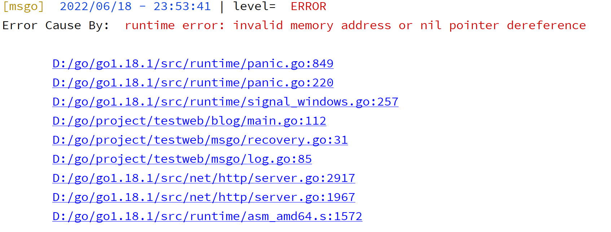

# 错误处理

> 当程序发生异常的时候，比如panic程序直接就崩溃了，很明显在应用运行的过程中，不允许发生这样的事情，那么我们的框架就需要支持对这样问题的处理

对这样问题的处理，我们很容易想到recover，他会捕获panic错误，同时我们应当在defer中进行捕获，defer是一个先进后出的栈结构，在return之前执行。

**recover 函数只在 defer 中生效**

## 1. Recovery中间件

~~~go
package msgo

import "net/http"

func Recovery(next HandlerFunc) HandlerFunc {
	return func(ctx *Context) {
		defer func() {
			if err := recover(); err != nil {
				ctx.Logger.Error(err)
				ctx.Fail(http.StatusInternalServerError, "Internal Server Error")
			}
		}()
		next(ctx)
	}
}

~~~

~~~go

func New() *Engine {
	r := &router{}
	engine := &Engine{
		router:     r,
		funcMap:    nil,
		HTMLRender: render.HTMLRender{},
		Logger:     msLog.Default(),
	}
	engine.pool.New = func() any {
		return engine.allocateContext()
	}
	r.engine = engine
	return engine
}
func Default() *Engine {
	engine := New()
	engine.Use(Recovery, Logging)
	return engine
}
~~~

~~~go
func (e *Engine) ServeHTTP(w http.ResponseWriter, r *http.Request) {
	ctx := e.pool.Get().(*Context)
	ctx.W = w
	ctx.R = r
	ctx.Logger = e.Logger
	e.handleHttpRequest(ctx)
	e.pool.Put(ctx)
}

~~~

## 2. 打印出错位置

> 像这种处理异常的行为，单纯的报error没有意义，我们需要打印出出错的位置信息

这里我们要用到runtime.Caller，Caller()报告当前go调用栈所执行的函数的文件和行号信息

- `skip`：
  上溯的栈帧数，0表示Caller的调用者（Caller所在的调用栈）（0-当前函数，1-上一层函数，…）。
- `pc` ：
  调用栈标识符
- `file`:
  文件路径
- `line`:
  该调用在文件中的行号
- `ok`:
  如果无法获得信息，ok会被设为false

Callers 用来返回调用栈的程序计数器, 第 0 个 Caller 是 Callers 本身，第 1 个是上一层 trace，第 2 个是再上一层的 `defer func`。

~~~go
package msgo

import (
	"fmt"
	"net/http"
	"runtime"
	"strings"
)

func detailMsg(err any) string {
	var sb strings.Builder
	var pcs = make([]uintptr, 32)
	n := runtime.Callers(3, pcs)
	sb.WriteString(fmt.Sprintf("%v\n", err))
	for _, pc := range pcs[:n] {
		//函数
		fn := runtime.FuncForPC(pc)
		file, line := fn.FileLine(pc)
		sb.WriteString(fmt.Sprintf("\n\t%s:%d", file, line))
	}
	return sb.String()
}
func Recovery(next HandlerFunc) HandlerFunc {
	return func(ctx *Context) {
		defer func() {
			if err := recover(); err != nil {
				ctx.Logger.Error(detailMsg(err))
				ctx.Fail(http.StatusInternalServerError, "Internal Server Error")
			}
		}()
		next(ctx)
	}
}

~~~

这样我们的报错信息就比较全面一些，便于开发者定位错误

~~~go

func (l *Logger) Print(level LoggerLevel, msg any) {
	if l.Level > level {
		//级别不满足 不打印日志
		return
	}
	param := &LoggingFormatterParam{
		Level:        level,
		Msg:          msg,
		LoggerFields: l.LoggerFields,
	}

	for _, out := range l.Outs {
		if out.Out == os.Stdout {
			param.Color = true
			l.print(param, out)
		}
		if out.Level == -1 || out.Level == level {
			param.Color = false
			l.print(param, out)
			//
			l.CheckFileSize(out)
		}

	}

}

func (l *Logger) print(param *LoggingFormatterParam, out *LoggerWriter) {
	formatter := l.Formatter.Formatter(param)
	fmt.Fprintln(out.Out, formatter)
}
~~~

## 3. 优雅的错误处理

> 以前我们时长会写这样的代码：

~~~go
err := a()
if err != nil {
    //deal
}
err := b()
if err != nil {
    //deal
}
~~~

一个逻辑下来，代码写的比较散乱和复杂

~~~go
package mserror

type MsError struct {
	err      error
	errorFuc ErrorFuc
}

func (e *MsError) Error() string {
	return e.err.Error()
}
func Default() *MsError {
	return &MsError{}
}

func (e *MsError) Put(err error) {
	e.checkError(err)
}

func (e *MsError) checkError(err error) {
	if err != nil {
		e.err = err
		panic(e)
	}
}

type ErrorFuc func(msError *MsError)

func (e *MsError) Result(fuc ErrorFuc) {
	e.errorFuc = fuc
}

func (e *MsError) ExecResult() {
	e.errorFuc(e)
}

~~~

~~~go
func Recovery(next HandlerFunc) HandlerFunc {
	return func(ctx *Context) {
		defer func() {
			if err := recover(); err != nil {
				if e := err.(error); e != nil {
					var msError *mserror.MsError
					if errors.As(e, &msError) {
						msError.ExecResult()
						return
					}
				}
				ctx.Logger.Error(detailMsg(err))
				ctx.Fail(http.StatusInternalServerError, "Internal Server Error")
			}
		}()
		next(ctx)
	}
}

~~~

~~~go
g.Post("/xmlParam", func(ctx *msgo.Context) {
		user := &User{}
		_ = ctx.BindXML(user)
		msError := mserror.Default()
		msError.Result(func(msError *mserror.MsError) {
			ctx.Logger.Error(msError.Error())
			ctx.JSON(http.StatusInternalServerError, user)
		})
		ret := a(1, msError)
		ret = b(ret, msError)
		ret = c(ret, msError)
		fmt.Println(ret)
		ctx.JSON(http.StatusOK, user)
	})
~~~

~~~go

func (f *TextFormatter) Formatter(param *LoggingFormatterParam) string {
	now := time.Now()
	var builderField strings.Builder
	var fieldsDisplay = ""
	if param.LoggerFields != nil {
		fieldsDisplay = "| fields: "
		num := len(param.LoggerFields)
		count := 0
		for k, v := range param.LoggerFields {
			fmt.Fprintf(&builderField, "%s=%v", k, v)
			if count < num-1 {
				fmt.Fprintf(&builderField, ",")
				count++
			}
		}
	}
	msgKey := "\n msg: "
	var sb strings.Builder
	if param.Level == LevelError {
		msgKey = "\n Error Cause By: "
		var pcs [32]uintptr
		n := runtime.Callers(5, pcs[:])
		for _, pc := range pcs[:n] {
			fn := runtime.FuncForPC(pc)
			line, l := fn.FileLine(pc)
			sb.WriteString(fmt.Sprintf("\n\t%s:%d", line, l))
		}

	}
	if param.Color {
		//要带颜色  error的颜色 为红色 info为绿色 debug为蓝色
		levelColor := f.LevelColor(param.Level)
		msgColor := f.MsgColor(param.Level)
		return fmt.Sprintf("%s [msgo] %s %s%v%s | level= %s %s %s %s%s %v %s %s %s%s \n",
			yellow, reset, blue, now.Format("2006/01/02 - 15:04:05"), reset,
			levelColor, param.Level.Level(), reset, msgColor, msgKey, param.Msg, reset, fieldsDisplay,
			builderField.String(), sb.String(),
		)
	}
	return fmt.Sprintf("[msgo] %v | level=%s  %s  %v %s %s%s\n",
		now.Format("2006/01/02 - 15:04:05"),
		param.Level.Level(), msgKey, param.Msg, fieldsDisplay, builderField.String(), sb.String(),
	)
}
~~~

## 4. http错误

> 在写业务的时候，比如用户名密码不对，我们状态往往返回的是200，但是信息是返回的code=1000，msg=xxx 这样的格式，前端是根据code来进行信息提示

~~~go
func (c *Context) ErrorHandle(err error) {
	code, data := c.engine.errorHandler(err)
	c.JSON(code, data)
}

func (c *Context) HandlerWithError(code int, obj any, err error) {
	if err != nil {
		statusCode, data := c.engine.errorHandler(err)
		c.JSON(statusCode, data)
		return
	}
	c.JSON(code, obj)
}

~~~

~~~go
	engine.RegisterErrorHandler(func(err error) (int, any) {
		switch e := err.(type) {
		case *BlogError:
			return http.StatusOK, e.Response()
		default:
			return http.StatusInternalServerError, "Internal Server Error"
		}
	})
~~~

~~~go
type ErrorHandler func(err error) (int, any)

func (e *Engine) RegisterErrorHandler(err ErrorHandler) {
	e.errorHandler = err
}

~~~

~~~go
package main

type BlogError struct {
	Success bool
	Code    int64
	Data    any
	Msg     string
}

type BlogNoDataError struct {
	Success bool
	Code    int64
	Msg     string
}

func (b *BlogError) Error() string {
	return b.Msg
}

func (b *BlogError) Fail(code int64, msg string) {
	b.Success = false
	b.Code = code
	b.Msg = msg
}

func (b *BlogError) Response() any {
	if b.Data == nil {
		return &BlogNoDataError{
			Success: b.Success,
			Code:    b.Code,
			Msg:     b.Msg,
		}
	}
	return b
}

~~~

