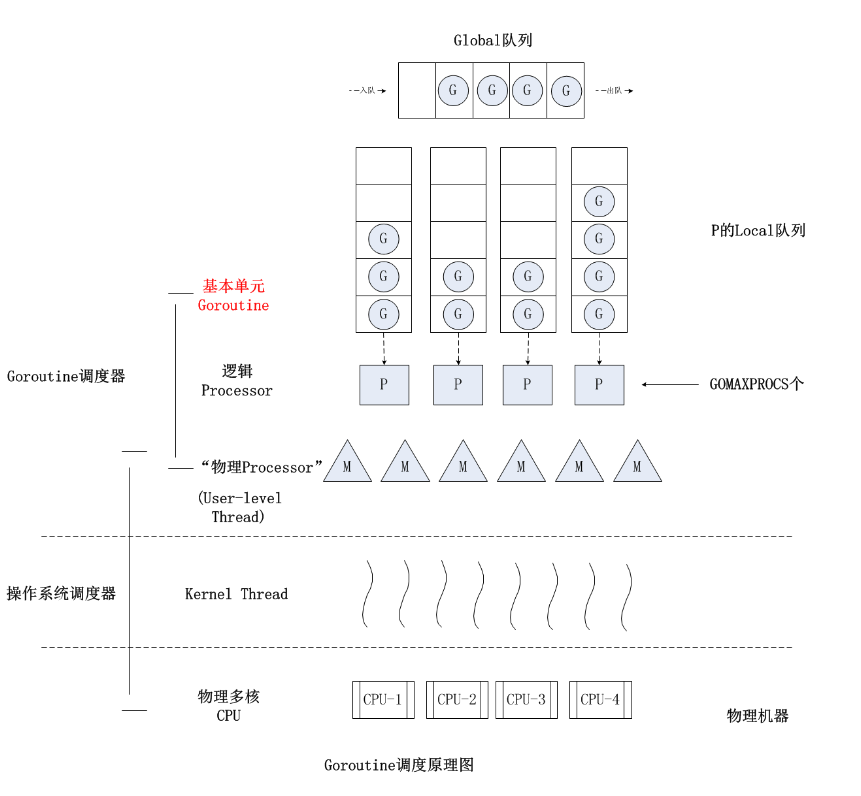
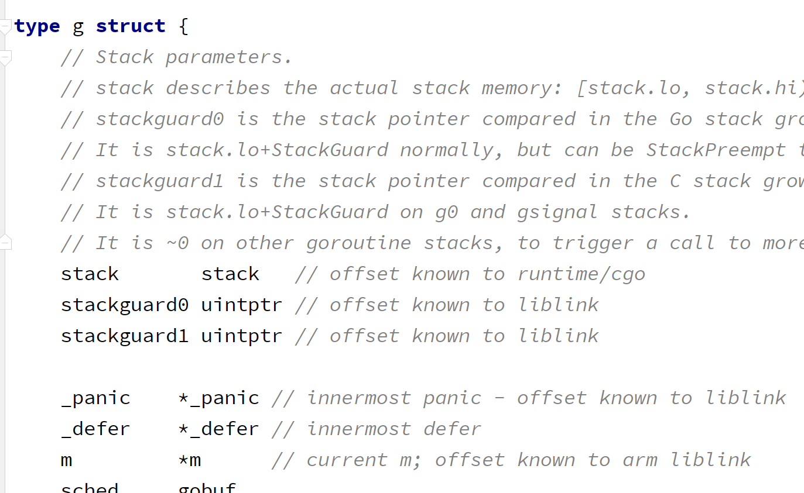
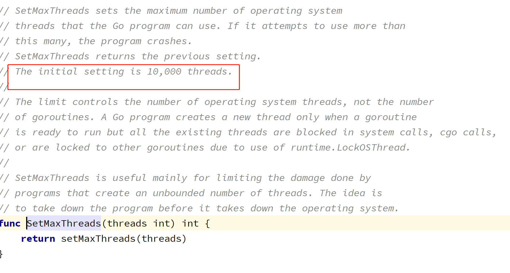

# 协程池

> go的优势是高并发，高并发是由go+channel的组合来完成的，那么这里，我们提出一个问题，go协程是否是创建的越多越好？

## 1. GMP模型



* 每个 P 维护一个 G 的本地队列
* 当一个 G 被创建出来，或者变为可执行状态时，优先把它放到 P 的本地队列中，否则放到全局队列
* 当一个 G 在 M 里执行结束后，P 会从队列中把该 G 取出；如果此时 P 的队列为空，即没有其他 G 可以执行， M 会先尝试从全局队列寻找 G 来执行，如果全局队列为空，它会随机挑选另外一个 P，从它的队列里拿走一半 G 到自己的队列中执行

**P 的数量在默认情况下，会被设定为 CPU 的核数。而 M 虽然需要跟 P 绑定执行，但数量上并不与 P 相等。这是因为 M 会因为系统调用或者其他事情被阻塞，因此随着程序的执行，M 的数量可能增长，而 P 在没有用户干预的情况下，则会保持不变 **


### 1.1 大量创建go协程的代价

* 内存开销

  go协程大约占2k的内存

  `src/runtime/runtime2.go`

  

* 调度开销

  虽然go协程的调度开销非常小，但也有一定的开销。

  `runntime.Gosched()`当前协程主动让出 CPU 去执行另外一个协程

* gc开销

  协程占用的内存最终需要gc来回收

* 隐性的CPU开销

  最终协程是要内核线程来执行，我们知道在GMP模型中，G阻塞后，会新创建M来执行，一个M往往对应一个内核线程，当创建大量go协程的时候，内核线程的开销可能也会增大

  ```
  GO: runtime: program exceeds 10000-thread limit
  ```

​	 

> gmp模型中，本地队列的限制是256

* 资源开销大的任务

  针对资源开销过大的任务，本身也不应当创建大量的协程，以免对CPU造成过大的压力，影响整体上的单机性能
  
* 任务堆积

  当创建过多协程，G阻塞增多，本地队列堆积过多，很可能造成内存溢出

* 系统任务影响

  runtime调度，gc等都是运行在go协程上的，当goroutine规模过大，会影响其他任务

## 2. 协程池

基于以上一些理由，有必要创建一个协程池，将协程有效的管理起来，不要随意的创建过多的协程。

`同时池化的核心在于复用，所以我们可以这么想，一个goroutine是否可以处理多个任务，而不是一个goroutine处理一个任务`

### 2.1 需求

我们先来罗列一下我们的需求：

1. 希望创建固定数量的协程
2. 有一个任务队列，等待协程进行调度执行
3. 协程用完时，其他任务处于等待状态，一旦有协程空余，立即获取任务执行
3. 协程长时间空余，清理，以免占用空间
4. 有超时时间，如果一个任务长时间完成不了，就超时，让出协程

### 2.2 设计


### 2.3 初步实现

~~~go
package mspool

import (
	"errors"
	"sync"
	"sync/atomic"
	"time"
)

type sig struct{}

const DefaultExpire = 3

var (
	ErrorInValidCap    = errors.New("pool cap can not <= 0")
	ErrorInValidExpire = errors.New("pool expire can not <= 0")
	ErrorHasClosed     = errors.New("pool has bean released!!")
)

type Pool struct {
	//cap 容量 pool max cap
	cap int32
	//running 正在运行的worker的数量
	running int32
	//空闲worker
	workers []*Worker
	//expire 过期时间 空闲的worker超过这个时间 回收掉
	expire time.Duration
	//release 释放资源  pool就不能使用了
	release chan sig
	//lock 去保护pool里面的相关资源的安全
	lock sync.Mutex
	//once 释放只能调用一次 不能多次调用
	once sync.Once
}

func NewPool(cap int) (*Pool, error) {
	return NewTimePool(cap, DefaultExpire)
}

func NewTimePool(cap int, expire int) (*Pool, error) {
	if cap <= 0 {
		return nil, ErrorInValidCap
	}
	if expire <= 0 {
		return nil, ErrorInValidExpire
	}
	p := &Pool{
		cap:     int32(cap),
		expire:  time.Duration(expire) * time.Second,
		release: make(chan sig, 1),
	}
	go expireWorker()
	return p, nil
}

func expireWorker() {
	//定时清理过期的空闲worker

}

//提交任务

func (p *Pool) Submit(task func()) error {
	if len(p.release) > 0 {
		return ErrorHasClosed
	}
	//获取池里面的一个worker，然后执行任务就可以了
	w := p.GetWorker()
	w.task <- task
	w.pool.incRunning()
	return nil
}

func (p *Pool) GetWorker() *Worker {
	//1. 目的获取pool里面的worker
	//2. 如果 有空闲的worker 直接获取

	idleWorkers := p.workers
	n := len(idleWorkers) - 1
	if n >= 0 {
		p.lock.Lock()
		w := idleWorkers[n]
		idleWorkers[n] = nil
		p.workers = idleWorkers[:n]
		p.lock.Unlock()
		return w
	}
	//3. 如果没有空闲的worker，要新建一个worker
	if p.running < p.cap {
		//还不够pool的容量，直接新建一个
		w := &Worker{
			pool: p,
			task: make(chan func(), 1),
		}
		w.run()
		return w
	}
	//4. 如果正在运行的workers 如果大于pool容量，阻塞等待，worker释放
	for {
		p.lock.Lock()
		idleWorkers := p.workers
		n := len(idleWorkers) - 1
		if n < 0 {
			p.lock.Unlock()
			continue
		}
		w := idleWorkers[n]
		idleWorkers[n] = nil
		p.workers = idleWorkers[:n]
		p.lock.Unlock()
		return w
	}
}

func (p *Pool) incRunning() {
	atomic.AddInt32(&p.running, 1)
}

func (p *Pool) PutWorker(w *Worker) {
	w.lastTime = time.Now()
	p.lock.Lock()
	p.workers = append(p.workers, w)
	p.lock.Unlock()
}

func (p *Pool) decRunning() {
	atomic.AddInt32(&p.running, -1)
}

func (p *Pool) Release() {
	p.once.Do(func() {
		//只执行一次
		p.lock.Lock()
		workers := p.workers
		for i, w := range workers {
			w.task = nil
			w.pool = nil
			workers[i] = nil
		}
		p.workers = nil
		p.lock.Unlock()
		p.release <- sig{}
	})
}

func (p *Pool) IsClosed() bool {

	return len(p.release) > 0
}

func (p *Pool) Restart() bool {
	if len(p.release) <= 0 {
		return true
	}
	_ = <-p.release
	return true
}

~~~

~~~go
package mspool

import (
	"time"
)

type Worker struct {
	pool *Pool
	//task 任务队列
	task chan func()
	//lastTime 执行任务的最后的时间
	lastTime time.Time
}

func (w *Worker) run() {
	go w.running()
}

func (w *Worker) running() {
	for f := range w.task {
		if f == nil {
			return
		}
		f()
		//任务运行完成，worker空闲
		w.pool.PutWorker(w)
		w.pool.decRunning()
	}
}

~~~

### 2.4 定时清除无用的worker

~~~go

func (p *Pool) expireWorker() {
	ticker := time.NewTicker(p.expire)
	for range ticker.C {
		currentTime := time.Now()
		if p.IsRelease() {
			break
		}
		p.lock.Lock()
		idleWorkers := p.workers
		n := -1
		for i, w := range idleWorkers {
			if currentTime.Sub(w.lastTime) <= p.expire {
				break
			}
			//需要清除的
			n = i
			w.task <- nil
			idleWorkers[i] = nil
		}
		if n > -1 {
			if n >= len(idleWorkers)-1 {
				p.workers = idleWorkers[:0]
			} else {
				p.workers = idleWorkers[n+1:]
			}
		}
		p.lock.Unlock()
	}
}

~~~

### 2.5 引入sync.pool

> 在前面我们已经用过pool了，这里我们可以将worker的创建也放入pool中提前暴露（缓存），用的时候从pool中获取，用完在还回pool中，这样性能更高

~~~go

func (p *Pool) GetWorker() *Worker {
	//1. 目的获取pool里面的worker
	//2. 如果 有空闲的worker 直接获取

	idleWorkers := p.workers
	n := len(idleWorkers) - 1
	if n >= 0 {
		p.lock.Lock()
		w := idleWorkers[n]
		idleWorkers[n] = nil
		p.workers = idleWorkers[:n]
		p.lock.Unlock()
		return w
	}
	//3. 如果没有空闲的worker，要新建一个worker
	if p.running < p.cap {
		//还不够pool的容量，直接新建一个
		c := p.workerCache.Get()
		var w *Worker
		if c == nil {
			w = &Worker{
				pool: p,
				task: make(chan func(), 1),
			}
		} else {
			w = c.(*Worker)
		}

		w.run()
		return w
	}
	//4. 如果正在运行的workers 如果大于pool容量，阻塞等待，worker释放
	for {
		p.lock.Lock()
		idleWorkers := p.workers
		n := len(idleWorkers) - 1
		if n < 0 {
			p.lock.Unlock()
			continue
		}
		w := idleWorkers[n]
		idleWorkers[n] = nil
		p.workers = idleWorkers[:n]
		p.lock.Unlock()
		return w
	}
}
~~~

~~~go
package mspool

import (
	"time"
)

type Worker struct {
	pool *Pool
	//task 任务队列
	task chan func()
	//lastTime 执行任务的最后的时间
	lastTime time.Time
}

func (w *Worker) run() {
	go w.running()
}

func (w *Worker) running() {
	for f := range w.task {
		if f == nil {
			w.pool.workerCache.Put(w)
			return
		}
		f()
		//任务运行完成，worker空闲
		w.pool.PutWorker(w)
		w.pool.decRunning()
	}
}

~~~

### 2.6 引入sync.Cond 

sync.Cond 是基于互斥锁/读写锁实现的条件变量，用来协调想要访问共享资源的那些 Goroutine。

当共享资源状态发生变化时，sync.Cond 可以用来通知等待条件发生而阻塞的 Goroutine。

在上述的场景中，我们可以将其应用在等待worker那里，可以使用sync.Cond阻塞，当worker执行完任务后，通知其继续执行。


* `Signal方法：`允许调用者Caller唤醒一个等待此Cond和goroutine。如果此时没有等待的goroutine，显然无需通知waiter；如果Cond等待队列中有一个或者多个等待的goroutine，则需要从等待队列中移除第一个goroutine并把它唤醒。在Java语言中，Signal方法也叫做notify方法。调用Signal方法时，不强求你一定要持有c.L的锁。
* `Broadcast方法`，允许调用者Caller唤醒所有等待此Cond的goroutine。如果此时没有等待的goroutine，显然无需通知waiter；如果Cond等待队列中有一个或者多个等待的goroutine，则清空所有等待的goroutine，并全部唤醒。在Java语言中，Broadcast方法也被叫做notifyAll方法。同样地，调用Broadcast方法时，也不强求你一定持有c.L的锁。
* `Wait方法`，会把调用者Caller放入Cond的等待队列中并阻塞，直到被Signal或者Broadcast的方法从等待队列中移除并唤醒。调用Wait方法时必须要持有c.L的锁。

~~~go

func (p *Pool) waitIdleWorker() *Worker {
	p.lock.Lock()
	p.cond.Wait()
	fmt.Println("被唤醒")
	idleWorkers := p.workers
	n := len(idleWorkers) - 1
	if n < 0 {
		p.lock.Unlock()
		return p.waitIdleWorker()
	}
	w := idleWorkers[n]
	idleWorkers[n] = nil
	p.workers = idleWorkers[:n]
	p.lock.Unlock()
	return w
}
~~~

~~~go
func NewTimePool(cap int, expire int) (*Pool, error) {
	if cap <= 0 {
		return nil, ErrInvalidCap
	}
	if expire <= 0 {
		return nil, ErrInvalidCap
	}
	p := &Pool{
		cap:     int32(cap),
		expire:  time.Duration(expire) * time.Second,
		release: make(chan sig, 1),
	}
	p.workerCache.New = func() any {
		return &Worker{
			pool: p,
			task: make(chan func(), 1),
		}
	}
	p.cond = sync.NewCond(&p.lock)
	go p.expireWorker()
	return p, nil
}
~~~

~~~go
func (p *Pool) PutWorker(w *Worker) {
	w.lastTime = time.Now()
	p.lock.Lock()
	p.workers = append(p.workers, w)
	p.cond.Signal()
	p.lock.Unlock()
}
~~~

### 2.7 任务超时释放

> 针对任务超时，需要使用工具的开发者，在程序中自动处理，及时退出goroutine

### 2.8 异常处理

> 当task发生问题时，需要能捕获到，对外提供入口，让开发者自定义错误处理方式

~~~go
package mspool

import (
	msLog "github.com/mszlu521/msgo/log"
	"time"
)

type Worker struct {
	pool *Pool
	//task 任务队列
	task chan func()
	//lastTime 执行任务的最后的时间
	lastTime time.Time
}

func (w *Worker) run() {
	go w.running()
}

func (w *Worker) running() {
	defer func() {
		w.pool.decRunning()
		w.pool.workerCache.Put(w)
		if err := recover(); err != nil {
			//捕获任务发生的panic
			if w.pool.PanicHandler != nil {
				w.pool.PanicHandler()
			} else {
				msLog.Default().Error(err)
			}
		}
		w.pool.cond.Signal()
	}()
	for f := range w.task {
		if f == nil {
			w.pool.workerCache.Put(w)
			return
		}
		f()
		//任务运行完成，worker空闲
		w.pool.PutWorker(w)
		w.pool.decRunning()
	}
}

~~~

~~~go
//PanicHandler
	PanicHandler func(any)
~~~

~~~go

func (p *Pool) waitIdleWorker() *Worker {
	p.lock.Lock()
	p.cond.Wait()

	idleWorkers := p.workers
	n := len(idleWorkers) - 1
	if n < 0 {
		p.lock.Unlock()
		if p.running < p.cap {
			//还不够pool的容量，直接新建一个
			c := p.workerCache.Get()
			var w *Worker
			if c == nil {
				w = &Worker{
					pool: p,
					task: make(chan func(), 1),
				}
			} else {
				w = c.(*Worker)
			}
			w.run()
			return w
		}
		return p.waitIdleWorker()
	}
	w := idleWorkers[n]
	idleWorkers[n] = nil
	p.workers = idleWorkers[:n]
	p.lock.Unlock()
	return w
}
~~~

### 2.9 性能测试

~~~go
package mspool

import (
	"math"
	"runtime"
	"sync"
	"testing"
	"time"
)

const (
	_   = 1 << (10 * iota)
	KiB // 1024
	MiB // 1048576
	// GiB // 1073741824
	// TiB // 1099511627776             (超过了int32的范围)
	// PiB // 1125899906842624
	// EiB // 1152921504606846976
	// ZiB // 1180591620717411303424    (超过了int64的范围)
	// YiB // 1208925819614629174706176
)

const (
	Param    = 100
	PoolSize = 1000
	TestSize = 10000
	n        = 1000000
)

var curMem uint64

const (
	RunTimes           = 1000000
	BenchParam         = 10
	DefaultExpiredTime = 10 * time.Second
)

func demoFunc() {
	time.Sleep(time.Duration(BenchParam) * time.Millisecond)
}

func TestNoPool(t *testing.T) {
	var wg sync.WaitGroup
	for i := 0; i < n; i++ {
		wg.Add(1)
		go func() {
			demoFunc()
			wg.Done()
		}()
	}

	wg.Wait()
	mem := runtime.MemStats{}
	runtime.ReadMemStats(&mem)
	curMem = mem.TotalAlloc/MiB - curMem
	t.Logf("memory usage:%d MB", curMem)
}

func TestHasPool(t *testing.T) {
	pool, _ := NewPool(math.MaxInt32)
	defer pool.Release()
	var wg sync.WaitGroup
	for i := 0; i < n; i++ {
		wg.Add(1)
		_ = pool.Submit(func() {
			demoFunc()
			wg.Done()
		})
	}
	wg.Wait()

	mem := runtime.MemStats{}
	runtime.ReadMemStats(&mem)
	curMem = mem.TotalAlloc/MiB - curMem
	t.Logf("memory usage:%d MB", curMem)
}

~~~

bug修改：

~~~go

func (p *Pool) expireWorker() {
	//定时清理过期的空闲worker
	ticker := time.NewTicker(p.expire)
	for range ticker.C {
		if p.IsClosed() {
			break
		}
		//循环空闲的workers 如果当前时间和worker的最后运行任务的时间 差值大于expire 进行清理
		p.lock.Lock()
		idleWorkers := p.workers
		n := len(idleWorkers) - 1
		if n >= 0 {
			var clearN = -1
			for i, w := range idleWorkers {
				if time.Now().Sub(w.lastTime) <= p.expire {
					break
				}
				clearN = i
				w.task <- nil
				idleWorkers[i] = nil
			}
			// 3 2
			if clearN != -1 {
				if clearN >= len(idleWorkers)-1 {
					p.workers = idleWorkers[:0]
				} else {
					// len=3 0,1 del 2
					p.workers = idleWorkers[clearN+1:]
				}
				fmt.Printf("清除完成,running:%d, workers:%v \n", p.running, p.workers)
			}
		}
		p.lock.Unlock()
	}
}
~~~

