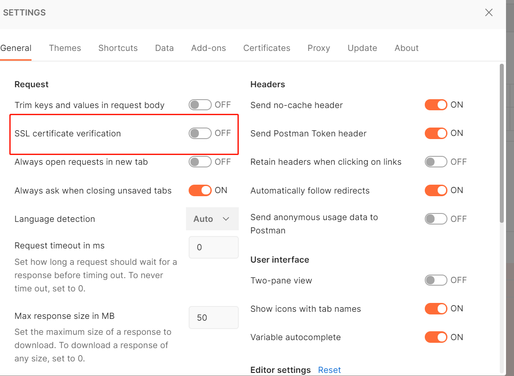

# 认证

## 1. 开启https支持

~~~go
func (e *Engine) RunTLS(addr, certFile, keyFile string) {
	err := http.ListenAndServeTLS(addr, certFile, keyFile, e.Handler())
	if err != nil {
		log.Fatal(err)
	}
}
~~~

### 1.1 测试

证书生成：

* 安装openssl

  网站下载：http://slproweb.com/products/Win32OpenSSL.html

  （mac电脑 自行搜索安装）

* 生成私钥文件

  ~~~shell
  ## 需要输入密码
  openssl genrsa -des3 -out ca.key 2048
  ~~~

* 创建证书请求

  ~~~shell
  openssl req -new -key ca.key -out ca.csr
  ~~~

* 生成ca.crt

  ~~~shell
  openssl x509 -req -days 365 -in ca.csr -signkey ca.key -out ca.crt
  ~~~

找到openssl.cnf 文件

1. 打开copy_extensions = copy

2. 打开 req_extensions = v3_req

3. 找到[ v3_req ],添加 subjectAltName = @alt_names

4. 添加新的标签 [ alt_names ] , 和标签字段

   ~~~ini
   [ alt_names ]
   IP.1 = 127.0.0.1
   DNS.1 = *.mszlu.com
   ~~~

5. 生成证书私钥server.key

   ~~~shell
   openssl genpkey -algorithm RSA -out server.key
   ~~~

   

6. 通过私钥server.key生成证书请求文件server.csr

   ~~~shell
   openssl req -new -nodes -key server.key -out server.csr -days 3650 -config ./openssl.cnf -extensions v3_req
   ~~~

7. 生成SAN证书

   ~~~shell
   openssl x509 -req -days 365 -in server.csr -out server.pem -CA ca.crt -CAkey ca.key -CAcreateserial -extfile ./openssl.cnf -extensions v3_req
   ~~~

~~~go
engine.RunTLS(":8118", "key/server.pem", "key/server.key")
~~~

**postman测试**

客户端需要生成对应的公钥和私钥

私钥：

~~~shell
openssl genpkey -algorithm RSA -out client.key
~~~

证书:

~~~shell
openssl req -new -nodes -key client.key -out client.csr -days 3650 -config ./openssl.cnf -extensions v3_req
~~~

SAN证书：

~~~shell
openssl x509 -req -days 365 -in client.csr -out client.pem -CA ca.crt -CAkey ca.key -CAcreateserial -extfile ./openssl.cnf -extensions v3_req
~~~

postman访问https://127.0.0.1:8118/user/jsonParam即可。

## 2. 认证支持

### 2.1 Basic认证

Basic 认证（基础认证），是最简单的认证方式。它简单地将用户名:密码进行 base64 编码后，放到 HTTP Authorization Header 中。HTTP 请求到达后端服务后，后端服务会解析出 Authorization Header 中的 base64 字符串，解码获取用户名和密码，并将用户名和密码跟数据库中记录的值进行比较，如果匹配则认证通过。
当然base64并不是加密技术，所以这种认证方式并不安全，即使密码进行加密，攻击者也可以进行重放攻击。

**可以和SSL（可以理解为是HTTPS）一起使用保证其安全性**

~~~go
Authorization: Basic ${basic}
~~~

#### 2.1.1 Context传递信息

~~~go
type Context struct {
	W                     http.ResponseWriter
	R                     *http.Request
	engine                *Engine
	queryCache            url.Values
	formCache             url.Values
	DisallowUnknownFields bool
	IsValidate            bool
	StatusCode            int
	Logger                *msLog.Logger
	Keys                  map[string]any
	mu                    sync.RWMutex
}

~~~

~~~go
func (c *Context) Set(key string, value string) {
	c.mu.Lock()
	if c.Keys == nil {
		c.Keys = make(map[string]any)
	}

	c.Keys[key] = value
	c.mu.Unlock()
}

func (c *Context) Get(key string) (value any, exists bool) {
	c.mu.RLock()
	value, exists = c.Keys[key]
	c.mu.RUnlock()
	return
}
~~~

#### 2.1.2 实现

中间件：

~~~go
package msgo

import (
	"encoding/base64"
	"net/http"
)

type Accounts struct {
	UnAuthHandler func(ctx *Context)
	Users         map[string]string
}

func (a *Accounts) BasicAuth(next HandlerFunc) HandlerFunc {
	return func(ctx *Context) {
		//判断请求中是否有Authorization的Header
		username, password, ok := ctx.R.BasicAuth()
		if !ok {
			a.UnAuthHandlers(ctx)
			return
		}
		pw, ok := a.Users[username]
		if !ok {
			a.UnAuthHandlers(ctx)
			return
		}
		if pw != password {
			a.UnAuthHandlers(ctx)
			return
		}
		ctx.Set("user", username)
		next(ctx)
	}
}

func (a *Accounts) UnAuthHandlers(ctx *Context) {
	if a.UnAuthHandler != nil {
		a.UnAuthHandler(ctx)
	} else {
		ctx.W.WriteHeader(http.StatusUnauthorized)
	}
}

func BasicAuth(username, password string) string {
	auth := username + ":" + password
	return base64.StdEncoding.EncodeToString([]byte(auth))
}

~~~

~~~go
func (c *Context) SetBasicAuth(username, password string) {
	c.R.Header.Set("Authorization", "Basic "+basicAuth(username, password))
}
~~~

### 2.2 Digest认证

Digest 认证（摘要认证），是另一种 HTTP 认证协议，它与基本认证兼容，但修复了基本认证的严重缺陷。Digest 具有如下特点：

- 绝不会用明文方式在网络上发送密码。
- 可以有效防止恶意用户进行重放攻击。
- 可以有选择地防止对报文内容的篡改。

完成摘要认证需要下面这四步：

* 客户端请求服务端的资源。
* 在客户端能够证明它知道密码从而确认其身份之前，服务端认证失败，返回401 Unauthorized，并返回WWW-Authenticate头，里面包含认证需要的信息。
* 客户端根据WWW-Authenticate头中的信息，选择加密算法，并使用密码随机数 nonce，计算出密码摘要 response，并再次请求服务端。
* 服务器将客户端提供的密码摘要与服务器内部计算出的摘要进行对比。如果匹配，就说明客户端知道密码，认证通过，并返回一些与授权会话相关的附加信息，放在 Authorization-Info 中。
  WWW-Authenticate头中包含的信息见下表：

虽然使用摘要可以避免密码以明文方式发送，一定程度上保护了密码的安全性，但是仅仅隐藏密码并不能保证请求是安全的。因为请求（包括密码摘要）仍然可以被截获，这样就可以重放给服务器，带来安全问题。

为了防止重放攻击，服务器向客户端发送了密码随机数 nonce，nonce 每次请求都会变化。客户端会根据 nonce 生成密码摘要，这种方式，可以使摘要随着随机数的变化而变化。服务端收到的密码摘要只对特定的随机数有效，而没有密码的话，攻击者就无法计算出正确的摘要，这样我们就可以防止重放攻击。

摘要认证可以保护密码，比基本认证安全很多。但摘要认证并不能保护内容，所以仍然要与 HTTPS 配合使用，来确保通信的安全。

### 2.3 Bearer 认证

Bearer 认证，也称为令牌认证，是一种 HTTP 身份验证方法。Bearer 认证的核心是 bearer token。bearer token 是一个加密字符串，通常由服务端根据密钥生成。客户端在请求服务端时，必须在请求头中包含Authorization: Bearer 。服务端收到请求后，解析出 ，并校验 的合法性，如果校验通过，则认证通过。跟Basic认证一样，Bearer 认证需要配合 HTTPS 一起使用，来保证认证安全性。

当前最流行的 token 编码方式是 `JSON Web Token`。

#### 2.3.1 JWT

JWT(全称：Json Web Token)是一个开放标准(RFC 7519)，它定义了一种紧凑的、自包含的方式，用于作为JSON对象在各方之间安全地传输信息。该信息可以被验证和信任，因为它是数字签名的。

简单点说就是一种认证机制。

JWT一般是这样一个字符串，分为三个部分，以"."隔开：

~~~go
A.B.C
~~~

**Header**

A部分：

JWT第一部分是头部分，它是一个描述JWT元数据的Json对象

~~~go
{
    "alg": "HS256",
    "typ": "JWT"
}
~~~

alg属性表示签名使用的算法，默认为HMAC SHA256（写为HS256），typ属性表示令牌的类型，JWT令牌统一写为JWT。

最后，使用Base64 URL算法将上述JSON对象转换为字符串保存。

**Payload**

B部分：

JWT第二部分是Payload，也是一个Json对象，除了包含需要传递的数据，还有七个默认的字段供选择。

分别是

`iss：发行人`、`exp：到期时间`、`sub：主题`、`aud：用户`、`nbf：在此之前不可用`、`iat：发布时间`、`jti：JWT ID用于标识该JWT`。

~~~go
{
    //默认字段
    "sub":"码神之路Go手写微服务框架教程",
    //自定义字段
    "name":"码神之路",
    "isAdmin":"true",
    "loginTime":"2022-06-28 12:00:03"
}
~~~

这部分是可以被解密的，并不安全，所以不要存敏感信息。

使用Base64 URL算法转换为字符串保存

**Signature**

C部分：

JWT第三部分是签名。

首先需要指定一个secret，该secret仅仅保存在服务器中，保证不能让其他用户知道。然后使用Header指定的算法对Header和Payload进行计算，然后就得出一个签名哈希。也就是Signature。

那么Application Server如何进行验证呢？可以利用JWT前两段，用同一套哈希算法和同一个secret计算一个签名值，然后把计算出来的签名值和收到的JWT第三段比较，如果相同则认证通过。

**使用JWT进行认证的步骤：**

* 客户端使用用户名和密码请求登录
* 服务端收到请求后，会去验证用户名和密码。如果用户名和密码跟数据库记录不一致，则验证失败；如果一致则验证通过，服务端会签发一个 Token 返回给客户端
* 客户端收到请求后会将 Token 缓存起来，比如放在浏览器 Cookie 中或者 LocalStorage 中，之后每次请求都会携带该 Token
* 服务端收到请求后，会验证请求中的 Token，验证通过则进行业务逻辑处理，处理完后返回处理后的结果。

#### 2.3.2 实现

~~~go
go get -u github.com/golang-jwt/jwt/v4
~~~

~~~go

func (c *Context) SetCookie(name, value string, maxAge int, path, domain string, secure, httpOnly bool) {
	if path == "" {
		path = "/"
	}
	http.SetCookie(c.W, &http.Cookie{
		Name:     name,
		Value:    url.QueryEscape(value),
		MaxAge:   maxAge,
		Path:     path,
		Domain:   domain,
		SameSite: c.sameSite,
		Secure:   secure,
		HttpOnly: httpOnly,
	})
}
~~~

~~~go
package token

import (
	"github.com/golang-jwt/jwt/v4"
	"github.com/mszlu521/msgo"
	"time"
)

type JwtHandler struct {
	//算法
	Alg string
	//登录认证
	Authenticator func(ctx *msgo.Context) (map[string]any, error)
	//过期时间 秒
	TimeOut time.Duration
	//时间函数 从此时开始计算过期
	TimeFuc func() time.Time
	//私钥
	PrivateKey string
	//key
	Key string
	//save cookie
	SendCookie     bool
	CookieName     string
	CookieMaxAge   int
	CookieDomain   string
	SecureCookie   bool
	CookieHTTPOnly bool
}

//登录处理，登录成功后，使用jwt生成token

func (j *JwtHandler) LoginHandler(ctx *msgo.Context) (string, error) {
	data, err := j.Authenticator(ctx)
	if err != nil {
		return "", err
	}
	if j.Alg == "" {
		j.Alg = "HS256"
	}
	signingMethod := jwt.GetSigningMethod(j.Alg)
	token := jwt.New(signingMethod)
	claims := token.Claims.(jwt.MapClaims)
	if data != nil {
		for key, value := range data {
			claims[key] = value
		}
	}
	if j.TimeFuc == nil {
		j.TimeFuc = func() time.Time {
			return time.Now()
		}
	}
	expire := j.TimeFuc().Add(j.TimeOut)
	claims["exp"] = expire.Unix()
	claims["iat"] = j.TimeFuc().Unix()
	var tokenString string
	var errToken error
	if j.usingPublicKeyAlgo() {
		tokenString, errToken = token.SignedString(j.PrivateKey)
	} else {
		tokenString, errToken = token.SignedString(j.Key)
	}
	if errToken != nil {
		return "", err
	}
	if j.SendCookie {
		if j.CookieName == "" {
			j.CookieName = "jwt_token"
		}
		if j.CookieMaxAge == 0 {
			j.CookieMaxAge = int(expire.Unix() - j.TimeFuc().Unix())
		}
		maxAge := j.CookieMaxAge
		ctx.SetCookie(j.CookieName, tokenString, maxAge, "/", j.CookieDomain, j.SecureCookie, j.CookieHTTPOnly)
	}
	return tokenString, nil
}

func (j *JwtHandler) usingPublicKeyAlgo() bool {
	switch j.Alg {
	case "RS256", "RS512", "RS384":
		return true
	}
	return false
}

~~~

**退出登录**

~~~go
func (j *JwtHandler) LogoutHandler(ctx *msgo.Context) error {
	//清除cookie即可
	if j.SendCookie {
		if j.CookieName == "" {
			j.CookieName = JWTToken
		}
		ctx.SetCookie(j.CookieName, "", -1, "/", j.CookieDomain, j.SecureCookie, j.CookieHTTPOnly)
		return nil
	}
	return nil
}
~~~

**刷新Token**

~~~go
package token

import (
	"github.com/golang-jwt/jwt/v4"
	"github.com/mszlu521/msgo"
	"time"
)

const JWTToken = "jwt_token"

type JwtHandler struct {
	//算法
	Alg string
	//登录认证
	Authenticator func(ctx *msgo.Context) (map[string]any, error)
	//过期时间 秒
	TimeOut        time.Duration
	RefreshTimeOut time.Duration
	//时间函数 从此时开始计算过期
	TimeFuc func() time.Time
	//私钥
	PrivateKey string
	//key
	Key string
	//save cookie
	SendCookie     bool
	CookieName     string
	CookieMaxAge   int
	CookieDomain   string
	SecureCookie   bool
	CookieHTTPOnly bool
}

type JWTResponse struct {
	Token        string
	RefreshToken string
}

//登录处理，登录成功后，使用jwt生成token

func (j *JwtHandler) LoginHandler(ctx *msgo.Context) (*JWTResponse, error) {
	data, err := j.Authenticator(ctx)
	if err != nil {
		return nil, err
	}
	if j.Alg == "" {
		j.Alg = "HS256"
	}
	signingMethod := jwt.GetSigningMethod(j.Alg)
	token := jwt.New(signingMethod)
	claims := token.Claims.(jwt.MapClaims)
	if data != nil {
		for key, value := range data {
			claims[key] = value
		}
	}
	if j.TimeFuc == nil {
		j.TimeFuc = func() time.Time {
			return time.Now()
		}
	}
	expire := j.TimeFuc().Add(j.TimeOut)
	claims["exp"] = expire.Unix()
	claims["iat"] = j.TimeFuc().Unix()
	var tokenString string
	var errToken error
	if j.usingPublicKeyAlgo() {
		tokenString, errToken = token.SignedString(j.PrivateKey)
	} else {
		tokenString, errToken = token.SignedString(j.Key)
	}
	if errToken != nil {
		return nil, errToken
	}
	if j.SendCookie {
		if j.CookieName == "" {
			j.CookieName = JWTToken
		}
		if j.CookieMaxAge == 0 {
			j.CookieMaxAge = int(expire.Unix() - j.TimeFuc().Unix())
		}
		maxAge := j.CookieMaxAge
		ctx.SetCookie(j.CookieName, tokenString, maxAge, "/", j.CookieDomain, j.SecureCookie, j.CookieHTTPOnly)
	}
	jr := &JWTResponse{}
	refreshToken, err := j.refreshToken(data)
	if err != nil {
		return nil, err
	}
	jr.Token = tokenString
	jr.RefreshToken = refreshToken
	return jr, nil
}

func (j *JwtHandler) LogoutHandler(ctx *msgo.Context) error {
	//清除cookie即可
	if j.SendCookie {
		if j.CookieName == "" {
			j.CookieName = JWTToken
		}
		ctx.SetCookie(j.CookieName, "", -1, "/", j.CookieDomain, j.SecureCookie, j.CookieHTTPOnly)
		return nil
	}
	return nil
}
func (j *JwtHandler) usingPublicKeyAlgo() bool {
	switch j.Alg {
	case "RS256", "RS512", "RS384":
		return true
	}
	return false
}

func (j *JwtHandler) refreshToken(data map[string]any) (string, error) {
	signingMethod := jwt.GetSigningMethod(j.Alg)
	token := jwt.New(signingMethod)
	claims := token.Claims.(jwt.MapClaims)
	if data != nil {
		for key, value := range data {
			claims[key] = value
		}
	}
	if j.TimeFuc == nil {
		j.TimeFuc = func() time.Time {
			return time.Now()
		}
	}
	expire := j.TimeFuc().Add(j.RefreshTimeOut)
	claims["exp"] = expire.Unix()
	claims["iat"] = j.TimeFuc().Unix()
	var tokenString string
	var errToken error
	if j.usingPublicKeyAlgo() {
		tokenString, errToken = token.SignedString(j.PrivateKey)
	} else {
		tokenString, errToken = token.SignedString(j.Key)
	}
	if errToken != nil {
		return "", errToken
	}
	return tokenString, nil
}

~~~

~~~go
func (c *Context) GetCookie(name string) string {
	cookie, err := c.R.Cookie(name)
	if err != nil {
		return ""
	}
	if cookie != nil {
		return cookie.Value
	}
	return ""
}
~~~

~~~go

func (j *JwtHandler) RefreshHandler(ctx *msgo.Context) (*JWTResponse, error) {
	var token string
	//检测refresh token是否过期
	storageToken, exists := ctx.Get(j.RefreshKey)
	if exists {
		token = storageToken.(string)
	}
	if token == "" {
		return nil, errors.New("token not exist")
	}
	t, err := jwt.Parse(token, func(token *jwt.Token) (interface{}, error) {
		if j.usingPublicKeyAlgo() {
			return []byte(j.PrivateKey), nil
		}
		return []byte(j.Key), nil
	})
	if err != nil {
		return nil, err
	}
	claims := t.Claims.(jwt.MapClaims)
	//未过期的情况下 重新生成token和refreshToken
	if j.TimeFuc == nil {
		j.TimeFuc = func() time.Time {
			return time.Now()
		}
	}
	expire := j.TimeFuc().Add(j.RefreshTimeOut)
	claims["exp"] = expire.Unix()
	claims["iat"] = j.TimeFuc().Unix()

	var tokenString string
	var errToken error
	if j.usingPublicKeyAlgo() {
		tokenString, errToken = t.SignedString(j.PrivateKey)
	} else {
		tokenString, errToken = t.SignedString(j.Key)
	}
	if errToken != nil {
		return nil, errToken
	}
	if j.SendCookie {
		if j.CookieName == "" {
			j.CookieName = JWTToken
		}
		if j.CookieMaxAge == 0 {
			j.CookieMaxAge = int(expire.Unix() - j.TimeFuc().Unix())
		}
		maxAge := j.CookieMaxAge
		ctx.SetCookie(j.CookieName, tokenString, maxAge, "/", j.CookieDomain, j.SecureCookie, j.CookieHTTPOnly)
	}
	jr := &JWTResponse{}
	refreshToken, err := j.refreshToken(claims)
	if err != nil {
		return nil, err
	}
	jr.Token = tokenString
	jr.RefreshToken = refreshToken
	return jr, nil
}
~~~

#### 2.3.3 测试

~~~go

	g.Get("/login", func(ctx *msgo.Context) {

		jwt := &token.JwtHandler{}
		jwt.Key = []byte("123456")
		jwt.SendCookie = true
		jwt.TimeOut = 10 * time.Minute
		jwt.Authenticator = func(ctx *msgo.Context) (map[string]any, error) {
			data := make(map[string]any)
			data["userId"] = 1
			return data, nil
		}
		token, err := jwt.LoginHandler(ctx)
		if err != nil {
			log.Println(err)
			ctx.JSON(http.StatusOK, err.Error())
			return
		}
		ctx.JSON(http.StatusOK, token)
	})
~~~

#### 2.3.4 实现jwt认证中间件

~~~go

func (j *JwtHandler) AuthInterceptor(next msgo.HandlerFunc) msgo.HandlerFunc {
	return func(ctx *msgo.Context) {
		//
		if j.Header == "" {
			j.Header = "Authorization"
		}
		token := ctx.R.Header.Get(j.Header)
		if token == "" {
			if j.SendCookie {
				token = ctx.GetCookie(j.CookieName)
				if token == "" {
					if j.AuthHandler == nil {
						ctx.W.WriteHeader(http.StatusUnauthorized)
					} else {
						j.AuthHandler(ctx, nil)
					}
					return
				}
			}
		}
		t, err := jwt.Parse(token, func(token *jwt.Token) (interface{}, error) {
			if j.usingPublicKeyAlgo() {
				return []byte(j.PrivateKey), nil
			}
			return []byte(j.Key), nil
		})
		if err != nil {
			if j.AuthHandler == nil {
				ctx.W.WriteHeader(http.StatusUnauthorized)
			} else {
				j.AuthHandler(ctx, err)
			}
			return
		}
		ctx.Set("claims", t.Claims.(jwt.MapClaims))
		next(ctx)
	}
}

~~~

~~~go
jwt := token.JwtHandler{
		Key: []byte("123456"),
	}
	engine.Use(jwt.AuthInterceptor)
~~~

