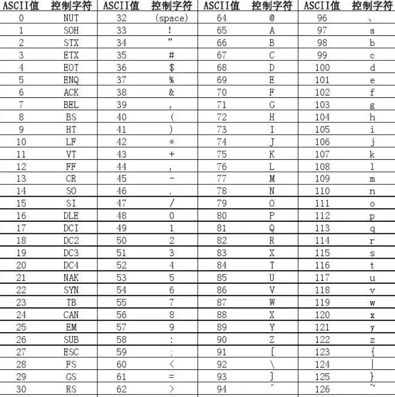

# ORM

> 当开发涉及到存储数据的时候，往往要用到数据库，用的最多的就是mysql了，这里我们实现一个orm，让开发者更加便捷的操作数据库

## 1. Insert实现

> orm的本质就是拼接sql，让开发者更加方便的使用

~~~go
package orm

import (
	"database/sql"
	"errors"
	"fmt"
	msLog "github.com/mszlu521/msgo/log"
	"reflect"
	"strings"
	"time"
)

type MsDb struct {
	db     *sql.DB
	logger *msLog.Logger
	Prefix string
}

type MsSession struct {
	db          *MsDb
	TableName   string
	fieldName   []string
	placeHolder []string
	values      []any
}

func (s *MsSession) Table(name string) *MsSession {
	s.TableName = name
	return s
}

func (d *MsDb) TablePrefix(prefix string) *MsDb {
	d.Prefix = prefix
	return d
}

func (d *MsDb) New() *MsSession {
	return &MsSession{
		db: d,
	}
}

func (s *MsSession) Insert(data any) (int64, int64, error) {
	s.fieldNames(data)
	query := fmt.Sprintf("insert into %s (%s) values(%s)", s.TableName, strings.Join(s.fieldName, ","), strings.Join(s.placeHolder, ","))
	stmt, err := s.db.db.Prepare(query)
	if err != nil {
		s.db.logger.Error(err)
		return -1, -1, err
	}
	r, err := stmt.Exec(s.values...)
	if err != nil {
		s.db.logger.Error(err)
		return -1, -1, err
	}
	id, err := r.LastInsertId()
	if err != nil {
		s.db.logger.Error(err)
		return -1, -1, err
	}
	affected, err := r.RowsAffected()
	if err != nil {
		s.db.logger.Error(err)
		return -1, -1, err
	}
	return id, affected, nil
}

func (s *MsSession) fieldNames(data any) {
	t := reflect.TypeOf(data)
	v := reflect.ValueOf(data)
	if t.Kind() != reflect.Pointer {
		panic(errors.New("data type must be pointer"))
	}
	tVar := t.Elem()
	vVar := v.Elem()
	if s.TableName == "" {
		s.TableName = s.db.Prefix + strings.ToLower(Name(tVar.Name()))
	}

	var fieldNames []string
	var placeholder []string
	var values []any
	for i := 0; i < tVar.NumField(); i++ {
		//首字母是小写的
		if !vVar.Field(i).CanInterface() {
			continue
		}
		//解析tag
		field := tVar.Field(i)
		sqlTag := field.Tag.Get("mssql")
		if sqlTag == "" {
			sqlTag = strings.ToLower(Name(field.Name))
		}
		contains := strings.Contains(sqlTag, "auto_increment")
		if sqlTag == "id" || contains {
			//对id做个判断 如果其值小于等于0 数据库可能是自增 跳过此字段
			if isAutoId(vVar.Field(i).Interface()) {
				continue
			}
		}
		if contains {
			sqlTag = sqlTag[:strings.Index(sqlTag, ",")]
		}
		fieldNames = append(fieldNames, sqlTag)
		placeholder = append(placeholder, "?")
		values = append(values, vVar.Field(i).Interface())
	}
	s.fieldName = fieldNames
	s.placeHolder = placeholder
	s.values = values
}

func isAutoId(id any) bool {
	t := reflect.TypeOf(id)
	v := reflect.ValueOf(id)
	switch t.Kind() {
	case reflect.Int64:
		if v.Interface().(int64) <= 0 {
			return true
		}
	case reflect.Int32:
		if v.Interface().(int32) <= 0 {
			return true
		}
	case reflect.Int:
		if v.Interface().(int) <= 0 {
			return true
		}
	default:
		return false
	}
	return false
}

func Name(name string) string {
	all := name[:]
	var sb strings.Builder
	lastIndex := 0
	for index, value := range all {
		if value >= 65 && value <= 90 {
			if index == 0 {
				continue
			}
			sb.WriteString(name[lastIndex:index])
			sb.WriteString("_")
			lastIndex = index
		}
	}
	if lastIndex != len(name)-1 {
		sb.WriteString(name[lastIndex:])
	}
	return sb.String()
}

func Open(driver string, source string) (*MsDb, error) {
	db, err := sql.Open(driver, source)
	if err != nil {
		return nil, err
	}
	msDb := &MsDb{
		db:     db,
		logger: msLog.Default(),
	}
	//最大空闲连接数，默认不配置，是2个最大空闲连接
	db.SetMaxIdleConns(5)
	//最大连接数，默认不配置，是不限制最大连接数
	db.SetMaxOpenConns(100)
	// 连接最大存活时间
	db.SetConnMaxLifetime(time.Minute * 3)
	//空闲连接最大存活时间
	db.SetConnMaxIdleTime(time.Minute * 1)
	err = db.Ping()
	if err != nil {
		return nil, err
	}
	return msDb, nil
}

~~~

~~~go
package logic

import (
	"fmt"
	_ "github.com/go-sql-driver/mysql"
	"github.com/mszlu521/msgo/orm"
	"net/url"
)

type User struct {
	Id       int64
	Username string
	Password string
	Age      int
}

func SaveUser() {
	dataSourceName := fmt.Sprintf("root:root@tcp(localhost:3306)/msgo?charset=utf8&loc=%s&parseTime=true", url.QueryEscape("Asia/Shanghai"))
	msDb, err := orm.Open("mysql", dataSourceName)
	if err != nil {
		panic(err)
	}
	user := &User{}
	user.Id = 1000
	user.Username = "mszlu"
	user.Password = "123456"
	user.Age = 30
	id, aff, err := msDb.New().Table("msgo_user").Insert(user)
	if err != nil {
		panic(err)
	}
	fmt.Println(id, aff, user)
}

~~~

## 2. 批量插入

~~~go

func (s *MsSession) BatchInsert(data []any) (int64, int64, error) {
	if len(data) == 0 {
		return -1, -1, errors.New("no data insert")
	}
	//批量插入 insert into table (x,x) values (),()
	s.batchFieldNames(data)
	query := fmt.Sprintf("insert into %s (%s) values ", s.TableName, strings.Join(s.fieldName, ","))
	var sb strings.Builder
	sb.WriteString(query)
	for index, _ := range data {
		sb.WriteString("(")
		sb.WriteString(strings.Join(s.placeHolder, ","))
		sb.WriteString(")")
		if index < len(data)-1 {
			sb.WriteString(",")
		}
	}
	stmt, err := s.db.db.Prepare(sb.String())
	if err != nil {
		return -1, -1, err
	}
	r, err := stmt.Exec(s.values...)
	if err != nil {
		s.db.logger.Error(err)
		return -1, -1, err
	}
	id, err := r.LastInsertId()
	if err != nil {
		s.db.logger.Error(err)
		return -1, -1, err
	}
	affected, err := r.RowsAffected()
	if err != nil {
		s.db.logger.Error(err)
		return -1, -1, err
	}
	return id, affected, nil
}

func (s *MsSession) fieldNames(data any) {
	t := reflect.TypeOf(data)
	v := reflect.ValueOf(data)
	if t.Kind() != reflect.Pointer {
		panic(errors.New("data type must be pointer"))
	}
	tVar := t.Elem()
	vVar := v.Elem()
	if s.TableName == "" {
		s.TableName = s.db.Prefix + strings.ToLower(Name(tVar.Name()))
	}

	var fieldNames []string
	var placeholder []string
	var values []any
	for i := 0; i < tVar.NumField(); i++ {
		//首字母是小写的
		if !vVar.Field(i).CanInterface() {
			continue
		}
		//解析tag
		field := tVar.Field(i)
		sqlTag := field.Tag.Get("mssql")
		if sqlTag == "" {
			sqlTag = strings.ToLower(Name(field.Name))
		}
		contains := strings.Contains(sqlTag, "auto_increment")
		if sqlTag == "id" || contains {
			//对id做个判断 如果其值小于等于0 数据库可能是自增 跳过此字段
			if isAutoId(vVar.Field(i).Interface()) {
				continue
			}
		}
		if contains {
			sqlTag = sqlTag[:strings.Index(sqlTag, ",")]
		}
		fieldNames = append(fieldNames, sqlTag)
		placeholder = append(placeholder, "?")
		values = append(values, vVar.Field(i).Interface())
	}
	s.fieldName = fieldNames
	s.placeHolder = placeholder
	s.values = values
}

func (s *MsSession) batchFieldNames(dataArray []any) {
	data := dataArray[0]
	t := reflect.TypeOf(data)
	v := reflect.ValueOf(data)
	if t.Kind() != reflect.Pointer {
		panic(errors.New("batch insert element type must be pointer"))
	}
	tVar := t.Elem()
	vVar := v.Elem()
	if s.TableName == "" {
		s.TableName = s.db.Prefix + strings.ToLower(Name(tVar.Name()))
	}

	var fieldNames []string
	var placeholder []string
	for i := 0; i < tVar.NumField(); i++ {
		//首字母是小写的
		if !vVar.Field(i).CanInterface() {
			continue
		}
		//解析tag
		field := tVar.Field(i)
		sqlTag := field.Tag.Get("mssql")
		if sqlTag == "" {
			sqlTag = strings.ToLower(Name(field.Name))
		}
		contains := strings.Contains(sqlTag, "auto_increment")
		if sqlTag == "id" || contains {
			//对id做个判断 如果其值小于等于0 数据库可能是自增 跳过此字段
			if isAutoId(vVar.Field(i).Interface()) {
				continue
			}
		}
		if contains {
			sqlTag = sqlTag[:strings.Index(sqlTag, ",")]
		}
		fieldNames = append(fieldNames, sqlTag)
		placeholder = append(placeholder, "?")
	}
	s.fieldName = fieldNames
	s.placeHolder = placeholder
	var allValues []any
	for _, value := range dataArray {
		t := reflect.TypeOf(value)
		v := reflect.ValueOf(value)
		tVar := t.Elem()
		vVar := v.Elem()
		for i := 0; i < tVar.NumField(); i++ {
			//首字母是小写的
			if !vVar.Field(i).CanInterface() {
				continue
			}
			//解析tag
			field := tVar.Field(i)
			sqlTag := field.Tag.Get("mssql")
			if sqlTag == "" {
				sqlTag = strings.ToLower(Name(field.Name))
			}
			contains := strings.Contains(sqlTag, "auto_increment")
			if sqlTag == "id" || contains {
				//对id做个判断 如果其值小于等于0 数据库可能是自增 跳过此字段
				if isAutoId(vVar.Field(i).Interface()) {
					continue
				}
			}
			if contains {
				sqlTag = sqlTag[:strings.Index(sqlTag, ",")]
			}
			allValues = append(allValues, vVar.Field(i).Interface())
		}
	}
	s.values = allValues
}

~~~

~~~go

func BatchInsertUser() {
	dataSourceName := fmt.Sprintf("root:root@tcp(localhost:3306)/msgo?charset=utf8&loc=%s&parseTime=true", url.QueryEscape("Asia/Shanghai"))
	msDb, err := orm.Open("mysql", dataSourceName)
	if err != nil {
		panic(err)
	}
	user := &User{}
	user.Username = "mszlu"
	user.Password = "123456"
	user.Age = 30
	user1 := &User{}
	user1.Username = "mszlu1"
	user1.Password = "1234567"
	user1.Age = 28
	msDb.Prefix = "msgo_"
	var users []any
	users = append(users, user)
	users = append(users, user1)
	id, aff, err := msDb.New().BatchInsert(users)
	if err != nil {
		panic(err)
	}
	fmt.Println(id, aff, users)
}
~~~

## 3. 更新

> 更新需要带条件
>

~~~go

func (s *MsSession) Update(data ...any) (int64, error) {
	//Update("age",1) or Update(user)
	size := len(data)
	if size <= 0 || size > 2 {
		return -1, errors.New("params error")
	}
	single := true
	if size == 2 {
		single = false
	}
	if !single {
		if s.updateParam.String() != "" {
			s.updateParam.WriteString(",")
		}
		field := data[0].(string)
		s.updateParam.WriteString(field)
		s.updateParam.WriteString(" = ?")
		s.updateValues = append(s.updateValues, data[1])
	} else {
		d := data[0]
		t := reflect.TypeOf(d)
		v := reflect.ValueOf(d)
		if t.Kind() != reflect.Pointer {
			return -1, errors.New("data not pointer")
		}
		tVar := t.Elem()
		vVar := v.Elem()
		if s.TableName == "" {
			s.TableName = s.db.Prefix + strings.ToLower(Name(tVar.Name()))
		}
		for i := 0; i < tVar.NumField(); i++ {
			if s.updateParam.String() != "" {
				s.updateParam.WriteString(",")
			}
			sqlTag := tVar.Field(i).Tag.Get("mssql")
			if sqlTag == "" {
				sqlTag = strings.ToLower(Name(tVar.Field(i).Name))
			}
			if strings.Contains(sqlTag, ",") {
				sqlTag = sqlTag[:strings.Index(sqlTag, ",")]
			}
			fieldValue := vVar.Field(i).Interface()
			if sqlTag == "id" && isAutoId(fieldValue) {
				continue
			}
			s.updateParam.WriteString(sqlTag)
			s.updateParam.WriteString(" = ?")
			s.updateValues = append(s.updateValues, fieldValue)
		}
	}
	query := fmt.Sprintf("update %s set %s %s", s.TableName, s.updateParam.String(), s.whereParam.String())
	stmt, err := s.db.db.Prepare(query)
	if err != nil {
		return -1, err
	}
	s.updateValues = append(s.updateValues, s.values...)
	r, err := stmt.Exec(s.updateValues...)
	if err != nil {
		return -1, err
	}
	affected, err := r.RowsAffected()
	if err != nil {
		return -1, err
	}
	return affected, nil
}

func (s *MsSession) Where(field string, data any) *MsSession {
	if s.whereParam.String() != "" {
		s.whereParam.WriteString(" and ")
	} else {
		s.whereParam.WriteString(" where ")
	}
	s.whereParam.WriteString(field)
	s.whereParam.WriteString(" = ?")
	s.values = append(s.values, data)
	return s
}

func (s *MsSession) Or(field string, data any) *MsSession {
	if s.whereParam.String() != "" {
		s.whereParam.WriteString(" or ")
	} else {
		s.whereParam.WriteString(" where ")
	}
	s.whereParam.WriteString(field)
	s.whereParam.WriteString(" = ?")
	s.values = append(s.values, data)
	return s
}
~~~

~~~go

func Update() {
	dataSourceName := fmt.Sprintf("root:root@tcp(localhost:3306)/msgo?charset=utf8&loc=%s&parseTime=true", url.QueryEscape("Asia/Shanghai"))
	msDb, err := orm.Open("mysql", dataSourceName)
	if err != nil {
		panic(err)
	}
	user := &User{}
	user.Username = "mszlu11111111111"
	user.Password = "123456111"
	user.Age = 3011
	msDb.Prefix = "msgo_"
	update, err := msDb.New().Table("msgo_user").Where("id", 1000).Where("age", 30).Update("age", 44)
	if err != nil {
		panic(err)
	}
	fmt.Println(update)
}

~~~

## 4. 查询

~~~go

func (s *MsSession) SelectOne(data any, fields ...string) error {
	t := reflect.TypeOf(data)
	var fieldStr = "*"
	if len(fields) > 0 {
		fieldStr = strings.Join(fields, ",")
	}
	if t.Kind() != reflect.Pointer {
		panic(errors.New("data type must be pointer"))
	}
	query := fmt.Sprintf("select %s from %s ", fieldStr, s.TableName)
	var sb strings.Builder
	sb.WriteString(query)
	sb.WriteString(s.whereParam.String())
	s.db.logger.Info(sb.String())
	stmt, err := s.db.db.Prepare(sb.String())
	if err != nil {
		return err
	}
	rows, err := stmt.Query(s.values...)
	if err != nil {
		return err
	}
	columns, err := rows.Columns()
	if err != nil {
		return err
	}
	values := make([]any, len(columns))
	var fieldsScan = make([]any, len(columns))
	for i := range fieldsScan {
		fieldsScan[i] = &values[i]
	}
	if rows.Next() {
		err = rows.Scan(fieldsScan...)
		if err != nil {
			return err
		}
		v := reflect.ValueOf(data)
		valueOf := reflect.ValueOf(values)
		for i := 0; i < t.Elem().NumField(); i++ {
			name := t.Elem().Field(i).Name
			tag := t.Elem().Field(i).Tag
			sqlTag := tag.Get("msorm")
			if sqlTag == "" {
				sqlTag = strings.ToLower(Name(name))
			} else {
				if strings.Contains(sqlTag, ",") {
					sqlTag = sqlTag[:strings.Index(sqlTag, ",")]
				}
			}
			for j, coName := range columns {
				if sqlTag == coName {
					if v.Elem().Field(i).CanSet() {
						covertValue := s.ConvertType(valueOf, j, v, i)
						v.Elem().Field(i).Set(covertValue)
					}
				}
			}
		}
	}

	return nil
}

func (s *MsSession) ConvertType(valueOf reflect.Value, j int, v reflect.Value, i int) reflect.Value {
	eVar := valueOf.Index(j)
	t2 := v.Elem().Field(i).Type()
	of := reflect.ValueOf(eVar.Interface())
	covertValue := of.Convert(t2)
	return covertValue
}

~~~

## 5. 删除

~~~go

func (s *MsSession) Delete() error {
	query := fmt.Sprintf("delete from %s ", s.TableName)
	var sb strings.Builder
	sb.WriteString(query)
	sb.WriteString(s.whereParam.String())
	stmt, err := s.db.db.Prepare(query)
	if err != nil {
		return err
	}
	_, err = stmt.Exec(s.values...)
	if err != nil {
		return err
	}
	return nil
}

~~~

## 6. 查询多行

~~~go

func (s *MsSession) Select(data any, fields ...string) ([]any, error) {
	var fieldStr = "*"
	if len(fields) > 0 {
		fieldStr = strings.Join(fields, ",")
	}
	t := reflect.TypeOf(data)
	if t.Kind() != reflect.Pointer {
		panic(errors.New("data type must be struct"))
	}
	if s.TableName == "" {
		s.TableName = s.db.Prefix + strings.ToLower(Name(t.Elem().Name()))
	}
	query := fmt.Sprintf("select %s from %s ", fieldStr, s.TableName)
	var sb strings.Builder
	sb.WriteString(query)
	sb.WriteString(s.whereParam.String())
	s.db.logger.Info(sb.String())
	stmt, err := s.db.db.Prepare(sb.String())
	if err != nil {
		return nil, err
	}
	rows, err := stmt.Query(s.values...)
	if err != nil {
		return nil, err
	}
	columns, err := rows.Columns()
	if err != nil {
		return nil, err
	}
	values := make([]any, len(columns))
	var fieldsScan = make([]any, len(columns))
	for i := range fieldsScan {
		fieldsScan[i] = &values[i]
	}
	var results []any
	for {
		if rows.Next() {
			data = reflect.New(t.Elem()).Interface()
			err = rows.Scan(fieldsScan...)
			if err != nil {
				return nil, err
			}
			v := reflect.ValueOf(data)
			valueOf := reflect.ValueOf(values)
			for i := 0; i < t.Elem().NumField(); i++ {
				name := t.Elem().Field(i).Name
				tag := t.Elem().Field(i).Tag
				sqlTag := tag.Get("msorm")
				if sqlTag == "" {
					sqlTag = strings.ToLower(Name(name))
				} else {
					if strings.Contains(sqlTag, ",") {
						sqlTag = sqlTag[:strings.Index(sqlTag, ",")]
					}
				}
				for j, coName := range columns {
					if sqlTag == coName {
						if v.Elem().Field(i).CanSet() {
							eVar := valueOf.Index(j)
							t2 := v.Elem().Field(i).Type()
							of := reflect.ValueOf(eVar.Interface())
							covertValue := of.Convert(t2)
							v.Elem().Field(i).Set(covertValue)
						}
					}
				}
			}

			results = append(results, data)
		} else {
			break
		}
	}
	return results, nil
}

~~~

## 7. 其他查询条件

~~~go

func (s *MsSession) Like(field string, data any) *MsSession {
	if s.whereParam.String() == "" {
		s.whereParam.WriteString(" where ")
	}
	s.whereParam.WriteString(field)
	s.whereParam.WriteString(" like ?")

	s.values = append(s.values, "%"+data.(string)+"%")
	return s
}

func (s *MsSession) LikeRight(field string, data any) *MsSession {
	if s.whereParam.String() == "" {
		s.whereParam.WriteString(" where ")
	}
	s.whereParam.WriteString(field)
	s.whereParam.WriteString(" like ?")

	s.values = append(s.values, data.(string)+"%")
	return s
}

func (s *MsSession) Group(field ...string) *MsSession {
	s.whereParam.WriteString(" group by ")
	s.whereParam.WriteString(strings.Join(field, ","))
	return s
}

func (s *MsSession) OrderDesc(field ...string) *MsSession {
	s.whereParam.WriteString(" order by ")
	s.whereParam.WriteString(strings.Join(field, ","))
	s.whereParam.WriteString(" desc ")
	return s
}

func (s *MsSession) OrderAsc(field ...string) *MsSession {
	s.whereParam.WriteString(" order by ")
	s.whereParam.WriteString(strings.Join(field, ","))
	s.whereParam.WriteString(" asc ")
	return s
}

//Order // order by name asc,age desc
func (s *MsSession) Order(field ...string) *MsSession {
	s.whereParam.WriteString(" order by ")
	size := len(field)
	if size%2 != 0 {
		panic("Order field must be 偶数")
	}
	for index, v := range field {
		s.whereParam.WriteString(" ")
		s.whereParam.WriteString(v)
		s.whereParam.WriteString(" ")
		if index%2 != 0 && index < len(field)-1 {
			s.whereParam.WriteString(",")
		}
	}
	return s
}
~~~

//留个作业 自行查询条件 可以补充完整

## 8. 聚合函数

~~~~go

func (s *MsSession) Count() (int64, error) {
	query := fmt.Sprintf("select count(*) from %s ", s.TableName)
	var sb strings.Builder
	sb.WriteString(query)
	sb.WriteString(s.whereParam.String())
	s.db.logger.Info(sb.String())
	stmt, err := s.db.db.Prepare(sb.String())
	if err != nil {
		return 0, err
	}
	var result int64
	row := stmt.QueryRow()
	err = row.Err()
	if err != nil {
		return 0, err
	}
	err = row.Scan(&result)
	if err != nil {
		return 0, err
	}
	return result, nil
}
~~~~

~~~go

func (s *MsSession) Aggregate(funcName, field string) (int64, error) {
	var aggSb strings.Builder
	aggSb.WriteString(funcName)
	aggSb.WriteString("(")
	aggSb.WriteString(field)
	aggSb.WriteString(")")
	query := fmt.Sprintf("select %s from %s ", aggSb.String(), s.TableName)
	var sb strings.Builder
	sb.WriteString(query)
	sb.WriteString(s.whereParam.String())
	s.db.logger.Info(sb.String())
	stmt, err := s.db.db.Prepare(sb.String())
	if err != nil {
		return 0, err
	}
	var result int64
	row := stmt.QueryRow()
	err = row.Err()
	if err != nil {
		return 0, err
	}
	err = row.Scan(&result)
	if err != nil {
		return 0, err
	}
	return result, nil
}
~~~

## 9. 原生sql支持

~~~go
func (s *MsSession) Exec(sql string, values ...any) (int64, error) {
	stmt, err := s.db.db.Prepare(sql)
	if err != nil {
		return 0, err
	}
	r, err := stmt.Exec(values)
	if err != nil {
		return 0, err
	}
	if strings.Contains(strings.ToLower(sql), "insert") {
		return r.LastInsertId()
	}
	return r.RowsAffected()
}
~~~

~~~go

func (s *MsSession) QueryRow(sql string, data any, queryValues ...any) error {
	t := reflect.TypeOf(data)
	stmt, err := s.db.db.Prepare(sql)
	if err != nil {
		return err
	}
	rows, err := stmt.Query(queryValues...)
	if err != nil {
		return err
	}
	columns, err := rows.Columns()
	if err != nil {
		return err
	}
	values := make([]any, len(columns))
	var fieldsScan = make([]any, len(columns))
	for i := range fieldsScan {
		fieldsScan[i] = &values[i]
	}
	if rows.Next() {
		err = rows.Scan(fieldsScan...)
		if err != nil {
			return err
		}
		v := reflect.ValueOf(data)
		valueOf := reflect.ValueOf(values)
		for i := 0; i < t.Elem().NumField(); i++ {
			name := t.Elem().Field(i).Name
			tag := t.Elem().Field(i).Tag
			sqlTag := tag.Get("msorm")
			if sqlTag == "" {
				sqlTag = strings.ToLower(Name(name))
			} else {
				if strings.Contains(sqlTag, ",") {
					sqlTag = sqlTag[:strings.Index(sqlTag, ",")]
				}
			}
			for j, coName := range columns {
				if sqlTag == coName {
					if v.Elem().Field(i).CanSet() {
						covertValue := s.ConvertType(valueOf, j, v, i)
						v.Elem().Field(i).Set(covertValue)
					}
				}
			}
		}
	}

	return nil

}
~~~

## 10. 事务

- Begin()//开启事物

- Rollback()//回滚

- Commit()//确认提交执行

~~~go

func (s *MsSession) Begin() error {
	tx, err := s.db.db.Begin()
	if err != nil {
		return err
	}
	s.tx = tx
	s.beginTx = true
	return nil
}

func (s *MsSession) Commit() error {
	err := s.tx.Commit()
	if err != nil {
		return err
	}
	s.beginTx = false
	return nil
}

func (s *MsSession) Rollback() error {
	err := s.tx.Rollback()
	if err != nil {
		return err
	}
	s.beginTx = false
	return nil
}
~~~

