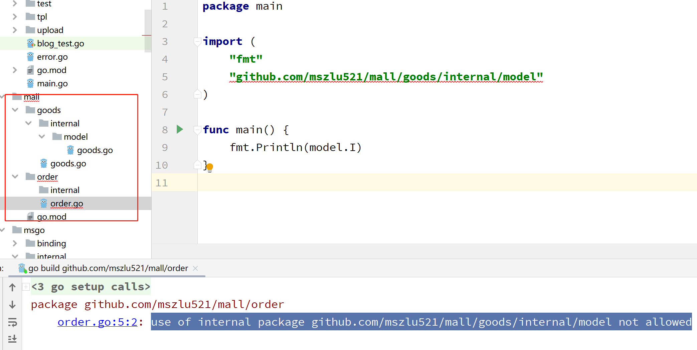

# 工程化实践

> 首先明确在go中，每一个目录都是一个包，每一个包都是一等公民，所以要合理的设置目录

## 1. internal

internal 目录下的包，不允许被其他项目中进行导入，这是在 Go 1.4 当中引入的 feature，会在编译时执行

所以如果有不想被其他项目或者模块引入的函数，方法，变量等，都可以放入此包下。

## 2. config

> 基本上每个项目都会涉及到配置文件，可以将其放在config目录下

## 3. main.go

> main.go做为程序的入口，应该放在哪？

如果是单体项目或者简单的项目将`main.go` 放在根目录下即可

如果是复杂的项目，将其以`cmd/应用名称/main.go`形式构建

## 4. api

> 接口层单独定义出来，用于定义对外访问的接口

比如grpc可以放置对应的proto文件，比如restful风格接口定义

## 5. pkg

> 相较于internal，pkg代表的意义更多的指向公用，开放

这层是存放主要业务逻辑代码的，主要将其分为五层，domain，service，repo，model，dao

* domain ：业务逻辑组装，是写业务的主要地方
* service： api服务层，主要做领域实体的 转换，比如DTO->DO 
* repo：存储层，定义数据访问，比如cache，db的封装
* model：模型层，定义了DTO，DO，BO，VO，PO等
* dao：数据层，对数据库的直接操作

**注意**：以上目录也可以放入internal中，防止外部访问

* `DO: ` Domain Object 领域对象，比如数据库映射
* `DTO：`Data Transfer Object，数据传输对象，比如api接收用户的参数或者响应或者服务和服务之间传递数据
* `VO：`view object，其实就是将页面中需要展示的数据封装在VO里面。
* `PO：` 然后将PO作为persistence object，持久对象，一个PO对应一张表
* `BO：`service组件对外可以返回这个BO，这个BO的话呢是包含业务逻辑的，不光是包含一堆数据和getter和setter方法，还包括了这个很多的业务逻辑方法

## 6. 其他

## 7. 规范

* 依赖倒置

  不同层之间调用为抽象的接口

  ~~~go
  package message
  
  import "context"
  
  type Message struct {
  	Msg string
  }
  
  type Sender interface {
  	Send(ctx context.Context, message *Message)
  }
  
  ~~~

* 依赖注入

  依赖注入（DI，Dependency Injection）指的是实现控制反转（IOC，Inversion of Control）的一种方式，其实很好理解就是内部依赖什么，不要在内部创建，而是通过参数由外部注入。

* 内部封装

  高内聚低耦合

  合理的抽象函数等，让代码变的更加简洁。

> 目录要划分好，代码写在规定的目录内
>
> 提前做接口定义，上下层直接调用接口
