# 微服务初探

## 1. 架构变迁之路

### 1.1 单体架构

互联网早期，一般的网站应用流量较小，只需要一个应用，将所有的功能代码都部署在一起就可以，这样可以减少开发，部署和维护的成本。

比如说一个电商系统，里面包含用户管理，商品管理，订单管理，物流管理等，我们把它做成一个web项目，并打包，部署在一个web容器上。

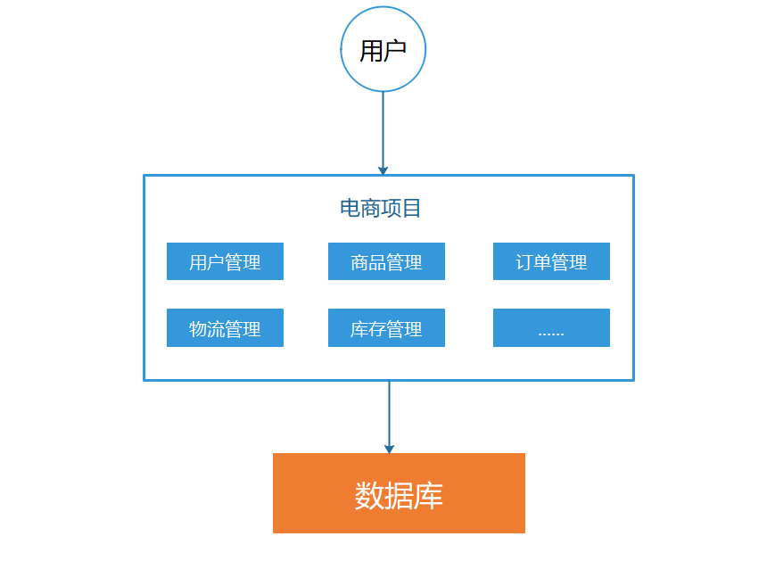

优点：

1. 项目架构简单，适合小型项目，开发成本低
2. 项目部署在一个节点上，维护方便

缺点：

1. 全部功能集成在一个工程中，对大型项目来说，不易开发和维护
2. 项目模块之间紧密耦合，单点容错率低
3. 无法针对不同模块进行针对性优化和水平扩展

### 1.2 垂直架构

随着访问量的逐渐增大，单一应用只能依靠增加节点来应对，但是这时候你会发现，并不是所有的模块都会有比较大的访问量。

以电商系统为例子，用户访问量的增加会影响用户管理模块和订单模块等，对营销管理，运营管理系统等可能影响较小，这时候我们希望只增加用户管理和订单管理的节点，但是单体应用架构无法做到，这时候垂直应用架构诞生了。

所谓的垂直应用架构，就是将原来的一个应用拆分成互不相干的几个应用，以提升效率。

比如我们可以对电商系统进行拆分：

1. 电商系统（用户管理，订单管理，商品管理等）
2. 运营管理系统（商家管理，活动管理，客服系统，订单管理，用户管理，商品管理等）
3. CMS系统（广告系统，营销管理等）

这样拆分完成之后，一旦用户的访问量变大，只需要增加电商系统的节点就可以了，而无需增加运营管理系统和CMS系统的节点。

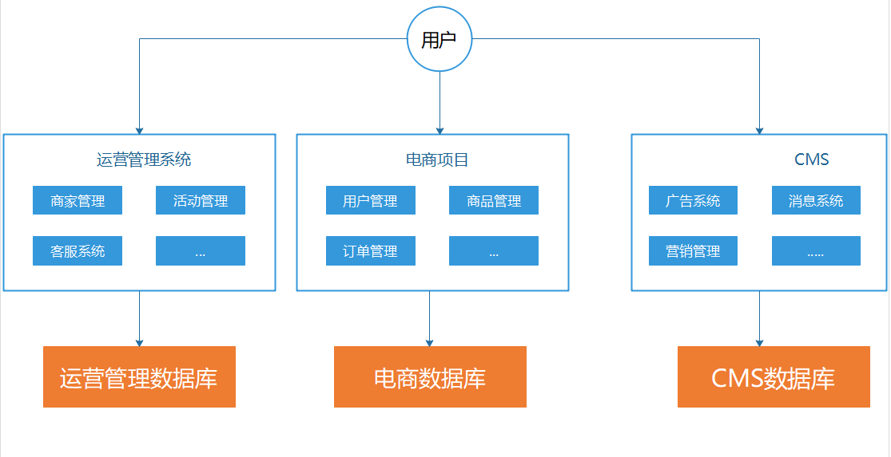

### 1.3 SOA架构

当垂直应用越来越多，重复的业务代码就会越来越多。

比如运营管理系统也需要对订单，用户，商品等做管理。

营销管理中也需要对订单做相关的调用。

这时候，我们就思考可不可以将重复的代码抽取出来，做成统一的业务层做为独立的服务，然后由前端控制层调用不同的业务层服务呢？

这就是分布式架构，服务层可以部署集群，多个服务集群共同组成一个完整的应用。

在分布式架构下，当服务越来越多，需增加一个调度中心对集群进行管理。

在SOA（面向服务的体系结构）架构中，通常这个调度中心被称为注册中心。服务层将服务注册在注册中心，表现层只需要向注册中心索要服务地址即可，负载均衡，心跳检测等都由注册中心(SOA架构的核心)来实现。

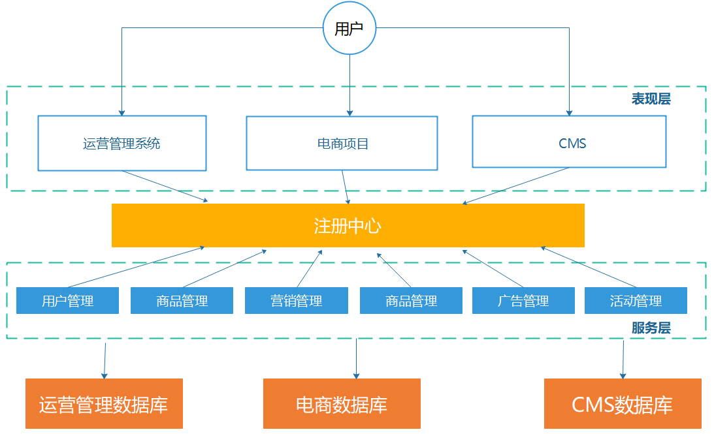

优点：

1. 使用注册中心，解决了服务间的调用关系
2. 扩展也大大增强

缺点：

1. 服务和服务之间有耦合，比如说多个服务使用同一个数据库服务
2. 服务关系复杂，无法独立执行，部署，增加了运维和测试的难度
3. 服务的边界不明显，重复代码，耦合性仍旧存在

### 1.4 微服务架构

微服务架构从某种程度上来说，是对SOA架构的延伸，它强调服务的彻底拆分。

服务原子化。每一个服务都可以独立部署，独立运行，独立升级，独立扩展，有自己的数据库服务。

此时的服务称为“微服务”。

现代微服务的定义：**微服务是一种通过多个小型服务组合来构建单个应用的架构风格，这些服务围绕业务能力而非特定的技术标准来构建。各个服务可以采用不同的编程语言，不同的数据存储技术，运行在不同的进程之中。服务采取轻量级的通信机制和自动化的部署机制实现通信与运维**

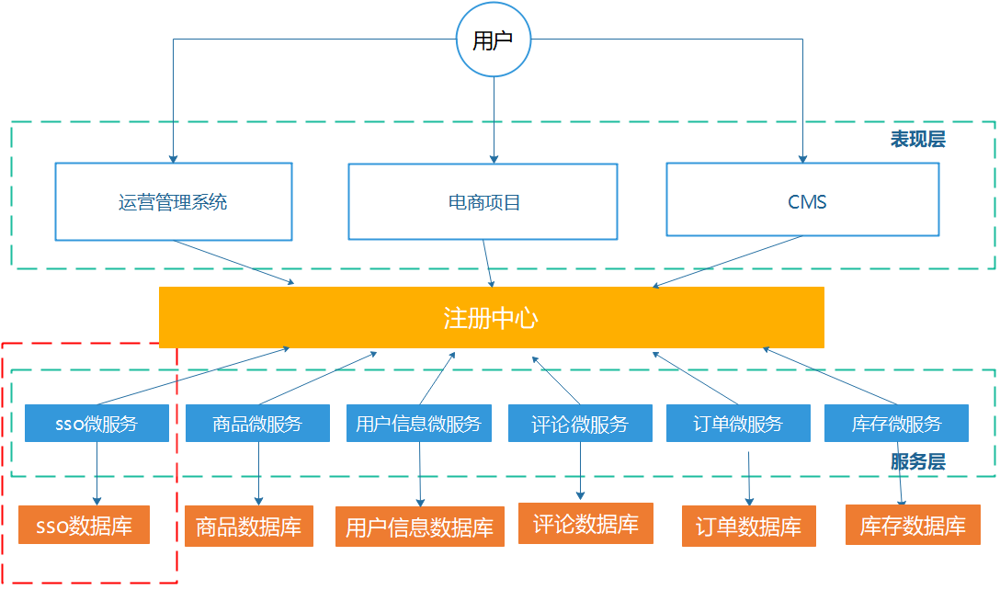

优点：

1. 服务原子化，每个服务任务清晰，易于扩展维护

缺点：

1. 维护成本过高（容错，分布式事务等）

### 1.5 服务网格

传统微服务的问题：

* 过于绑定特定技术栈 当面对异构系统时，需要花费大量精力来进行代码的改造，不同异构系统可能面临不同的改造。
* 代码侵入度过高 开发者往往需要花费大量的精力来考虑如何与框架或 SDK 结合，并在业务中更好的深度融合，对于大部分开发者而言都是一个高曲线的学习过程。
* 多语言支持受限 微服务提倡不同组件可以使用最适合它的语言开发，但是传统微服务框架，如 Spring Cloud 则是 Java 的天下，多语言的支持难度很大。这也就导致在面对异构系统对接时的无奈，或选择退而求其次的方案了

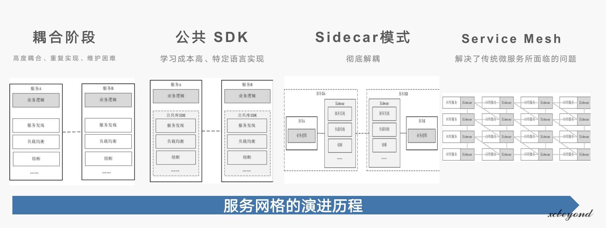

为了解决传统微服务面临的问题，以应对全新的挑战，微服务架构也进一步演化，最终催生了服务网格（Service Mesh）的出现，迎来了新一代微服务架构，也被称为下一代微服务。

* 耦合阶段：高度耦合、重复实现、维护困难，在耦合架构设计中体现的最为突出，单体架构就是典型的代表。
* 公共 SDK：让基础设施功能设计成为公共 SDK，提高利用率，是解藕最有效的途径，比如 Spring Cloud 就是类似的方式。但学习成本高、特定语言实现，却将一部分人拦在了门外。
* Sidecar 模式：再次深度解藕，不单单功能解藕，更从跨语言、更新发布和运维等方面入手，实现对业务服务的零侵入，更解藕于开发语言和单一技术栈，实现了完全隔离，为部署、升级带来了便利，做到了真正的基础设施层与业务逻辑层的彻底解耦。另一方面，Sidecar 可以更加快速地为应用服务提供更灵活的扩展，而不需要应用服务的大量改造。
* Service Mesh：把 Sidecar 模式充分应用到一个庞大的微服务架构系统中来，为每个应用服务配套部署一个 Sidecar 代理，完成服务间复杂的通信，最终就会得到一个的网络拓扑结构，这就是 Service Mesh，又称之为“服务网格“。它从本质上解决了传统微服务所面临的问题。

### 1.6 Serverless

`Serverless`又名无服务器,所谓无服务器并非是说不需要依赖和依靠服务器等资源,而是开发者再也不用过多考虑服务器的问题,可以更专注在产品代码上。

`Serverless`是一种软件系统架构的思想和方法，它不是软件框架、类库或者工具。它与传统架构的不同之处在于，完全由第三方管理，由事件触发，存在于无状态(`Stateless`)、 暂存(可能只存在于一次调用的过程中)计算容器内。

- FAAS：函数及服务，通俗来说就是我们可以写一个函数，在该函数内执行业务逻辑，函数由fass平台运行
- BAAS：后端及服务，通常指云服务，该云服务常指中间件服务

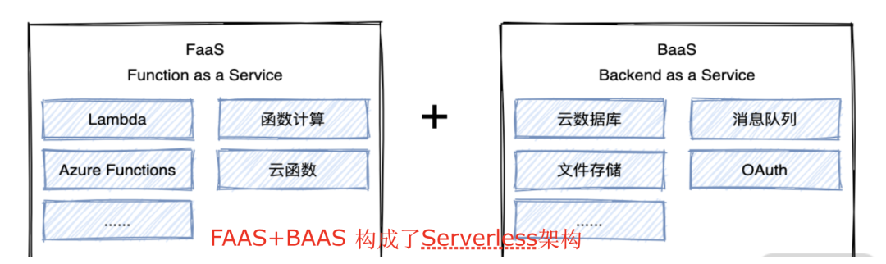

**为什么要有ServerLess？**

* 开发时，仍旧需要关注无关业务的事情，比如机器资源弹性伸缩，调用服务的稳定性，考虑运行环境等
* 运维需要考虑上线资源申请，软件安装，维护，上线流程构建等
* 前后端分离场景下，前端人员也需要考虑服务器环境。比如扩缩容，性能，监控，限流等

Serverless 应用本质上是由一个个 FaaS 函数组成的，Serverless 应用的每一次运行，其实是单个或多个函数的运行，所以 **Serverelss** 的运行原理，本质上就是函数的运行原理。

我们开发应用时，只需要调用云函数即可，不用在关心其他，函数计算会为您准备好计算资源，以弹性、可靠的方式运行您的代码，并提供日志查询，性能监控，报警等功能。

### 1.7 云原生

云原生技术有利于各组织在公有云、私有云和混合云等新型动态环境中,构建和运行可弹性扩展的应用。云原生的代表技术包括

`容器`
`服务网格`
`微服务`
`不可变基础设施`
`声明式API`

**容器：**代表[docker 教程地址](https://www.bilibili.com/video/BV1rL411A7uC/)，k8s等

**不可变基础设施：**服务器在部署后永远不会被修改。如果需要以任何方式更新,修复或修改某些内容,则会根据具有相应更改的公共映像构建新服务器以替换旧服务器。经过验证后,它们就会投入使用,而旧的则会退役。这样使得部署更加可靠，简单。

**声明式API：**只需要提交一个定义好的`API`对象来“声明”表示所期望的最终状态是什么样子就可以了。如果提交的是一个个命令,去指导怎么一步一步达到期望状态,这就是“命令式”了。可以说,声明式API是Kubernetes项目编排能力“赖以生存”的核心所在。**针对期望状态结果给出声明,而不是过程**

云原生是以`Kubernetes`为核心，周边围绕着的一系列开源软件，组成的一整个生态。

## 2. 微服务概念

> 在微服务架构下，由于其服务过多，为了保证其稳定性，健壮性，可用性等，需要引入以下定义：

* 服务治理

  服务治理就是进行服务的自动化管理，其核心是服务的自动注册与发现。

  **服务注册：**  服务实例将自身服务信息注册到注册中心。

  **服务发现：**  服务实例通过注册中心，获取到注册到其中的服务实例的信息，通过这些信息去请求它们提供的服务。

  **服务剔除：**  服务注册中心将出问题的服务自动剔除到可用列表之外，使其不会被调用到。

  

* 服务调用

  在微服务架构中，通常存在多个服务之间的远程调用需求。

  目前主流的远程调用技术有基于HTTP的RESTFUL接口和基于TCP的RPC协议。

  1. REST： 这是一种HTTP的调用格式，更标准，更通用，无论哪种语言都支持http协议。
  2. RPC： 一种进程间的通信方式。允许像调用本地服务一样调用远程服务。RPC框架的主要作用就是让远程服务调用更简单，透明。RPC框架负责屏蔽底层的传输方式，序列化方式和通信细节。开发人员在使用的时候只需要了解谁在什么位置提供了什么样的远程服务接口即可，并不需要关心底层通信细节和调用过程。

  区别与联系：

  | 比较项   | Restful | RPC         |
  | -------- | ------- | ----------- |
  | 通讯协议 | HTTP    | 一般使用TCP |
  | 性能     | 略低    | 较高        |
  | 灵活度   | 高      | 较高        |

  

* 服务网关

  随着微服务的不断增多，不同的微服务一般会有不同的网络地址，而外部客户端可能需要调用多个服务的接口才能完成一个业务需求，如何让客户端直接与各个微服务通信可能出现：

  1. 客户端需要调用不同的url地址，增加难度
  2. 在一定的场景下，存在跨域请求的问题
  3. 每个微服务都需要单独进行身份认证
  4. 微服务可能使用的协议不同，客户端需要进行适配
  5. 客户端需要自己实现负载均衡
  6. ....

  针对这些问题，API网关顺势而生。

  API网关字面意思上理解，是将所有的API调用都接入到API网关，由网关层统一接入和输出。

  一个网关的基本功能有：

  1. 统一接入
  2. 安全防护
  3. 协议适配
  4. 流量管控
  5. 长短链接支持
  6. 容错能力
  7. 负载均衡

  有了网关之后，各个API服务提供团队可以专注于自己的业务逻辑处理，而API网关更专注于安全，流量，路由等问题。

  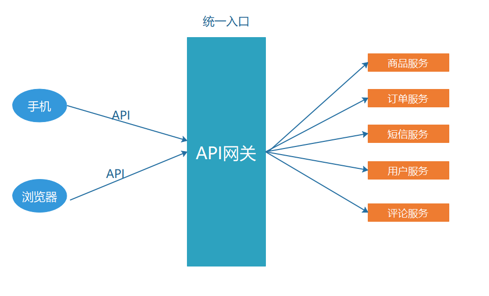

* 服务容错

  在微服务当中，一个请求经常会设计调用几个服务，如果其中某个服务不可用，没有做服务容错的话，极有可能会造成一连串的服务不可用，这就是雪崩效应。

  **我们没法预防雪崩效应的发生，只能尽可能去做好容错。**

  服务容错的三个核心思想：

  1. 不被外界环境影响
  2. 不被上游请求压垮
  3. 不被下游响应拖垮

  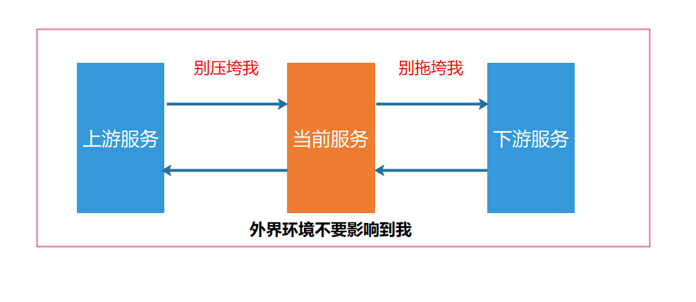

* 链路追踪等

  随着微服务架构的流行，服务按照不同的维度进行拆分，一次请求往往需要涉及多个服务。互联网应用构建在不同的软件模块集上，这些软件模块，有可能是由不同的团队开发，可能使用不同的编程语言来实现，有可能部署在了几千台，上万台服务器上，横跨多个不同的数据中心。

  因此需要对一次请求涉及的多个服务链路进行日志记录，性能监控。

  这就是链路追踪。

## 3. nacos

地址：https://nacos.io/zh-cn/index.html

一个更易于构建云原生应用的动态服务发现、配置管理和服务管理平台

阿里巴巴开源产品，java开发，目前国内最为流行的微服务组件之一。

## 4. Consul

Consul是一个**服务网格**解决方案，提供了一个功能齐全的控制平面，具有服务发现、配置和分段功能。这些功能中的每一项都可以根据需要单独使用，也可以一起使用来构建一个完整的**服务网格**。Consul需要一个数据平面，并支持代理和原生集成模型。Consul提供了一个简单的内置代理，因此一切都可以开箱即用，但也支持第三方代理集成，如**Envoy**。

地址：https://www.consul.io/

文档：https://yushuai-w.gitbook.io/consul/intro

国外用的比较多，*Consul* 所在的 HashiCorp ，旗下的有些软件不允许中国使用，虽然不包括Consul，但国内使用并不太多。

## 5. grpc

[grpc视频教程地址](https://www.bilibili.com/video/BV16Z4y117yz/)

gRPC是Google的开源产品，是跨语言的通用型RPC框架，基于[HTTP2](https://http2.github.io/)协议标准设计开发，默认采用[Protocol Buffers](https://developers.google.com/protocol-buffers/)数据序列化协议，支持多种开发语言。gRPC提供了一种简单的方法来精确的定义服务，并且为客户端和服务端自动生成可靠的功能库。

地址：https://www.grpc.io/docs/what-is-grpc/introduction/

在gRPC客户端可以直接调用不同服务器上的远程程序，使用姿势看起来就像调用本地程序一样，很容易去构建分布式应用和服务。和很多RPC系统一样，服务端负责实现定义好的接口并处理客户端的请求，客户端根据接口描述直接调用需要的服务。客户端和服务端可以分别使用gRPC支持的不同语言实现。

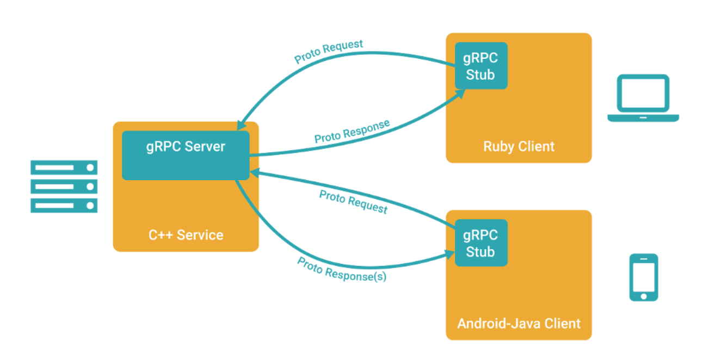

- 强大的IDL

  gRPC使用ProtoBuf来定义服务，ProtoBuf是由Google开发的一种数据序列化协议（类似于XML、JSON、hessian）。ProtoBuf能够将数据进行序列化，并广泛应用在数据存储、通信协议等方面。

- 多语言支持

  gRPC支持多种语言，并能够基于语言自动生成客户端和服务端功能库。目前已提供了C版本grpc、Java版本grpc-java 和 Go版本grpc-go，其它语言的版本正在积极开发中，其中，grpc支持C、C++、Node.js、Python、Ruby、Objective-C、PHP和C#等语言，grpc-java已经支持Android开发。

- HTTP2

  gRPC基于HTTP2标准设计，所以相对于其他RPC框架，gRPC带来了更多强大功能，如双向流、头部压缩、多复用请求等。这些功能给移动设备带来重大益处，如节省带宽、降低TCP链接次数、节省CPU使用和延长电池寿命等。同时，gRPC还能够提高了云端服务和Web应用的性能。gRPC既能够在客户端应用，也能够在服务器端应用，从而以透明的方式实现客户端和服务器端的通信和简化通信系统的构建。

## 6. grpc-gateway

  地址：https://github.com/grpc-ecosystem/grpc-gateway

​	 通过protobuf的自定义option实现了一个网关，服务端同时开启gRPC和HTTP服务，HTTP服务接收客户端请求后转换为grpc请求数据，获取响应后转为json数据返回给客户端。

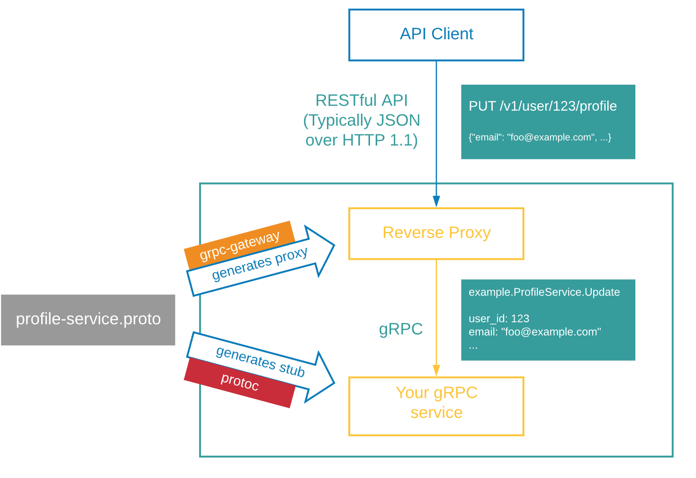

## 7. sentinel-go

地址：https://github.com/alibaba/sentinel-golang

随着微服务的流行，服务和服务之间的稳定性变得越来越重要。Sentinel 是面向分布式、多语言异构化服务架构的流量治理组件，主要以流量为切入点，从流量路由、流量控制、流量整形、熔断降级、系统自适应过载保护、热点流量防护等多个维度来帮助开发者保障微服务的稳定性。

## 8. Lura 

可扩展的，简单且无状态的高性能API网关框架

地址：https://github.com/luraproject/lura

Linux基金会孵化项目。

## 9. Jaeger

Jaeger是一款广受欢迎的开源分布式链路跟踪系统，兼容OpenTracing API，且已加入CNCF开源组织。其主要功能是聚合来自各个异构系统的实时监控数据。对一些常用的框架通过插件可以达到无侵入式跟踪

地址：https://www.jaegertracing.io/ ，go语言开发

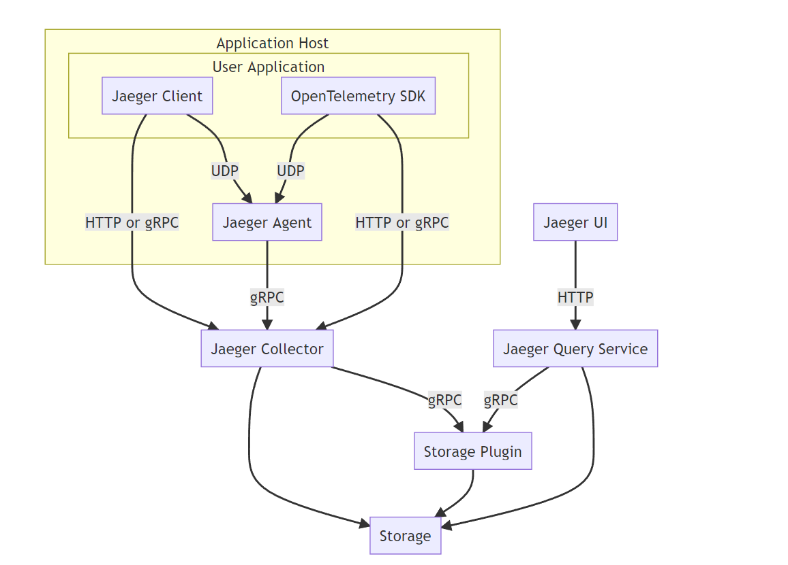

## 10. prometheus

Prometheus 是一套开源的系统监控报警框架。它受启发于 Google 的 Brogmon 监控系统，由工作在 SoundCloud 的前 google 员工在 2012 年创建，作为社区开源项目进行开发，并于 2015 年正式发布。

2016 年，Prometheus 正式加入 Cloud Native Computing Foundation（CNCF）基金会的项目，成为受欢迎度仅次于 Kubernetes 的项目。2017 年底发布了基于全新存储层的 2.0 版本，能更好地与容器平台、云平台配合。

docker+k8s+prometheus（普罗米修斯） 号称容器时代的三剑客。

地址：https://github.com/prometheus/prometheus

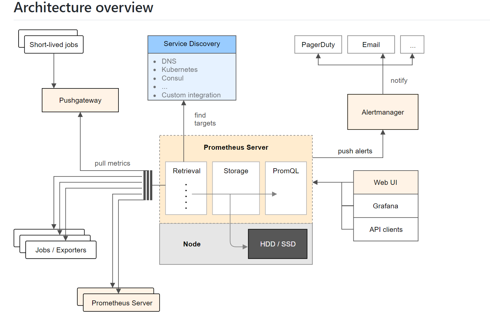

## 11. seata

Seata 是一款开源的分布式事务解决方案，致力于在微服务架构下提供高性能和简单易用的分布式事务服务。

地址：https://github.com/opentrx/seata-golang

## 12. DTM

地址：https://github.com/dtm-labs/dtm

DTM是一款变革性的分布式事务框架，提供了傻瓜式的使用方式，极大的降低了分布式事务的使用门槛，改变了“能不用分布式事务就不用”的行业现状，优雅的解决了服务间的数据一致性问题。

Saga是分布式事务领域最有名气的解决方案之一，最初出现在1987年Hector Garcaa-Molrna & Kenneth Salem发表的论文[SAGAS](https%3A//www.cs.cornell.edu/andru/cs711/2002fa/reading/sagas.pdf)里。

Saga是由一系列的本地事务构成。每一个本地事务在更新完数据库之后，会发布一条消息或者一个事件来触发Saga中的下一个本地事务的执行。如果一个本地事务因为某些业务规则无法满足而失败，Saga会执行在这个失败的事务之前成功提交的所有事务的补偿操作。

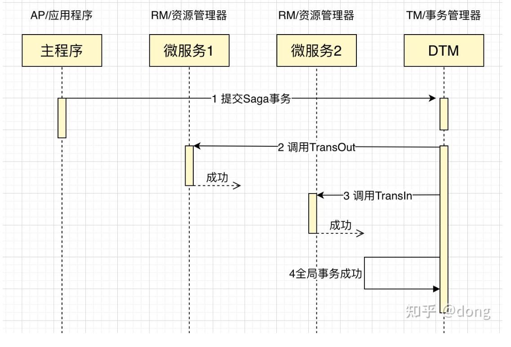

## 13. manba

地址：https://github.com/fagongzi/manba

Manba是一个基于HTTP协议的restful的API网关。可以作为统一的API接入层。

## 14. 微服务框架

1. https://github.com/asim/go-micro
2. https://github.com/zeromicro/go-zero
3. https://github.com/go-kratos/kratos

## 15. etcd

分布式，可靠的键值存储，可用于分布式系统中存储关键核心数据

地址：https://github.com/etcd-io/etcd
