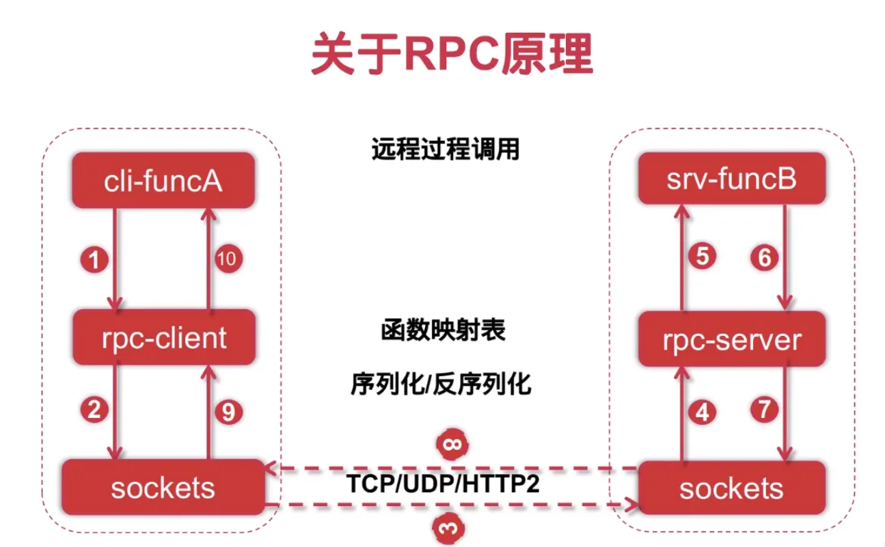
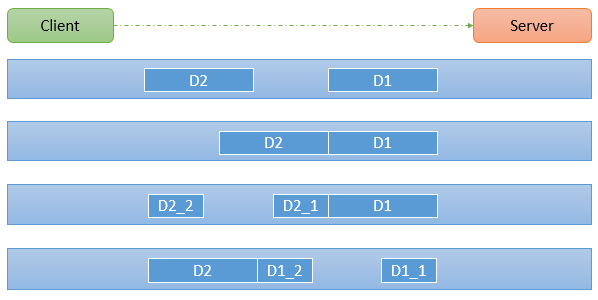

# RPC

RPC 框架是分布式领域核心组件，也是微服务的基础。

RPC （Remote Procedure Call）全称是远程过程调用，相对于本地方法调用，在同一内存空间可以直接通过方法栈实现调用，远程调用则跨了不同的服务终端，并不能直接调用。

RPC框架 要解决的就是远程方法调用的问题，并且实现调用远程服务像调用本地服务一样简单，框架内部封装实现了网络调用的细节。

## 1. 通信协议选择

根据不同的需求来选择通信协议，UDP是不可靠传输，一般来说很少做为RPC框架的选择。

TCP和HTTP是最佳选择。

HTTP虽然有很多无用的头部信息，传输效率上会比较低，但是HTTP通用性更强，跨语言，跨平台，更易移植。

TCP可靠传输，需要自定义协议，传输效率更高，但是通用性不强。

### 1.1  HTTP/1.0和HTTP/1.1的区别

HTTP1.0最早在网页中使用是在1996年，那个时候只是使用一些较为简单的网页上和网络请求上，而HTTP1.1则在1999年才开始广泛应用于现在的各大浏览器网络请求中，同时HTTP1.1也是当前使用最为广泛的HTTP协议。 主要区别主要体现在：

1. **缓存处理**，在HTTP1.0中主要使用header里的If-Modified-Since,Expires来做为缓存判断的标准，HTTP1.1则引入了更多的缓存控制策略例如Entity tag，If-Unmodified-Since, If-Match, If-None-Match等更多可供选择的缓存头来控制缓存策略。
2. **带宽优化及网络连接的使用**，HTTP1.0中，存在一些浪费带宽的现象，例如客户端只是需要某个对象的一部分，而服务器却将整个对象送过来了，并且不支持断点续传功能，HTTP1.1则在请求头引入了range头域，它允许只请求资源的某个部分，即返回码是206（Partial Content），这样就方便了开发者自由的选择以便于充分利用带宽和连接。
3. **错误通知的管理**，在HTTP1.1中新增了24个错误状态响应码，如409（Conflict）表示请求的资源与资源的当前状态发生冲突；410（Gone）表示服务器上的某个资源被永久性的删除。
4. **Host头处理**，在HTTP1.0中认为每台服务器都绑定一个唯一的IP地址，因此，请求消息中的URL并没有传递主机名（hostname）。但随着虚拟主机技术的发展，在一台物理服务器上可以存在多个虚拟主机（Multi-homed Web Servers），并且它们共享一个IP地址。HTTP1.1的请求消息和响应消息都应支持Host头域，且请求消息中如果没有Host头域会报告一个错误（400 Bad Request）。
5. **长连接**，HTTP 1.1支持长连接（PersistentConnection）和请求的流水线（Pipelining）处理，在一个TCP连接上可以传送多个HTTP请求和响应，减少了建立和关闭连接的消耗和延迟，在HTTP1.1中默认开启Connection： keep-alive，一定程度上弥补了HTTP1.0每次请求都要创建连接的缺点。

### 1.2 HTTP/1.1和HTTP/2的区别

- **新的二进制格式**（Binary Format），HTTP1.x的解析是基于文本。基于文本协议的格式解析存在天然缺陷，文本的表现形式有多样性，要做到健壮性考虑的场景必然很多，二进制则不同，只认0和1的组合。基于这种考虑HTTP2.0的协议解析决定采用二进制格式，实现方便且健壮。
- **多路复用**（MultiPlexing），即连接共享，即每一个request都是是用作连接共享机制的。一个request对应一个id，这样一个连接上可以有多个request，每个连接的request可以随机的混杂在一起，接收方可以根据request的 id将request再归属到各自不同的服务端请求里面。
- **header压缩**，如上文中所言，对前面提到过HTTP1.x的header带有大量信息，而且每次都要重复发送，HTTP2.0使用encoder来减少需要传输的header大小，通讯双方各自cache一份header fields表，既避免了重复header的传输，又减小了需要传输的大小。
- **服务端推送**（server push）HTTP2.0也具有server push功能。

> grpc采用了http2协议，由于http的通用性，所以现在的几乎所有的rpc框架都支持grpc

## 2. 序列化协议

数据在网络中传输，必须是二进制的，所以我们需要先将传输的对象进行序列化之后，才能传输。

接收方通过反序列化将数据解析出来。

序列化协议有XML、 JSON、Protobuf、Thrift 等，Golang 原生支持的 Gob 协议。

## 3. 编解码

如果使用TCP，我们需要定义数据传输的格式，防止在传输过程中出现的粘包，拆包等问题。

假设客户端分别发送了两个数据包D1和D2给服务端，由于服务端一次读取到字节数是不确定的，故可能存在以下四种情况：

1. 服务端分两次读取到了两个独立的数据包，分别是D1和D2，没有粘包和拆包
2. 服务端一次接受到了两个数据包，D1和D2粘合在一起，称之为`TCP粘包`
3. 服务端分两次读取到了数据包，第一次读取到了完整的D1包和D2包的部分内容，第二次读取到了D2包的剩余内容，这称之为`TCP拆包`
4. 服务端分两次读取到了数据包，第一次读取到了D1包的部分内容D1_1，第二次读取到了D1包的剩余部分内容D1_2和完整的D2包。

**特别要注意的是，如果TCP的接受`滑窗`非常小，而数据包D1和D2比较大，很有可能会发生第五种情况，即服务端分多次才能将D1和D2包完全接收，期间发生`多次拆包`。**

自定义格式可以`使用定长的头和不定长的体，标识数据长度即可`。

|         1字节          |      1字节      |          4字节          |          1字节          | 1字节                | 1字节                   | 8字节               | 不定           |
| :--------------------: | :-------------: | :---------------------: | :---------------------: | -------------------- | ----------------------- | ------------------- | -------------- |
| 魔法数（Magic Number） | 版本（Version） | 消息长度（full length） | 消息类型（messageType） | 压缩类型（compress） | 序列化类型（serialize） | 请求id（requestId） | 请求体（body） |

* magic number : 通信双方协商的一个暗号 魔数的作用是用于服务端在接收数据时先解析出魔数做正确性对比。如果和协议中的魔数不匹配，则认为是非法数据
* version : 不同版本的协议对应的解析方法可能是不同的，应对业务变化需求
* full length： 记录了整个消息的长度
* messageType：普通请求、普通响应、心跳等，根据消息类型做出不同的解析
* compress： 序列化的字节流，还可以进行压缩，使得体积更小，在网络传输更快，不一定要使用
* serialize：序列化方式，比如json，protostuff，glob等
* request id：每个请求分配好请求Id，这样响应数据的时候，才能对的上
* body：具体的数据

## 4. 实现

### 4.1 http方式

~~~go
package rpc

import (
	"bufio"
	"bytes"
	"encoding/json"
	"errors"
	"fmt"
	"io"
	"net/http"
	"net/url"
	"strings"
	"time"
)

type MsHttpClient struct {
	client http.Client
}

// NewHttpClient Transport请求分发，协程安全，支持连接池s
func NewHttpClient() *MsHttpClient {
	client := http.Client{
		Timeout: time.Duration(3) * time.Second,
		Transport: &http.Transport{
			MaxIdleConnsPerHost:   5,
			MaxConnsPerHost:       100,
			IdleConnTimeout:       90 * time.Second,
			TLSHandshakeTimeout:   10 * time.Second,
			ExpectContinueTimeout: 1 * time.Second,
		},
	}
	return &MsHttpClient{client: client}
}

func (c *MsHttpClient) GetRequest(method string, url string, args map[string]any) (*http.Request, error) {
	if args != nil && len(args) > 0 {
		url = url + "?" + c.toValues(args)
	}
	req, err := http.NewRequest(method, url, nil)
	if err != nil {
		return nil, err
	}
	return req, nil
}

func (c *MsHttpClient) FormRequest(method string, url string, args map[string]any) (*http.Request, error) {
	req, err := http.NewRequest(method, url, strings.NewReader(c.toValues(args)))
	if err != nil {
		return nil, err
	}
	return req, nil
}

func (c *MsHttpClient) JsonRequest(method string, url string, args map[string]any) (*http.Request, error) {
	jsonStr, _ := json.Marshal(args)
	req, err := http.NewRequest(method, url, bytes.NewReader(jsonStr))
	if err != nil {
		return nil, err
	}
	return req, nil
}

func (c *MsHttpClient) Get(url string, args map[string]any) ([]byte, error) {
	if args != nil && len(args) > 0 {
		url = url + "?" + c.toValues(args)
	}
	req, err := http.NewRequest("GET", url, nil)
	if err != nil {
		return nil, err
	}
	return c.handleResponse(req)
}

func (c *MsHttpClient) PostForm(url string, args map[string]any) ([]byte, error) {
	req, err := http.NewRequest("POST", url, strings.NewReader(c.toValues(args)))
	if err != nil {
		return nil, err
	}
	return c.handleResponse(req)
}

func (c *MsHttpClient) PostJson(url string, args map[string]any) ([]byte, error) {
	jsonStr, _ := json.Marshal(args)
	req, err := http.NewRequest("POST", url, bytes.NewReader(jsonStr))
	if err != nil {
		return nil, err
	}
	return c.handleResponse(req)
}

func (c *MsHttpClient) Response(req *http.Request) ([]byte, error) {
	return c.handleResponse(req)
}
func (c *MsHttpClient) handleResponse(req *http.Request) ([]byte, error) {
	var err error
	response, err := c.client.Do(req)
	if err != nil {
		return nil, err
	}
	if response.StatusCode != 200 {
		return nil, errors.New(response.Status)
	}
	buffLen := 79
	buff := make([]byte, buffLen)
	body := make([]byte, 0)
	reader := bufio.NewReader(response.Body)
	for {
		n, err := reader.Read(buff)
		if err == io.EOF || n == 0 {
			break
		}
		body = append(body, buff[:n]...)
		if n < buffLen {
			break
		}
	}
	defer response.Body.Close()
	if err != nil {
		return nil, err
	}
	return body, nil
}

func (c *MsHttpClient) toValues(args map[string]any) string {
	if args != nil && len(args) > 0 {
		params := url.Values{}
		for k, v := range args {
			params.Set(k, fmt.Sprintf("%v", v))
		}
		return params.Encode()
	}
	return ""
}

~~~

ordercenter：

~~~go
package main

import (
	"encoding/json"
	"fmt"
	"github.com/mszlu521/msgo"
	"github.com/mszlu521/msgo/rpc"
	"net/http"
)

type Result struct {
	Code int    `json:"code"`
	Msg  string `json:"msg"`
	Data any    `json:"data"`
}

type Goods struct {
	Id   int64  `json:"id"`
	Name string `json:"name"`
}

func main() {

	engine := msgo.Default()
	client := rpc.NewHttpClient()
	g := engine.Group("order")
	g.Get("/find", func(ctx *msgo.Context) {
		//查询商品
		bytes, err := client.Get("http://localhost:9002/goods/find", nil)
		if err != nil {
			ctx.Logger.Error(err)
		}
		fmt.Println(string(bytes))
		v := &Result{}
		json.Unmarshal(bytes, v)
		ctx.JSON(http.StatusOK, v)
	})
	engine.Run(":9003")
}

~~~

goodsCenter：

~~~go
package main

import (
	"github.com/mszlu521/msgo"
	"net/http"
)

type Result struct {
	Code int    `json:"code"`
	Msg  string `json:"msg"`
	Data any    `json:"data"`
}

type Goods struct {
	Id   int64  `json:"id"`
	Name string `json:"name"`
}

func main() {

	engine := msgo.Default()
	g := engine.Group("goods")
	g.Get("/find", func(ctx *msgo.Context) {
		//查询商品
		goods := Goods{Id: 1000, Name: "商品中心9001商品"}
		ctx.JSON(http.StatusOK, &Result{Code: 200, Msg: "success", Data: goods})
	})
	engine.Run(":9002")
}

~~~

### 4.2 改造http方式

config:

~~~go
package rpc

import "strconv"

type Config struct {
	Protocol string
	Host     string
	Port     int
	Ssl      bool
}

func (c Config) Url() string {
	switch c.Protocol {
	case HTTP, HTTP2:
		prefix := "http://"
		if c.Ssl {
			prefix = "https://"
		}
		return prefix + c.Host + ":" + strconv.FormatInt(int64(c.Port), 10)
	}
	return ""
}

const (
	HTTP  = "HTTP"
	HTTP2 = "HTTP2"
	TCP   = "TCP"
)

const (
	GET      = "GET"
	POSTForm = "POST_FORM"
	POSTJson = "POST_JSON"
)

~~~

rpc.go:

~~~go
package rpc

type MsService interface {
	Env() Config
}

~~~

~~~go

func (c *MsHttpClient) Use(name string, s MsService) {
	if c.serviceMap == nil {
		c.serviceMap = make(map[string]MsService)
	}
	c.serviceMap[name] = s
}

func (c *MsHttpClient) Do(name string, method string) MsService {
	s, ok := c.serviceMap[name]
	if !ok {
		panic(errors.New(name + " not exist, please action"))
	}
	t := reflect.TypeOf(s)
	v := reflect.ValueOf(s)
	if t.Kind() != reflect.Pointer {
		panic(errors.New("service must be pointer"))
	}
	tVar := t.Elem()
	vVar := v.Elem()
	findIndex := -1
	for i := 0; i < tVar.NumField(); i++ {
		field := tVar.Field(i)
		name := field.Name
		if method == name {
			findIndex = i
		}
	}
	if findIndex == -1 {
		panic(errors.New(method + " not exist"))
	}
	requestPath := tVar.Field(findIndex).Tag.Get("msrpc")
	if requestPath == "" {
		panic(errors.New("msrpc tag not exist"))
	}
	split := strings.Split(requestPath, ",")
	mt := split[0]
	path := split[1]
	co := s.Env()
	prefix := co.Url()
	f := func(args map[string]any) ([]byte, error) {
		if mt == GET {
			return c.Get(prefix+path, args)
		}
		if mt == POSTForm {
			return c.PostForm(prefix+path, args)
		}
		if mt == POSTJson {
			return c.PostJson(prefix+path, args)
		}
		return nil, nil
	}
	value := reflect.ValueOf(f)
	vVar.Field(findIndex).Set(value)
	return s
}

~~~

goods:

~~~go
package service

import (
	"github.com/mszlu521/msgo/rpc"
)

type Goods struct {
	Id   int64  `json:"id"`
	Name string `json:"name"`
}

type GoodsService struct {
	Find func(args map[string]any) ([]byte, error) `msrpc:"GET,/goods/find"`
}

func (r *GoodsService) Env() rpc.Config {
	c := rpc.Config{
		Host:     "localhost",
		Port:     9002,
		Protocol: rpc.HTTP,
	}
	return c
}

~~~

~~~go
package main

import (
	"encoding/json"
	"fmt"
	"github.com/mszlu521/msgo"
	"github.com/mszlu521/msgo/rpc"
	"github.com/mszlu521/ordercenter/model"
	"github.com/mszlu521/ordercenter/service"
	"net/http"
)

func main() {
	engine := msgo.Default()
	client := rpc.NewHttpClient()
	g := engine.Group("order")
	goodsService := &service.GoodsService{}
	client.Use("goodsService", goodsService)
	g.Get("/find", func(ctx *msgo.Context) {
		//查询商品
		v := &model.Result{}
		bytes, err := client.Do("goodsService", "Find").(*service.GoodsService).Find(nil)
		if err != nil {
			ctx.Logger.Error(err)
		}
		fmt.Println(string(bytes))
		json.Unmarshal(bytes, v)
		ctx.JSON(http.StatusOK, v)
	})
	engine.Run(":9003")
}

~~~

> 通过上述改造，我们可以比较轻易的使用框架，来实现http方式的rpc调用

**记住：框架的目的是易用，但同时需要遵守规则，所以定义规则也是框架的一部分**

### 4.3 http2（grpc）方式

有关grpc的使用可以先去看教程，[教程地址](https://www.bilibili.com/video/BV16Z4y117yz/)

~~~go
go get google.golang.org/grpc
~~~

~~~go
protoc  --go_out=./ --go-grpc_out=./  .\api\goods.proto
~~~

goodscenter服务端：

~~~go
syntax = "proto3";

//import "google/protobuf/any.proto";

option go_package="/api";

package api;

service GoodsApi {
  rpc Find(GoodsRequest) returns (GoodsResponse);
}

message GoodsRequest {

}

message GoodsResponse {
  int64 Code = 1;
  string Msg = 2;
  Goods Data = 3;
}

message Goods {
  int64 Id = 1;
  string Name = 2;
}
~~~

~~~go
package service

import (
	"context"
	"github.com/mszlu521/goodscenter/api"
)

type GoodsApiService struct {
}

func (GoodsApiService) Find(context.Context, *api.GoodsRequest) (*api.GoodsResponse, error) {
	goods := &api.Goods{Id: 1000, Name: "商品中心9002商品,grpc提供"}
	res := &api.GoodsResponse{
		Code: 200,
		Msg:  "success",
		Data: goods,
	}
	return res, nil
}
func (GoodsApiService) mustEmbedUnimplementedGoodsApiServer() {}

~~~

grpc服务端：

~~~go
listen, _ := net.Listen("tcp", ":9111")
	server := grpc.NewServer()
	api.RegisterGoodsApiServer(server, &api.GoodsApiService{})
	err := server.Serve(listen)
	log.Println(err)
~~~

grpc客户端:

~~~go
g.Get("/findGrpc", func(ctx *msgo.Context) {
		//查询商品
		var serviceHost = "127.0.0.1:9111"
		conn, err := grpc.Dial(serviceHost, grpc.WithTransportCredentials(insecure.NewCredentials()))
		if err != nil {
			fmt.Println(err)
		}
		defer conn.Close()

		client := api.NewGoodsApiClient(conn)
		rsp, err := client.Find(context.TODO(), &api.GoodsRequest{})

		if err != nil {
			fmt.Println(err)
		}
		ctx.JSON(http.StatusOK, rsp)
	})
~~~

#### 4.3.1 形成框架工具

服务端：

~~~go
package rpc

import (
	"google.golang.org/grpc"
	"net"
)

type MsGrpcServer struct {
	listen     net.Listener
	grpcServer *grpc.Server
	registers  []func(grpcServer *grpc.Server)
	ops        []grpc.ServerOption
}

func NewGrpcServer(address string, ops ...MsGrpcOption) (*MsGrpcServer, error) {
	listen, err := net.Listen("tcp", address)
	if err != nil {
		return nil, err
	}
	ms := &MsGrpcServer{
		listen: listen,
	}
	for _, op := range ops {
		op.Apply(ms)
	}
	s := grpc.NewServer(ms.ops...)
	ms.grpcServer = s
	return ms, nil
}

func (s *MsGrpcServer) Run() error {
	for _, register := range s.registers {
		register(s.grpcServer)
	}
	return s.grpcServer.Serve(s.listen)
}

func (s *MsGrpcServer) Register(register func(grpServer *grpc.Server)) {
	s.registers = append(s.registers, register)
}

type MsGrpcOption interface {
	Apply(s *MsGrpcServer)
}

type DefaultGrpcOption struct {
	f func(s *MsGrpcServer)
}

func (d DefaultGrpcOption) Apply(s *MsGrpcServer) {
	d.f(s)
}

func WithGrpcOptions(options ...grpc.ServerOption) MsGrpcOption {
	return DefaultGrpcOption{f: func(s *MsGrpcServer) {
		s.ops = append(s.ops, options...)
	}}
}

~~~

~~~go、
   grpcServer, _ := rpc.NewGrpcServer(":9111")
	grpcServer.Register(func(grpServer *grpc.Server) {
		api.RegisterGoodsApiServer(grpServer, &api.GoodsApiService{})
	})
	err := grpcServer.Run()
~~~

~~~go

type MsGrpcClient struct {
	Conn *grpc.ClientConn
}

func NewGrpcClient(config *MsGrpcClientConfig) (*MsGrpcClient, error) {
	var ctx = context.Background()
	var dialOptions = config.dialOptions

	if config.Block {
		//阻塞
		if config.DialTimeout > time.Duration(0) {
			var cancel context.CancelFunc
			ctx, cancel = context.WithTimeout(ctx, config.DialTimeout)
			defer cancel()
		}
		dialOptions = append(dialOptions, grpc.WithBlock())
	}
	if config.KeepAlive != nil {
		dialOptions = append(dialOptions, grpc.WithKeepaliveParams(*config.KeepAlive))
	}
	conn, err := grpc.DialContext(ctx, config.Address, dialOptions...)
	if err != nil {
		return nil, err
	}
	return &MsGrpcClient{
		Conn: conn,
	}, nil
}

type MsGrpcClientConfig struct {
	Address     string
	Block       bool
	DialTimeout time.Duration
	ReadTimeout time.Duration
	Direct      bool
	KeepAlive   *keepalive.ClientParameters
	dialOptions []grpc.DialOption
}

func DefaultGrpcClientConfig() *MsGrpcClientConfig {
	return &MsGrpcClientConfig{
		dialOptions: []grpc.DialOption{
			grpc.WithTransportCredentials(insecure.NewCredentials()),
		},
		DialTimeout: time.Second * 3,
		ReadTimeout: time.Second * 2,
		Block:       true,
	}
}
~~~

### 4.4 TCP方式

> tcp方式就需要实现序列化，编解码等操作了

序列化协议支持两种：

Protobuf 和 go的Gob协议。

#### 4.4.1 server端

~~~go

type Serializer interface {
	Serialize(i interface{}) ([]byte, error)
	Deserialize(data []byte, i interface{}) error
}
type GobSerializer struct{}

func (c GobSerializer) Serialize(data any) ([]byte, error) {
	var buffer bytes.Buffer
	encoder := gob.NewEncoder(&buffer)
	if err := encoder.Encode(data); err != nil {
		return nil, err
	}
	return buffer.Bytes(), nil
}

func (c GobSerializer) Deserialize(data []byte, target any) error {
	buffer := bytes.NewBuffer(data)
	decoder := gob.NewDecoder(buffer)
	return decoder.Decode(target)
}

type MsRpcMessage struct {
	//头
	Header *Header
	//消息体
	Data any
}

const mn byte = 0x1d
const version = 0x01

type CompressType byte

const (
	Gzip CompressType = iota
)

type SerializeType byte

const (
	Gob SerializeType = iota
	ProtoBuff
)

type MessageType byte

const (
	msgRequest MessageType = iota
	msgResponse
	msgPing
	msgPong
)

type Header struct {
	MagicNumber   byte
	Version       byte
	FullLength    int32
	MessageType   MessageType
	CompressType  CompressType
	SerializeType SerializeType
	RequestId     int64
}

type MsRpcRequest struct {
	RequestId   int64
	ServiceName string
	MethodName  string
	Args        []any
}

type MsRpcResponse struct {
	RequestId     int64
	Code          int16
	Msg           string
	CompressType  CompressType
	SerializeType SerializeType
	Data          any
}

type MsRpcServer interface {
	Register(name string, service interface{})
	Run()
	Stop()
}

type MsTcpServer struct {
	listener   net.Listener
	Host       string
	Port       int
	Network    string
	serviceMap map[string]interface{}
}

type MsTcpConn struct {
	s       *MsTcpServer
	conn    net.Conn
	rspChan chan *MsRpcResponse
}

func (c *MsTcpConn) writeHandle() {
	ctx := context.Background()
	_, cancel := context.WithTimeout(ctx, time.Duration(3)*time.Second)
	defer cancel()
	select {
	case rsp := <-c.rspChan:
		//编码数据
		err := c.Send(c.conn, rsp)
		if err != nil {
			log.Println(err)
		}
		return
	case <-ctx.Done():
		log.Println("超时了")
		return
	}
}

func (c *MsTcpConn) Send(conn net.Conn, rsp *MsRpcResponse) error {
	headers := make([]byte, 17)
	//magic number
	headers[0] = mn
	//version
	headers[1] = version
	//full length
	//消息类型
	headers[6] = byte(msgResponse)
	//压缩类型
	headers[7] = byte(rsp.CompressType)
	//序列化
	headers[8] = byte(rsp.SerializeType)
	//请求id
	binary.BigEndian.PutUint64(headers[9:], uint64(rsp.RequestId))

	serializer, err := loadSerialize(rsp.SerializeType)
	if err != nil {
		return err
	}
	body, err := serializer.Serialize(rsp)
	if err != nil {
		return err
	}
	body, err = compress(body, rsp.CompressType)
	if err != nil {
		return err
	}
	fullLen := 17 + len(body)
	binary.BigEndian.PutUint32(headers[2:6], uint32(fullLen))
	_, err = conn.Write(headers[:])
	if err != nil {
		return err
	}
	err = binary.Write(c.conn, binary.BigEndian, body[:])
	if err != nil {
		return err
	}
	log.Println("发送数据成功")
	return nil
}

func NewTcpServer(host string, port int) *MsTcpServer {
	return &MsTcpServer{
		Host:    host,
		Port:    port,
		Network: "tcp",
	}
}
func (s *MsTcpServer) Register(name string, service interface{}) {
	if s.serviceMap == nil {
		s.serviceMap = make(map[string]interface{})
	}
	v := reflect.ValueOf(service)
	if v.Kind() != reflect.Pointer {
		panic(errors.New("service not pointer"))
	}
	s.serviceMap[name] = service
}
func (s *MsTcpServer) Run() {
	addr := fmt.Sprintf("%s:%d", s.Host, s.Port)
	listen, err := net.Listen(s.Network, addr)
	if err != nil {
		panic(err)
	}
	s.listener = listen
	for {
		conn, err := s.listener.Accept()
		if err != nil {
			log.Println(err)
			continue
		}
		msConn := &MsTcpConn{conn: conn, rspChan: make(chan *MsRpcResponse, 1), s: s}
		go s.readHandle(msConn)
		go msConn.writeHandle()
	}
}

func (s *MsTcpServer) readHandle(msConn *MsTcpConn) {
	defer func() {
		if err := recover(); err != nil {
			log.Println(err)
			msConn.conn.Close()
		}
	}()
	msg := s.decodeFrame(msConn.conn)
	if msg == nil {
		msConn.rspChan <- nil
		return
	}
	//根据请求
	if msg.Header.MessageType == msgRequest {
		req := msg.Data.(*MsRpcRequest)
		//查找注册的服务匹配后进行调用，调用完发送到一个channel当中
		service, ok := s.serviceMap[req.ServiceName]
		rsp := &MsRpcResponse{RequestId: req.RequestId, CompressType: msg.Header.CompressType, SerializeType: msg.Header.SerializeType}
		if !ok {
			rsp.Code = 500
			rsp.Msg = "no service found"
			msConn.rspChan <- rsp
			return
		}
		v := reflect.ValueOf(service)
		reflectMethod := v.MethodByName(req.MethodName)
		args := make([]reflect.Value, len(req.Args))
		for i := range req.Args {
			args[i] = reflect.ValueOf(req.Args[i])
		}
		result := reflectMethod.Call(args)
		if len(result) == 0 {
			//无返回结果
			rsp.Code = 200
			msConn.rspChan <- rsp
			return
		}
		resArgs := make([]interface{}, len(result))
		for i := 0; i < len(result); i++ {
			resArgs[i] = result[i].Interface()
		}
		var err error
		if _, ok := result[len(result)-1].Interface().(error); ok {
			err = result[len(result)-1].Interface().(error)
		}

		if err != nil {
			rsp.Code = 500
			rsp.Msg = err.Error()
		}
		rsp.Code = 200
		rsp.Data = resArgs[0]
		msConn.rspChan <- rsp
		log.Println("接收数据成功")
		return
	}
}

func (s *MsTcpServer) Close() {
	if s.listener != nil {
		s.listener.Close()
	}
}

func (*MsTcpServer) decodeFrame(conn net.Conn) *MsRpcMessage {
	//读取数据 先读取header部分
	//1+1+4+1+1+1+8 = 17字节
	headers := make([]byte, 17)
	_, err := io.ReadFull(conn, headers)
	if err != nil {
		log.Println(err)
		return nil
	}
	//magic number
	magicNumber := headers[0]
	if magicNumber != mn {
		log.Println("magic number not valid : ", magicNumber)
		return nil
	}
	//version
	version := headers[1]
	//
	fullLength := headers[2:6]
	//
	mt := headers[6]
	messageType := MessageType(mt)
	//压缩类型
	compressType := headers[7]
	//序列化类型
	serializeType := headers[8]
	//请求id
	requestId := headers[9:]

	//将body解析出来，包装成request 根据请求内容查找对应的服务，完成调用
	//网络调用 大端
	fl := int32(binary.BigEndian.Uint32(fullLength))
	bodyLen := fl - 17
	body := make([]byte, bodyLen)
	_, err = io.ReadFull(conn, body)
	log.Println("读完了")
	if err != nil {
		log.Println(err)
		return nil
	}
	//先解压
	body, err = unCompress(body, CompressType(compressType))
	if err != nil {
		log.Println(err)
		return nil
	}
	//反序列化
	serializer, err := loadSerialize(SerializeType(serializeType))
	if err != nil {
		log.Println(err)
		return nil
	}
	header := &Header{}
	header.MagicNumber = magicNumber
	header.FullLength = fl
	header.CompressType = CompressType(compressType)
	header.Version = version
	header.SerializeType = SerializeType(serializeType)
	header.RequestId = int64(binary.BigEndian.Uint64(requestId))
	header.MessageType = messageType

	if messageType == msgRequest {
		msg := &MsRpcMessage{}
		msg.Header = header
		req := &MsRpcRequest{}
		err := serializer.Deserialize(body, req)
		if err != nil {
			log.Println(err)
			return nil
		}
		msg.Data = req
		return msg
	}
	if messageType == msgResponse {
		msg := &MsRpcMessage{}
		msg.Header = header
		rsp := &MsRpcResponse{}
		err := serializer.Deserialize(body, rsp)
		if err != nil {
			log.Println(err)
			return nil
		}
		msg.Data = rsp
		return msg
	}
	return nil
}

func loadSerialize(serializeType SerializeType) (Serializer, error) {
	switch serializeType {
	case Gob:
		//gob
		s := &GobSerializer{}
		return s, nil
	}
	return nil, errors.New("no serializeType")
}

func compress(body []byte, compressType CompressType) ([]byte, error) {
	switch compressType {
	case Gzip:
		//return body, nil
		//gzip
		//创建一个新的 byte 输出流
		var buf bytes.Buffer
		w := gzip.NewWriter(&buf)

		_, err := w.Write(body)
		if err != nil {
			return nil, err
		}
		if err := w.Close(); err != nil {
			return nil, err
		}
		return buf.Bytes(), nil
	}
	return nil, errors.New("no compressType")
}

func unCompress(body []byte, compressType CompressType) ([]byte, error) {
	switch compressType {
	case Gzip:
		//return body, nil
		//gzip
		reader, err := gzip.NewReader(bytes.NewReader(body))
		defer reader.Close()
		if err != nil {
			return nil, err
		}
		buf := new(bytes.Buffer)
		// 从 Reader 中读取出数据
		if _, err := buf.ReadFrom(reader); err != nil {
			return nil, err
		}
		return buf.Bytes(), nil
	}
	return nil, errors.New("no compressType")
}
~~~

~~~go
tcpServer := rpc.NewTcpServer("localhost", 9112)
	gob.Register(&model.Result{})
	gob.Register(&model.Goods{})
	tcpServer.Register("goods", &service.GoodsRpcService{})
	go tcpServer.Run()
	go engine.Run(":9002")
	quit := make(chan os.Signal)
	signal.Notify(quit, syscall.SIGINT, syscall.SIGTERM, syscall.SIGHUP, syscall.SIGQUIT)
	<-quit
	tcpServer.Close()
~~~

~~~go
package service

import (
	"github.com/mszlu521/goodscenter/model"
)

type GoodsRpcService struct {
}

func (*GoodsRpcService) Find(id int64) *model.Result {
	goods := model.Goods{Id: 1000, Name: "商品中心9002商品"}
	return &model.Result{Code: 200, Msg: "success", Data: goods}
}

~~~

#### 4.4.2 client端

~~~go

type MsRpcClient interface {
	Connect() error
	Invoke(context context.Context, serviceName string, methodName string, args []any) (any, error)
	Close() error
}

type MsTcpClient struct {
	conn   net.Conn
	option TcpClientOption
}

type TcpClientOption struct {
	Retries           int
	ConnectionTimeout time.Duration
	SerializeType     SerializeType
	CompressType      CompressType
	Host              string
	Port              int
}

var DefaultOption = TcpClientOption{
	Host:              "127.0.0.1",
	Port:              9112,
	Retries:           3,
	ConnectionTimeout: 5 * time.Second,
	SerializeType:     Gob,
	CompressType:      Gzip,
}

func NewTcpClient(option TcpClientOption) *MsTcpClient {
	return &MsTcpClient{option: option}
}

func (c *MsTcpClient) Connect() error {
	addr := fmt.Sprintf("%s:%d", c.option.Host, c.option.Port)
	conn, err := net.DialTimeout("tcp", addr, c.option.ConnectionTimeout)
	if err != nil {
		return err
	}
	c.conn = conn
	return nil
}

var reqId int64

func (c *MsTcpClient) Invoke(ctx context.Context, serviceName string, methodName string, args []any) (any, error) {
	var cancel context.CancelFunc
	ctx, cancel = context.WithTimeout(ctx, c.option.ConnectionTimeout)
	defer cancel()

	req := &MsRpcRequest{}
	req.RequestId = atomic.AddInt64(&reqId, 1)
	req.ServiceName = serviceName
	req.MethodName = methodName
	req.args = args

	headers := make([]byte, 17)
	//magic number
	headers[0] = mn
	//version
	headers[1] = version
	//full length
	//消息类型
	headers[6] = byte(msgRequest)
	//压缩类型
	headers[7] = byte(c.option.CompressType)
	//序列化
	headers[8] = byte(c.option.SerializeType)
	//请求id
	binary.BigEndian.PutUint64(headers[9:], uint64(req.RequestId))

	serializer, err := loadSerialize(c.option.SerializeType)
	if err != nil {
		return nil, err
	}
	body, err := serializer.Serialize(req)
	if err != nil {
		return nil, err
	}
	body, err = compress(body, c.option.CompressType)
	if err != nil {
		return nil, err
	}
	fullLen := 17 + len(body)
	binary.BigEndian.PutUint32(headers[2:6], uint32(fullLen))
	_, err = c.conn.Write(headers[:])
	if err != nil {
		return nil, err
	}
	err = binary.Write(c.conn, binary.BigEndian, body[:])
	if err != nil {
		return nil, err
	}
	rspChan := make(chan *MsRpcResponse)
	go c.readHandle(rspChan)
	rsp := <-rspChan
	return rsp, nil
}

func (c *MsTcpClient) Close() error {
	if c.conn != nil {
		return c.conn.Close()
	}
	return nil
}

func (c *MsTcpClient) readHandle(rspChan chan *MsRpcResponse) {
	defer func() {
		if err := recover(); err != nil {
			log.Println(err)
			c.conn.Close()
		}
	}()
	for {
		msg := c.decodeFrame(c.conn)
		if msg == nil {
			log.Println("未解析出任何数据")
			rspChan <- nil
			return
		}
		//根据请求
		if msg.Header.MessageType == msgResponse {
			rsp := msg.Data.(*MsRpcResponse)
			rspChan <- rsp
			return
		}
	}
}

func (*MsTcpClient) decodeFrame(conn net.Conn) *MsRpcMessage {
	//读取数据 先读取header部分
	//1+1+4+1+1+1+8 = 17字节
	headers := make([]byte, 17)
	_, err := io.ReadFull(conn, headers)
	if err != nil {
		log.Println(err)
		return nil
	}
	//magic number
	magicNumber := headers[0]
	if magicNumber != mn {
		log.Println("magic number not valid : ", magicNumber)
		return nil
	}
	//version
	version := headers[1]
	//
	fullLength := headers[2:6]
	//
	mt := headers[6]
	messageType := MessageType(mt)
	//压缩类型
	compressType := headers[7]
	//序列化类型
	serializeType := headers[8]
	//请求id
	requestId := headers[9:]

	//将body解析出来，包装成request 根据请求内容查找对应的服务，完成调用
	//网络调用 大端
	fl := int32(binary.BigEndian.Uint32(fullLength))
	bodyLen := fl - 17
	body := make([]byte, bodyLen)
	_, err = io.ReadFull(conn, body)
	log.Println("读完了")
	if err != nil {
		log.Println(err)
		return nil
	}
	//先解压
	body, err = unCompress(body, CompressType(compressType))
	if err != nil {
		log.Println(err)
		return nil
	}
	//反序列化
	serializer, err := loadSerialize(SerializeType(serializeType))
	if err != nil {
		log.Println(err)
		return nil
	}
	header := &Header{}
	header.MagicNumber = magicNumber
	header.FullLength = fl
	header.CompressType = CompressType(compressType)
	header.Version = version
	header.SerializeType = SerializeType(serializeType)
	header.RequestId = int64(binary.BigEndian.Uint64(requestId))
	header.MessageType = messageType

	if messageType == msgRequest {
		msg := &MsRpcMessage{}
		msg.Header = header
		req := &MsRpcRequest{}
		err := serializer.Deserialize(body, req)
		if err != nil {
			log.Println(err)
			return nil
		}
		msg.Data = req
		return msg
	}
	if messageType == msgResponse {
		msg := &MsRpcMessage{}
		msg.Header = header
		rsp := &MsRpcResponse{}
		err := serializer.Deserialize(body, rsp)
		if err != nil {
			log.Println(err)
			return nil
		}
		msg.Data = rsp
		return msg
	}
	return nil
}

type MsTcpClientProxy struct {
	client *MsTcpClient
	option TcpClientOption
}

func NewMsTcpClientProxy(option TcpClientOption) *MsTcpClientProxy {
	return &MsTcpClientProxy{option: option}
}

func (p *MsTcpClientProxy) Call(ctx context.Context, serviceName string, methodName string, args []any) (any, error) {
	client := NewTcpClient(p.option)
	p.client = client
	err := client.Connect()
	if err != nil {
		return nil, err
	}
	for i := 0; i < p.option.Retries; i++ {
		result, err := client.Invoke(ctx, serviceName, methodName, args)
		if err != nil {
			if i >= p.option.Retries-1 {
				log.Println(errors.New("already retry all time"))
				client.Close()
				return nil, err
			}
			continue
		}
		client.Close()
		return result, nil
	}
	return nil, errors.New("retry time is 0")
}

~~~

~~~go
g.Get("/findTcp", func(ctx *msgo.Context) {
		//查询商品
		gob.Register(&model.Result{})
		gob.Register(&model.Goods{})
		args := make([]any, 1)
		args[0] = 1
		result, err := proxy.Call(context.Background(), "goods", "Find", args)
		if err != nil {
			panic(err)
		}
		ctx.JSON(http.StatusOK, result)
	})
~~~

#### 4.4.3 protobuf序列化支持

~~~go

type ProtobufSerializer struct{}

func (c ProtobufSerializer) Serialize(data any) ([]byte, error) {
	marshal, err := proto.Marshal(data.(proto.Message))
	if err != nil {
		return nil, err
	}
	return marshal, nil
}

func (c ProtobufSerializer) Deserialize(data []byte, target any) error {
	message := target.(proto.Message)
	return proto.Unmarshal(data, message)
}
~~~

~~~go
protoc  --go_out=./ --go-grpc_out=./  .\rpc\tcp.proto 
~~~

~~~go
syntax = "proto3";

import "google/protobuf/struct.proto";

option go_package="/rpc";

package rpc;

message Request {
  int64 RequestId = 1;
  string ServiceName = 2;
  string MethodName = 3;
  repeated google.protobuf.Value Args = 4;
}

message Response {
  int64 RequestId = 1;
  int32 Code = 2;
  string Msg = 3;
  int32 CompressType = 4;
  int32 SerializeType = 5;
  google.protobuf.Value Data = 6;
}
~~~

~~~go
package rpc

import (
	"bytes"
	"compress/gzip"
	"context"
	"encoding/binary"
	"encoding/gob"
	"encoding/json"
	"errors"
	"fmt"
	"google.golang.org/protobuf/proto"
	"google.golang.org/protobuf/types/known/structpb"
	"io"
	"log"
	"net"
	"reflect"
	"sync/atomic"
	"time"
)

type Serializer interface {
	Serialize(i interface{}) ([]byte, error)
	Deserialize(data []byte, i interface{}) error
}
type GobSerializer struct{}

func (c GobSerializer) Serialize(data any) ([]byte, error) {
	var buffer bytes.Buffer
	encoder := gob.NewEncoder(&buffer)
	if err := encoder.Encode(data); err != nil {
		return nil, err
	}
	return buffer.Bytes(), nil
}

func (c GobSerializer) Deserialize(data []byte, target any) error {
	buffer := bytes.NewBuffer(data)
	decoder := gob.NewDecoder(buffer)
	return decoder.Decode(target)
}

type ProtobufSerializer struct{}

func (c ProtobufSerializer) Serialize(data any) ([]byte, error) {
	marshal, err := proto.Marshal(data.(proto.Message))
	if err != nil {
		return nil, err
	}
	return marshal, nil
}

func (c ProtobufSerializer) Deserialize(data []byte, target any) error {
	message := target.(proto.Message)
	return proto.Unmarshal(data, message)
}

type MsRpcMessage struct {
	//头
	Header *Header
	//消息体
	Data any
}

const mn byte = 0x1d
const version = 0x01

type CompressType byte

const (
	Gzip CompressType = iota
)

type SerializeType byte

const (
	Gob SerializeType = iota
	ProtoBuff
)

type MessageType byte

const (
	msgRequest MessageType = iota
	msgResponse
	msgPing
	msgPong
)

type Header struct {
	MagicNumber   byte
	Version       byte
	FullLength    int32
	MessageType   MessageType
	CompressType  CompressType
	SerializeType SerializeType
	RequestId     int64
}

type MsRpcRequest struct {
	RequestId   int64
	ServiceName string
	MethodName  string
	Args        []any
}

type MsRpcResponse struct {
	RequestId     int64
	Code          int16
	Msg           string
	CompressType  CompressType
	SerializeType SerializeType
	Data          any
}

type MsRpcServer interface {
	Register(name string, service interface{})
	Run()
	Stop()
}

type MsTcpServer struct {
	listener   net.Listener
	Host       string
	Port       int
	Network    string
	serviceMap map[string]interface{}
}

type MsTcpConn struct {
	s       *MsTcpServer
	conn    net.Conn
	rspChan chan *MsRpcResponse
}

func (c *MsTcpConn) writeHandle() {
	ctx := context.Background()
	_, cancel := context.WithTimeout(ctx, time.Duration(3)*time.Second)
	defer cancel()
	select {
	case rsp := <-c.rspChan:
		//编码数据
		err := c.Send(c.conn, rsp)
		if err != nil {
			log.Println(err)
		}
		return
	case <-ctx.Done():
		log.Println("超时了")
		return
	}
}

func (c *MsTcpConn) Send(conn net.Conn, rsp *MsRpcResponse) error {
	headers := make([]byte, 17)
	//magic number
	headers[0] = mn
	//version
	headers[1] = version
	//full length
	//消息类型
	headers[6] = byte(msgResponse)
	//压缩类型
	headers[7] = byte(rsp.CompressType)
	//序列化
	headers[8] = byte(rsp.SerializeType)
	//请求id
	binary.BigEndian.PutUint64(headers[9:], uint64(rsp.RequestId))

	serializer, err := loadSerialize(SerializeType(rsp.SerializeType))
	if err != nil {
		return err
	}
	var body []byte
	if ProtoBuff == rsp.SerializeType {
		pRsp := &Response{}
		pRsp.SerializeType = int32(rsp.SerializeType)
		pRsp.CompressType = int32(rsp.CompressType)
		pRsp.Code = int32(rsp.Code)
		pRsp.Msg = rsp.Msg
		pRsp.RequestId = rsp.RequestId
		//value, err := structpb.
		//	log.Println(err)
		m := make(map[string]any)
		marshal, _ := json.Marshal(rsp.Data)
		_ = json.Unmarshal(marshal, &m)
		value, err := structpb.NewStruct(m)
		log.Println(err)
		pRsp.Data = structpb.NewStructValue(value)
		body, err = serializer.Serialize(pRsp)
	} else {
		body, err = serializer.Serialize(rsp)
	}
	if err != nil {
		return err
	}
	body, err = compress(body, CompressType(rsp.CompressType))
	if err != nil {
		return err
	}
	fullLen := 17 + len(body)
	binary.BigEndian.PutUint32(headers[2:6], uint32(fullLen))
	_, err = conn.Write(headers[:])
	if err != nil {
		return err
	}
	err = binary.Write(c.conn, binary.BigEndian, body[:])
	if err != nil {
		return err
	}
	log.Println("发送数据成功")
	return nil
}

func NewTcpServer(host string, port int) *MsTcpServer {
	return &MsTcpServer{
		Host:    host,
		Port:    port,
		Network: "tcp",
	}
}
func (s *MsTcpServer) Register(name string, service interface{}) {
	if s.serviceMap == nil {
		s.serviceMap = make(map[string]interface{})
	}
	v := reflect.ValueOf(service)
	if v.Kind() != reflect.Pointer {
		panic(errors.New("service not pointer"))
	}
	s.serviceMap[name] = service
}
func (s *MsTcpServer) Run() {
	addr := fmt.Sprintf("%s:%d", s.Host, s.Port)
	listen, err := net.Listen(s.Network, addr)
	if err != nil {
		panic(err)
	}
	s.listener = listen
	for {
		conn, err := s.listener.Accept()
		if err != nil {
			log.Println(err)
			continue
		}
		msConn := &MsTcpConn{conn: conn, rspChan: make(chan *MsRpcResponse, 1), s: s}
		go s.readHandle(msConn)
		go msConn.writeHandle()
	}
}

func (s *MsTcpServer) readHandle(msConn *MsTcpConn) {
	defer func() {
		if err := recover(); err != nil {
			log.Println(err)
			msConn.conn.Close()
		}
	}()
	msg := s.decodeFrame(msConn.conn)
	if msg == nil {
		msConn.rspChan <- nil
		return
	}
	//根据请求
	if msg.Header.MessageType == msgRequest {
		req := msg.Data.(*Request)
		//查找注册的服务匹配后进行调用，调用完发送到一个channel当中
		service, ok := s.serviceMap[req.ServiceName]
		rsp := &MsRpcResponse{RequestId: req.RequestId, CompressType: msg.Header.CompressType, SerializeType: msg.Header.SerializeType}
		if !ok {
			rsp.Code = 500
			rsp.Msg = "no service found"
			msConn.rspChan <- rsp
			return
		}
		v := reflect.ValueOf(service)
		reflectMethod := v.MethodByName(req.MethodName)
		args := make([]reflect.Value, len(req.Args))
		for i := range req.Args {
			of := reflect.ValueOf(req.Args[i].AsInterface())
			of = of.Convert(reflectMethod.Type().In(i))
			args[i] = of
		}
		result := reflectMethod.Call(args)
		if len(result) == 0 {
			//无返回结果
			rsp.Code = 200
			msConn.rspChan <- rsp
			return
		}
		resArgs := make([]interface{}, len(result))
		for i := 0; i < len(result); i++ {
			resArgs[i] = result[i].Interface()
		}
		var err error
		if _, ok := result[len(result)-1].Interface().(error); ok {
			err = result[len(result)-1].Interface().(error)
		}

		if err != nil {
			rsp.Code = 500
			rsp.Msg = err.Error()
		}
		rsp.Code = 200
		rsp.Data = resArgs[0]
		msConn.rspChan <- rsp
		log.Println("接收数据成功")
		return
	}
}

func (s *MsTcpServer) Close() {
	if s.listener != nil {
		s.listener.Close()
	}
}

func (*MsTcpServer) decodeFrame(conn net.Conn) *MsRpcMessage {
	//读取数据 先读取header部分
	//1+1+4+1+1+1+8 = 17字节
	headers := make([]byte, 17)
	_, err := io.ReadFull(conn, headers)
	if err != nil {
		log.Println(err)
		return nil
	}
	//magic number
	magicNumber := headers[0]
	if magicNumber != mn {
		log.Println("magic number not valid : ", magicNumber)
		return nil
	}
	//version
	version := headers[1]
	//
	fullLength := headers[2:6]
	//
	mt := headers[6]
	messageType := MessageType(mt)
	//压缩类型
	compressType := headers[7]
	//序列化类型
	serializeType := headers[8]
	//请求id
	requestId := headers[9:]

	//将body解析出来，包装成request 根据请求内容查找对应的服务，完成调用
	//网络调用 大端
	fl := int32(binary.BigEndian.Uint32(fullLength))
	bodyLen := fl - 17
	body := make([]byte, bodyLen)
	_, err = io.ReadFull(conn, body)
	log.Println("读完了")
	if err != nil {
		log.Println(err)
		return nil
	}
	//先解压
	body, err = unCompress(body, CompressType(compressType))
	if err != nil {
		log.Println(err)
		return nil
	}
	//反序列化
	serializer, err := loadSerialize(SerializeType(serializeType))
	if err != nil {
		log.Println(err)
		return nil
	}
	header := &Header{}
	header.MagicNumber = magicNumber
	header.FullLength = fl
	header.CompressType = CompressType(compressType)
	header.Version = version
	header.SerializeType = SerializeType(serializeType)
	header.RequestId = int64(binary.BigEndian.Uint64(requestId))
	header.MessageType = messageType

	if messageType == msgRequest {
		msg := &MsRpcMessage{}
		msg.Header = header
		if ProtoBuff == SerializeType(serializeType) {
			req := &Request{}
			err := serializer.Deserialize(body, req)
			if err != nil {
				log.Println(err)
				return nil
			}
			msg.Data = req
		} else {
			req := &MsRpcRequest{}
			err := serializer.Deserialize(body, req)
			if err != nil {
				log.Println(err)
				return nil
			}
			msg.Data = req
		}
		return msg
	}
	if messageType == msgResponse {
		msg := &MsRpcMessage{}
		msg.Header = header
		if ProtoBuff == SerializeType(serializeType) {
			rsp := &Response{}
			err := serializer.Deserialize(body, rsp)
			if err != nil {
				log.Println(err)
				return nil
			}
			msg.Data = rsp
		} else {
			rsp := &MsRpcResponse{}
			err := serializer.Deserialize(body, rsp)
			if err != nil {
				log.Println(err)
				return nil
			}
			msg.Data = rsp
		}
		return msg
	}
	return nil
}

func loadSerialize(serializeType SerializeType) (Serializer, error) {
	switch serializeType {
	case Gob:
		//gob
		s := &GobSerializer{}
		return s, nil
	case ProtoBuff:
		s := &ProtobufSerializer{}
		return s, nil
	}
	return nil, errors.New("no serializeType")
}

func compress(body []byte, compressType CompressType) ([]byte, error) {
	switch compressType {
	case Gzip:
		//return body, nil
		//gzip
		//创建一个新的 byte 输出流
		var buf bytes.Buffer
		w := gzip.NewWriter(&buf)

		_, err := w.Write(body)
		if err != nil {
			return nil, err
		}
		if err := w.Close(); err != nil {
			return nil, err
		}
		return buf.Bytes(), nil
	}
	return nil, errors.New("no compressType")
}

func unCompress(body []byte, compressType CompressType) ([]byte, error) {
	switch compressType {
	case Gzip:
		//return body, nil
		//gzip
		reader, err := gzip.NewReader(bytes.NewReader(body))
		defer reader.Close()
		if err != nil {
			return nil, err
		}
		buf := new(bytes.Buffer)
		// 从 Reader 中读取出数据
		if _, err := buf.ReadFrom(reader); err != nil {
			return nil, err
		}
		return buf.Bytes(), nil
	}
	return nil, errors.New("no compressType")
}

type MsRpcClient interface {
	Connect() error
	Invoke(context context.Context, serviceName string, methodName string, args []any) (any, error)
	Close() error
}

type MsTcpClient struct {
	conn   net.Conn
	option TcpClientOption
}

type TcpClientOption struct {
	Retries           int
	ConnectionTimeout time.Duration
	SerializeType     SerializeType
	CompressType      CompressType
	Host              string
	Port              int
}

var DefaultOption = TcpClientOption{
	Host:              "127.0.0.1",
	Port:              9112,
	Retries:           3,
	ConnectionTimeout: 5 * time.Second,
	SerializeType:     Gob,
	CompressType:      Gzip,
}

func NewTcpClient(option TcpClientOption) *MsTcpClient {
	return &MsTcpClient{option: option}
}

func (c *MsTcpClient) Connect() error {
	addr := fmt.Sprintf("%s:%d", c.option.Host, c.option.Port)
	conn, err := net.DialTimeout("tcp", addr, c.option.ConnectionTimeout)
	if err != nil {
		return err
	}
	c.conn = conn
	return nil
}

var reqId int64

func (c *MsTcpClient) Invoke(ctx context.Context, serviceName string, methodName string, args []any) (any, error) {
	var cancel context.CancelFunc
	ctx, cancel = context.WithTimeout(ctx, c.option.ConnectionTimeout)
	defer cancel()

	req := &MsRpcRequest{}
	req.RequestId = atomic.AddInt64(&reqId, 1)
	req.ServiceName = serviceName
	req.MethodName = methodName
	req.Args = args

	headers := make([]byte, 17)
	//magic number
	headers[0] = mn
	//version
	headers[1] = version
	//full length
	//消息类型
	headers[6] = byte(msgRequest)
	//压缩类型
	headers[7] = byte(c.option.CompressType)
	//序列化
	headers[8] = byte(c.option.SerializeType)
	//请求id
	binary.BigEndian.PutUint64(headers[9:], uint64(req.RequestId))

	serializer, err := loadSerialize(c.option.SerializeType)
	if err != nil {
		return nil, err
	}
	var body []byte
	if ProtoBuff == c.option.SerializeType {
		pReq := &Request{}
		pReq.RequestId = atomic.AddInt64(&reqId, 1)
		pReq.ServiceName = serviceName
		pReq.MethodName = methodName
		list, err := structpb.NewList(args)
		log.Println(err)
		pReq.Args = list.Values
		body, err = serializer.Serialize(pReq)
	} else {
		body, err = serializer.Serialize(req)
	}
	fmt.Println(body)
	if err != nil {
		return nil, err
	}
	log.Println(body)
	body, err = compress(body, c.option.CompressType)
	if err != nil {
		return nil, err
	}
	fullLen := 17 + len(body)
	binary.BigEndian.PutUint32(headers[2:6], uint32(fullLen))
	_, err = c.conn.Write(headers[:])
	if err != nil {
		return nil, err
	}
	log.Println(body)
	log.Println("len:", len(body))
	err = binary.Write(c.conn, binary.BigEndian, body[:])
	if err != nil {
		return nil, err
	}
	rspChan := make(chan *MsRpcResponse)
	go c.readHandle(rspChan)
	rsp := <-rspChan
	return rsp, nil
}

func (c *MsTcpClient) Close() error {
	if c.conn != nil {
		return c.conn.Close()
	}
	return nil
}

func (c *MsTcpClient) readHandle(rspChan chan *MsRpcResponse) {
	defer func() {
		if err := recover(); err != nil {
			log.Println(err)
			c.conn.Close()
		}
	}()
	for {
		msg := c.decodeFrame(c.conn)
		if msg == nil {
			log.Println("未解析出任何数据")
			rspChan <- nil
			return
		}
		//根据请求
		if msg.Header.MessageType == msgResponse {
			if msg.Header.SerializeType == ProtoBuff {
				rsp := msg.Data.(*Response)
				asInterface := rsp.Data.AsInterface()
				marshal, _ := json.Marshal(asInterface)
				rsp1 := &MsRpcResponse{}
				json.Unmarshal(marshal, rsp1)
				rspChan <- rsp1
			} else {
				rsp := msg.Data.(*MsRpcResponse)
				rspChan <- rsp
			}
			return
		}
	}
}

func (*MsTcpClient) decodeFrame(conn net.Conn) *MsRpcMessage {
	//读取数据 先读取header部分
	//1+1+4+1+1+1+8 = 17字节
	headers := make([]byte, 17)
	_, err := io.ReadFull(conn, headers)
	if err != nil {
		log.Println(err)
		return nil
	}
	//magic number
	magicNumber := headers[0]
	if magicNumber != mn {
		log.Println("magic number not valid : ", magicNumber)
		return nil
	}
	//version
	version := headers[1]
	//
	fullLength := headers[2:6]
	//
	mt := headers[6]
	messageType := MessageType(mt)
	//压缩类型
	compressType := headers[7]
	//序列化类型
	serializeType := headers[8]
	//请求id
	requestId := headers[9:]

	//将body解析出来，包装成request 根据请求内容查找对应的服务，完成调用
	//网络调用 大端
	fl := int32(binary.BigEndian.Uint32(fullLength))
	bodyLen := fl - 17
	body := make([]byte, bodyLen)
	_, err = io.ReadFull(conn, body)
	log.Println("读完了")
	if err != nil {
		log.Println(err)
		return nil
	}
	//先解压
	body, err = unCompress(body, CompressType(compressType))
	if err != nil {
		log.Println(err)
		return nil
	}
	//反序列化
	serializer, err := loadSerialize(SerializeType(serializeType))
	if err != nil {
		log.Println(err)
		return nil
	}
	header := &Header{}
	header.MagicNumber = magicNumber
	header.FullLength = fl
	header.CompressType = CompressType(compressType)
	header.Version = version
	header.SerializeType = SerializeType(serializeType)
	header.RequestId = int64(binary.BigEndian.Uint64(requestId))
	header.MessageType = messageType

	if messageType == msgRequest {
		msg := &MsRpcMessage{}
		msg.Header = header
		if ProtoBuff == SerializeType(serializeType) {
			req := &Request{}
			err := serializer.Deserialize(body, req)
			if err != nil {
				log.Println(err)
				return nil
			}
			msg.Data = req
		} else {
			req := &MsRpcRequest{}
			err := serializer.Deserialize(body, req)
			if err != nil {
				log.Println(err)
				return nil
			}
			msg.Data = req
		}
		return msg
	}
	if messageType == msgResponse {
		msg := &MsRpcMessage{}
		msg.Header = header
		if ProtoBuff == SerializeType(serializeType) {
			rsp := &Response{}
			err := serializer.Deserialize(body, rsp)
			if err != nil {
				log.Println(err)
				return nil
			}
			msg.Data = rsp
		} else {
			rsp := &MsRpcResponse{}
			err := serializer.Deserialize(body, rsp)
			if err != nil {
				log.Println(err)
				return nil
			}
			msg.Data = rsp
		}
		return msg
	}
	return nil
}

type MsTcpClientProxy struct {
	client *MsTcpClient
	option TcpClientOption
}

func NewMsTcpClientProxy(option TcpClientOption) *MsTcpClientProxy {
	return &MsTcpClientProxy{option: option}
}

func (p *MsTcpClientProxy) Call(ctx context.Context, serviceName string, methodName string, args []any) (any, error) {
	client := NewTcpClient(p.option)
	p.client = client
	err := client.Connect()
	if err != nil {
		return nil, err
	}
	for i := 0; i < p.option.Retries; i++ {
		result, err := client.Invoke(ctx, serviceName, methodName, args)
		if err != nil {
			if i >= p.option.Retries-1 {
				log.Println(errors.New("already retry all time"))
				client.Close()
				return nil, err
			}
			continue
		}
		client.Close()
		return result, nil
	}
	return nil, errors.New("retry time is 0")
}

~~~

> 对rpc做了初步实现，属于简单实现，并没有处理更为复杂的心跳，超时，连接管理等，需要大家自行去完善
