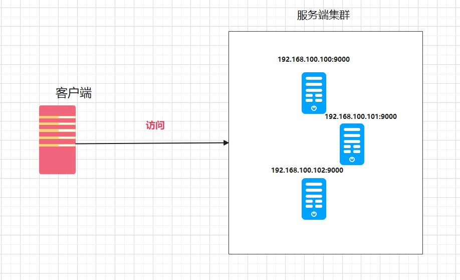
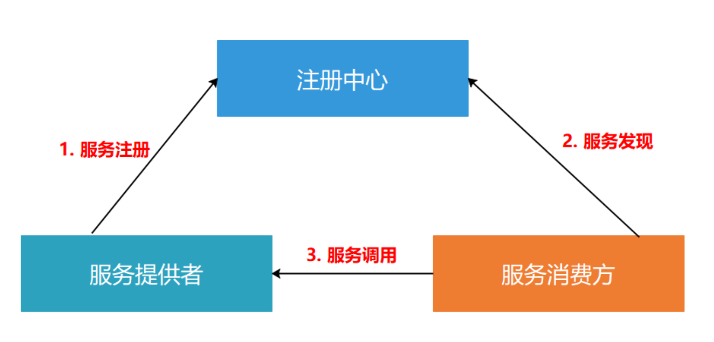

# 注册中心

> 前面我们实现了RPC，但是大家知道服务都是集群化部署的，那么客户端在连接服务端的时候，到底该选择哪一个服务器呢？
>
> 这时候我们就需要注册中心的帮助了。

## 1. nacos

### 1.1 注册服务

~~~go
package register

import (
	"github.com/nacos-group/nacos-sdk-go/clients"
	"github.com/nacos-group/nacos-sdk-go/clients/naming_client"
	"github.com/nacos-group/nacos-sdk-go/common/constant"
	"github.com/nacos-group/nacos-sdk-go/vo"
)

type NacosConfig struct {
	TimeOut      uint64
	LogLevel     string
	NamespaceId  string
	ServerConfig []constant.ServerConfig
}

func CreateNameClient(config NacosConfig) (naming_client.INamingClient, error) {
	// 创建clientConfig的另一种方式
	clientConfig := *constant.NewClientConfig(
		constant.WithNamespaceId(config.NamespaceId), //当namespace是public时，此处填空字符串。
		constant.WithTimeoutMs(config.TimeOut),
		constant.WithNotLoadCacheAtStart(true),
		constant.WithLogLevel(config.LogLevel),
	)

	// 至少一个ServerConfig
	namingClient, err := clients.NewNamingClient(
		vo.NacosClientParam{
			ClientConfig:  &clientConfig,
			ServerConfigs: config.ServerConfig,
		},
	)
	return namingClient, err
}

var DefaultNacosConfig = NacosConfig{
	ServerConfig: []constant.ServerConfig{
		{
			IpAddr:      "127.0.0.1",
			ContextPath: "/nacos",
			Port:        8848,
			Scheme:      "http",
		},
	},
	LogLevel:    "debug",
	NamespaceId: "",
	TimeOut:     5000,
}

type NacosServiceConfig struct {
	Ip          string
	Port        uint64
	ServiceName string
	ClusterName string
	GroupName   string
}

func RegisterService(namingClient naming_client.INamingClient, config NacosServiceConfig) (bool, error) {
	success, err := namingClient.RegisterInstance(vo.RegisterInstanceParam{
		Ip:          config.Ip,
		Port:        config.Port,
		ServiceName: config.ServiceName,
		Weight:      10,
		Enable:      true,
		Healthy:     true,
		Ephemeral:   true,
		Metadata:    map[string]string{"idc": "shanghai"},
		ClusterName: config.ClusterName, // 默认值DEFAULT
		GroupName:   config.GroupName,   // 默认值DEFAULT_GROUP
	})
	return success, err
}

~~~

~~~go
func (s *MsTcpServer) Register(name string, service interface{}) {
	if s.serviceMap == nil {
		s.serviceMap = make(map[string]interface{})
	}
	v := reflect.ValueOf(service)
	if v.Kind() != reflect.Pointer {
		panic(errors.New("service not pointer"))
	}
	s.serviceMap[name] = service
	client, err := register.CreateNameClient(s.NacosConfig)
	if err != nil {
		panic(err)
	}
	serviceConfig := register.NacosServiceConfig{}
	serviceConfig.ServiceName = name
	serviceConfig.Ip = s.Host
	serviceConfig.Port = uint64(s.Port)
	registerService, err := register.RegisterService(client, serviceConfig)
	if err != nil {
		panic(err)
	}
	if !registerService {
		panic(errors.New("register service error"))
	}
}
~~~

### 1.2 获取服务

> 通过注册中心来获取服务的地址，而不是直接写死一个地址

~~~go

type MsTcpClient struct {
	conn   net.Conn
	option TcpClientOption
	client naming_client.INamingClient
}

type TcpClientOption struct {
	Retries           int
	ConnectionTimeout time.Duration
	SerializeType     SerializeType
	CompressType      CompressType
	Host              string
	Port              int
	config            register.NacosConfig
	serviceConfig     register.NacosServiceConfig
}
~~~

~~~go

func (c *MsTcpClient) Connect() error {
	//这里获取的时候 从注册中心获取
	// SelectOneHealthyInstance将会按加权随机轮询的负载均衡策略返回一个健康的实例
	// 实例必须满足的条件：health=true,enable=true and weight>0
	instance, err := c.client.SelectOneHealthyInstance(vo.SelectOneHealthInstanceParam{
		ServiceName: c.option.serviceConfig.ServiceName,
		GroupName:   c.option.serviceConfig.GroupName,             // 默认值DEFAULT_GROUP
		Clusters:    []string{c.option.serviceConfig.ClusterName}, // 默认值DEFAULT
	})
	addr := fmt.Sprintf("%s:%d", instance.Ip, instance.Port)
	conn, err := net.DialTimeout("tcp", addr, c.option.ConnectionTimeout)
	if err != nil {
		return err
	}
	c.conn = conn
	return nil
}
~~~

~~~go
func (p *MsTcpClientProxy) SetNacosConfig(config register.NacosConfig, serviceConfig register.NacosServiceConfig) {
	p.option.config = config
	p.option.serviceConfig = serviceConfig
}
~~~

~~~go

	g.Get("/findTcp", func(ctx *msgo.Context) {
		//查询商品
		gob.Register(&model.Result{})
		gob.Register(&model.Goods{})
		args := make([]any, 1)
		args[0] = int64(5)
		serviceConfig := register.NacosServiceConfig{
			ServiceName: "goods",
			GroupName:   "",
			ClusterName: "",
		}
		proxy.SetNacosConfig(register.DefaultNacosConfig, serviceConfig)
		result, err := proxy.Call(context.Background(), "goods", "Find", args)
		if err != nil {
			panic(err)
		}
		ctx.JSON(http.StatusOK, result)
	})
~~~

> 测试，可以正常运行，这时候服务的ip和端口都是从注册中心来的，集群等配置都由注册中心负责

## 2. etcd

etcd是使用Go语言开发的一个开源的、高可用的分布式key—value存储系统，可以用于配置共享和服务的注册和发现

etcd具有以下的特点：
1.完全复制：集群中的每个节点都可以使用完整的存档
2.高可用性：Etcd可用于避免硬件的单点故障或网络问题
3.一致性：每次读取都会返回跨多主机的最新写入
4.简单：包括一个定义良好、面向用户的API（gRPC）
5.安全：实现了带有可选的客户端证书身份验证的自动化TLS
6.快速：每秒10000次写入的基准速度
7.可靠：使用Raft算法实现了强一致、高可用的服务存储目录

官方文档地址：https://etcd.io/

~~~go
go get go.etcd.io/etcd/client/v3
~~~

### 2.1 注册服务

~~~go
package register

import "time"

type Option struct {
	Endpoints   []string      //节点
	DialTimeout time.Duration //超时时间
	ServiceName string
	Host        string
	Port        int
}

func EtcdRegisterService(option Option) error {
	cli, err := clientv3.New(clientv3.Config{
		Endpoints:   option.Endpoints,   //节点
		DialTimeout: option.DialTimeout, //超过5秒钟连不上超时
	})
	if err != nil {
		return err
	}
	defer cli.Close()
	ctx, cancel := context.WithTimeout(context.Background(), time.Second)
	_, err = cli.Put(ctx, option.ServiceName, fmt.Sprintf("%s:%d", option.Host, option.Port))
	defer cancel()
	return err
}

func GetEtcdValue(option Option) (string, error) {
	cli, err := clientv3.New(clientv3.Config{
		Endpoints:   option.Endpoints,   //节点
		DialTimeout: option.DialTimeout, //超过5秒钟连不上超时
	})
	if err != nil {
		return "", err
	}
	defer cli.Close()
	ctx, cancel := context.WithTimeout(context.Background(), time.Second)
	v, err := cli.Get(ctx, option.ServiceName)
	defer cancel()
	kvs := v.Kvs
	return string(kvs[0].Value), err
}

~~~

~~~go
	err = register.EtcdRegisterService(register.Option{
		Endpoints:   []string{"127.0.0.1:2379"},
		DialTimeout: 5 * time.Second,
		Host:        "127.0.0.1",
		Port:        9112,
		ServiceName: "goodsCenter",
	})
~~~

## 3. 改造代码

> 现在代码有点混乱，改造一下让其更加易用

~~~go
type MsRegister interface {
	CreateCli(option Option) error
	RegisterService(serviceName string, host string, port int) error
	GetInfo(serviceName string) (string, error)
	Close() error
}
type Option struct {
	Endpoints    []string      //节点
	DialTimeout  time.Duration //超时时间
	ServiceName  string
	Host         string
	Port         int
	NamespaceId  string
	TimeoutMs    uint64
	LogLevel     string
	ServerConfig []constant.ServerConfig
}
~~~

~~~go

type NacosRegister struct {
	cli naming_client.INamingClient
}

func (r *NacosRegister) CreateCli(option Option) error {
	// 创建clientConfig的另一种方式
	clientConfig := *constant.NewClientConfig(
		constant.WithNamespaceId(option.NamespaceId), //当namespace是public时，此处填空字符串。
		constant.WithTimeoutMs(option.TimeoutMs),
		constant.WithNotLoadCacheAtStart(true),
		constant.WithLogLevel(option.LogLevel),
	)

	// 至少一个ServerConfig
	namingClient, err := clients.NewNamingClient(
		vo.NacosClientParam{
			ClientConfig:  &clientConfig,
			ServerConfigs: option.ServerConfig,
		},
	)
	r.cli = namingClient
	return err
}

func (r *NacosRegister) RegisterService(serviceName string, host string, port int) error {
	_, err := r.cli.RegisterInstance(vo.RegisterInstanceParam{
		Ip:          host,
		Port:        uint64(port),
		ServiceName: serviceName,
		Weight:      10,
		Enable:      true,
		Healthy:     true,
		Ephemeral:   true,
		Metadata:    map[string]string{"idc": "shanghai"},
	})
	return err
}

func (r *NacosRegister) GetInfo(serviceName string) (string, error) {
	instance, err := r.cli.SelectOneHealthyInstance(vo.SelectOneHealthInstanceParam{
		ServiceName: serviceName,
	})
	if err != nil {
		return "", err
	}
	addr := fmt.Sprintf("%s:%d", instance.Ip, instance.Port)
	return addr, nil
}

func (r *NacosRegister) Close() error {
	return nil
}
~~~

~~~go

type EtcdRegister struct {
	cli *clientv3.Client
}

func (r *EtcdRegister) CreateCli(option Option) error {
	cli, err := clientv3.New(clientv3.Config{
		Endpoints:   option.Endpoints,   //节点
		DialTimeout: option.DialTimeout, //超过5秒钟连不上超时
	})
	if err != nil {
		return err
	}
	r.cli = cli
	return nil
}

func (r *EtcdRegister) RegisterService(serviceName string, host string, port int) error {
	ctx, cancel := context.WithTimeout(context.Background(), time.Second)
	_, err := r.cli.Put(ctx, serviceName, fmt.Sprintf("%s:%d", host, port))
	defer cancel()
	return err
}

func (r *EtcdRegister) GetInfo(serviceName string) (string, error) {
	ctx, cancel := context.WithTimeout(context.Background(), time.Second)
	v, err := r.cli.Get(ctx, serviceName)
	defer cancel()
	kvs := v.Kvs
	return string(kvs[0].Value), err
}

func (r *EtcdRegister) Close() error {
	return r.cli.Close()
}

~~~

~~~go

func NewTcpClient(option TcpClientOption) *MsTcpClient {
	var reg register.MsRegister
	if option.RegisterType == "nacos" {
		reg = &register.NacosRegister{}
	}
	if option.RegisterType == "etcd" {
		reg = &register.EtcdRegister{}
	}
	err := reg.CreateCli(option.RegisterOption)
	if err != nil {
		panic(err)
	}
	return &MsTcpClient{option: option, register: reg}
}

func (c *MsTcpClient) Connect() error {
	//这里获取的时候 从注册中心获取
	// SelectOneHealthyInstance将会按加权随机轮询的负载均衡策略返回一个健康的实例
	// 实例必须满足的条件：health=true,enable=true and weight>0
	addr := ""
	if c.option.RegisterType == "nacos" {
		var err error
		addr, err = c.register.GetInfo(c.option.RegisterOption.ServiceName)
		if err != nil {
			return err
		}
	}
	if c.option.RegisterType == "etcd" {
		var err error
		addr, err = c.register.GetInfo(c.option.RegisterOption.ServiceName)
		if err != nil {
			return err
		}
	}
	conn, err := net.DialTimeout("tcp", addr, c.option.ConnectionTimeout)
	if err != nil {
		return err
	}
	c.conn = conn
	return nil
}

~~~

~~~GO
func (p *MsTcpClientProxy) SetRegisterConfig(registerType string, config register.Option) {
	p.option.RegisterType = registerType
	p.option.RegisterOption = config
}
~~~

~~~go
proxy := rpc.NewMsTcpClientProxy(config)
	proxy.SetRegisterConfig("nacos", register.Option{
		TimeoutMs: 5000,
		ServerConfig: []constant.ServerConfig{
			{
				IpAddr:      "127.0.0.1",
				ContextPath: "/nacos",
				Port:        8848,
				Scheme:      "http",
			},
		},
		LogLevel: "debug",
	})
	g.Get("/findTcp", func(ctx *ms.Context) {
		//查询商品
		gob.Register(&model.Result{})
		gob.Register(&model.Goods{})
		args := make([]any, 1)
		args[0] = int64(5)
		result, err := proxy.Call(context.Background(), "goods", "Find", args)
		if err != nil {
			panic(err)
		}
		ctx.JSON(http.StatusOK, result)
	})
~~~

~~~go

type MsTcpClient struct {
	conn     net.Conn
	option   TcpClientOption
	register register.MsRegister
}

type TcpClientOption struct {
	Retries           int
	ConnectionTimeout time.Duration
	SerializeType     SerializeType
	CompressType      CompressType
	Host              string
	Port              int
	RegisterType      string
	RegisterOption    register.Option
}
~~~

server:

~~~go
type MsTcpServer struct {
	listener       net.Listener
	Host           string
	Port           int
	Network        string
	serviceMap     map[string]interface{}
	RegisterType   string
	RegisterOption register.Option
	reg            register.MsRegister
	OpenLimiter    bool
	Limiter        *rate.Limiter
	LimiterTimeOut time.Duration
}
~~~

~~~go
func (s *MsTcpServer) SetRegisterOption(registerType string, registerOption register.Option) {
	s.RegisterOption = registerOption
	s.RegisterType = registerType
	if registerType == "nacos" {
		s.reg = &register.NacosRegister{}
	}
	if registerType == "etcd" {
		s.reg = &register.EtcdRegister{}
	}
	err := s.reg.CreateCli(registerOption)
	if err != nil {
		panic(err)
	}

}
func (s *MsTcpServer) Register(name string, service interface{}) {
	if s.serviceMap == nil {
		s.serviceMap = make(map[string]interface{})
	}
	v := reflect.ValueOf(service)
	if v.Kind() != reflect.Pointer {
		panic(errors.New("service not pointer"))
	}
	s.serviceMap[name] = service

	err := s.reg.RegisterService(name, s.Host, s.Port)
	if err != nil {
		panic(errors.New("register service error"))
	}
}

~~~

~~~go
tcpServer := rpc.NewTcpServer("localhost", 9112)
	tcpServer.SetRegisterOption("nacos", register.Option{
		TimeoutMs: 5000,
		ServerConfig: []constant.ServerConfig{
			{
				IpAddr:      "127.0.0.1",
				ContextPath: "/nacos",
				Port:        8848,
				Scheme:      "http",
			},
		},
		LogLevel: "debug",
	})
	gob.Register(&model.Result{})
	gob.Register(&model.Goods{})
	tcpServer.Register("goods", &service.GoodsRpcService{})
~~~

