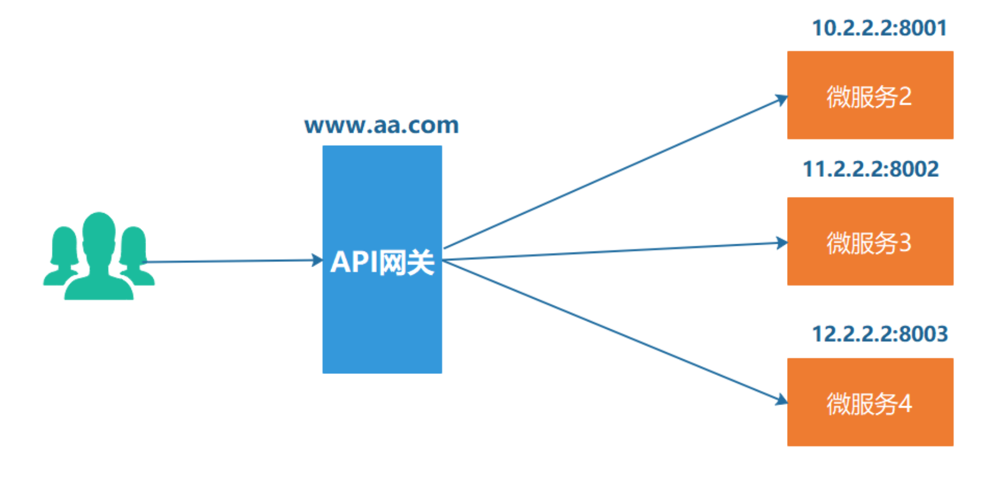

# 网关

> 在微服务的场景下，服务因为分布在不同的服务器上，但是用户在访问的时候，不可能去维护这成百上千的入口，希望有统一的入口来进行访问，这就是网关的作用。

**网关最重要的一个功能就是路由功能，能将请求转发到具体的业务服务器上**

## 1. 简单实现

httputil.ReverseProxy 定义了一组方法让使用者去实现，主要有这几个

* Director
  最核心的方法， 我们可以在这里对请求进行相应的修改，比如设置请求目标的地址，对原有请求头进行增删改，以及对请求体进行处理等等操作。

* ModifyResponse
  可以让我们对响应的结果进行处理，比如修改、读取响应头和响应体。

* ErrorHandler
  请求出错或者ModifyResponse返回error时会回调该方法，比如目标服务器无法连接，请求超时等等

~~~go
package main

import (
	"github.com/mszlu521/msgo"
	"github.com/mszlu521/msgo/gateway"
)

func main() {
	engine := msgo.Default()
	engine.OpenGateWay = true
	var configs []gateway.GWConfig
	configs = append(configs, gateway.GWConfig{
		Name: "order",
		Path: "/order/**",
		Host: "127.0.0.1",
		Port: 9003,
	}, gateway.GWConfig{
		Name: "goods",
		Path: "/goods/**",
		Host: "127.0.0.1",
		Port: 9002,
	})
	engine.SetGateConfigs(configs)
	engine.Run(":80")
}

~~~

~~~go
package gateway

type GWConfig struct {
	Name string
	Path string
	Host string
	Port int
}

~~~

~~~go
package gateway

import "strings"

type TreeNode struct {
	Name     string
	Children []*TreeNode
	IsEnd    bool
	GwName   string
}

func (t *TreeNode) Put(path string, gwName string) {
	root := t
	strs := strings.Split(path, "/")
	for index, v := range strs {
		if index == 0 {
			continue
		}
		children := t.Children
		isMatch := false
		for _, node := range children {
			if node.Name == v {
				isMatch = true
				t = node
				break
			}
		}
		if !isMatch {
			isEnd := false
			if index == len(strs)-1 {
				isEnd = true
			}
			treeNode := &TreeNode{Name: v, Children: make([]*TreeNode, 0), IsEnd: isEnd, GwName: gwName}
			children = append(children, treeNode)
			t.Children = children
			t = treeNode
		}
	}
	t = root
}

//返回最后匹配的节点
func (t *TreeNode) Get(path string) *TreeNode {
	strs := strings.Split(path, "/")
	for index, v := range strs {
		if index == 0 {
			continue
		}
		children := t.Children
		isMatch := false
		for _, node := range children {
			if node.Name == v ||
				node.Name == "*" ||
				strings.Contains(node.Name, ":") {
				isMatch = true
				t = node
				if index == len(strs)-1 {
					return node
				}
				break
			}
		}
		if !isMatch {
			//没匹配的情况下 检查是否有**
			for _, node := range children {
				if node.Name == "**" {
					return node
				}
			}
			return nil
		}
	}
	return nil
}

~~~

~~~go
type Engine struct {
	*router
	funcMap          template.FuncMap
	HTMLRender       render.HTMLRender
	pool             sync.Pool
	Logger           *msLog.Logger
	globalMiddles    []MiddlewareFunc
	errorHandler     ErrorHandler
	OpenGateWay      bool
	gatewayTreeNode  *gateway.TreeNode
	gatewayConfigMap map[string]gateway.GWConfig
}
~~~

~~~go

func (e *Engine) handleHttpRequest(ctx *Context) {
	if e.OpenGateWay {
		//网关业务处理
		uri := ctx.R.URL.Path
		node := e.gatewayTreeNode
		matchNode := node.Get(uri)
		if matchNode == nil {
			ctx.W.WriteHeader(http.StatusNotFound)
			fmt.Fprintln(ctx.W, ctx.R.RequestURI+" not found")
			return
		}
		gwConfig := e.gatewayConfigMap[matchNode.GwName]

		target, _ := url.Parse(fmt.Sprintf("http://%s:%d%s", gwConfig.Host, gwConfig.Port, uri))
		director := func(req *http.Request) {
            req.Host = target.Host
			req.URL.Host = target.Host
			req.URL.Path = target.Path
			req.URL.Scheme = target.Scheme
			if _, ok := req.Header["User-Agent"]; !ok {
				req.Header.Set("User-Agent", "")
			}
		}

		response := func(response *http.Response) error {
			log.Println("改变返回值")
			return nil
		}

		handler := func(writer http.ResponseWriter, request *http.Request, err error) {
			log.Println("错误处理", err)
		}
		proxy := httputil.ReverseProxy{Director: director, ModifyResponse: response, ErrorHandler: handler}
		proxy.ServeHTTP(ctx.W, ctx.R)
		return
	}
    //....
}
~~~

## 2. 支持Header设置

~~~go
if gwConfig.Header != nil {
				gwConfig.Header(req)
			}
~~~

**用户在配置中指定其要设置的请求Header即可**

## 3. 支持注册中心

> 有过前面的经验，这里就比较简单，设置注册中心名称，然后获取host和port的时候去注册中心获取即可

~~~go

func (e *Engine) handleHttpRequest(ctx *Context) {
	if e.OpenGateWay {
		//网关业务处理
		uri := ctx.R.URL.Path
		node := e.gatewayTreeNode
		matchNode := node.Get(uri)
		if matchNode == nil {
			ctx.W.WriteHeader(http.StatusNotFound)
			fmt.Fprintln(ctx.W, ctx.R.RequestURI+" not found")
			return
		}
		gwConfig := e.gatewayConfigMap[matchNode.GwName]
		if gwConfig.OpenRegister {
			if e.register == "nacos" {
				client := e.registerClient.(naming_client.INamingClient)
				instance, err := client.SelectOneHealthyInstance(vo.SelectOneHealthInstanceParam{
					ServiceName: gwConfig.Name,
				})
				if err != nil {
					panic(err)
				}
				gwConfig.Host = instance.Ip
				gwConfig.Port = int(instance.Port)
			}
		}
		target, _ := url.Parse(fmt.Sprintf("http://%s:%d%s", gwConfig.Host, gwConfig.Port, uri))
		director := func(req *http.Request) {
			req.Host = target.Host
			req.URL.Host = target.Host
			req.URL.Path = target.Path
			req.URL.Scheme = target.Scheme
			if _, ok := req.Header["User-Agent"]; !ok {
				req.Header.Set("User-Agent", "")
			}
			if gwConfig.Header != nil {
				gwConfig.Header(req)
			}
		}

		response := func(response *http.Response) error {
			log.Println("改变返回值")
			return nil
		}

		handler := func(writer http.ResponseWriter, request *http.Request, err error) {
			log.Println("错误处理", err)
		}
		proxy := httputil.ReverseProxy{Director: director, ModifyResponse: response, ErrorHandler: handler}
		proxy.ServeHTTP(ctx.W, ctx.R)
		return
	}
}
~~~

~~~go

type Engine struct {
	*router
	funcMap          template.FuncMap
	HTMLRender       render.HTMLRender
	pool             sync.Pool
	Logger           *msLog.Logger
	globalMiddles    []MiddlewareFunc
	errorHandler     ErrorHandler
	OpenGateWay      bool
	gatewayTreeNode  *gateway.TreeNode
	gatewayConfigMap map[string]gateway.GWConfig
	nacosConfig      register.NacosConfig
	registerClient   any
	register         string
}
~~~

~~~go

func (e *Engine) SetNacosConfig(config register.NacosConfig) {
	e.nacosConfig = config
	client, err := register.CreateNameClient(e.nacosConfig)
	if err != nil {
		panic(err)
	}
	e.registerClient = client
	e.register = "nacos"
}

~~~

~~~go
package main

import (
	"github.com/mszlu521/msgo"
	"github.com/mszlu521/msgo/gateway"
	"github.com/mszlu521/msgo/register"
	"net/http"
)

func main() {
	engine := msgo.Default()
	engine.OpenGateWay = true
	var configs []gateway.GWConfig
	configs = append(configs, gateway.GWConfig{
		Name: "order",
		Path: "/order/**",
		Host: "127.0.0.1",
		Port: 9003,
		Header: func(req *http.Request) {
			req.Header.Set("my", "mszlu")
		},
	}, gateway.GWConfig{
		Name:         "goodsCenter",
		Path:         "/goods/**",
		OpenRegister: true,
		Header: func(req *http.Request) {
			req.Header.Set("my", "mszlu")
		},
	})
	engine.SetNacosConfig(register.DefaultNacosConfig)
	engine.SetGateConfigs(configs)
	engine.Run(":80")
}

~~~

记得注册服务：

~~~go
//注册服务
	client, _ := register.CreateNameClient(register.DefaultNacosConfig)
	config := register.NacosServiceConfig{Port: 9002, ServiceName: "goodsCenter", Ip: "127.0.0.1"}
	register.RegisterService(client, config)
~~~

