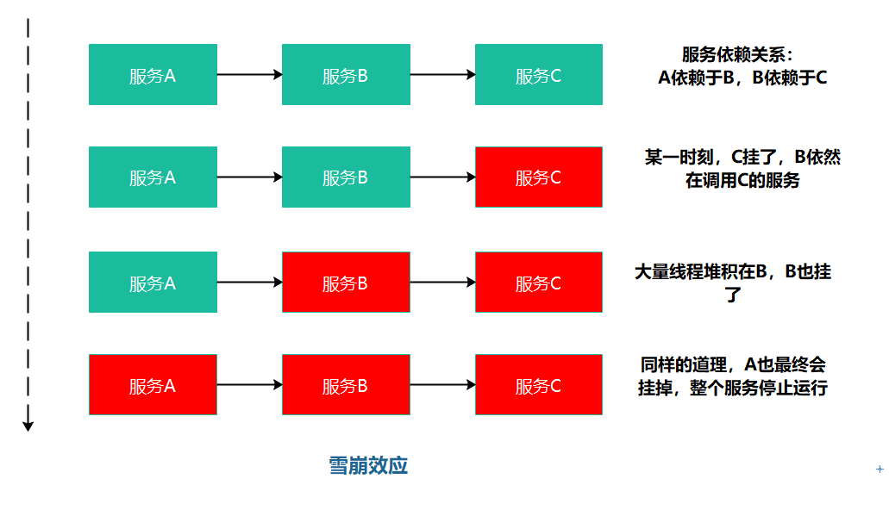
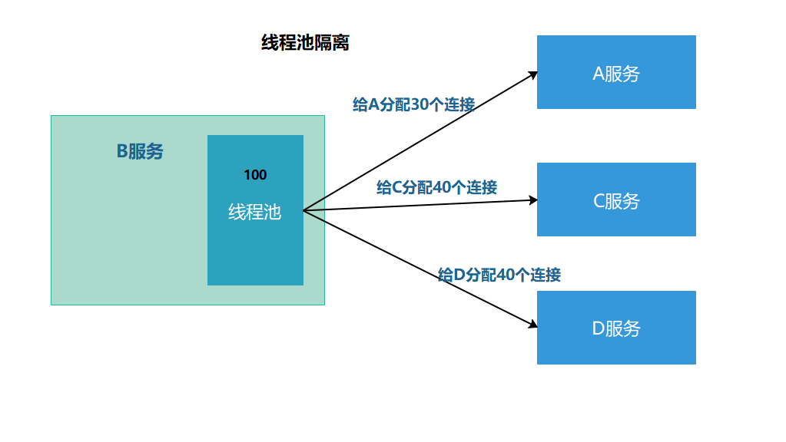
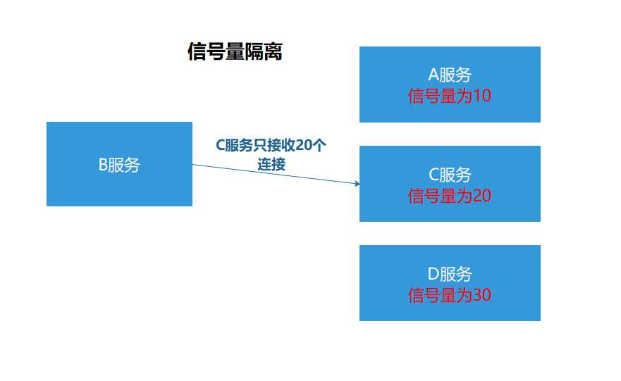
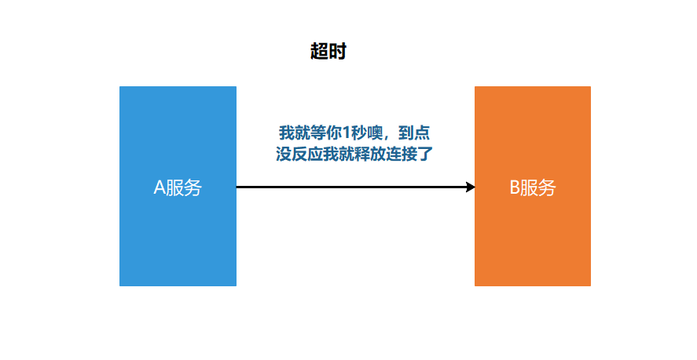
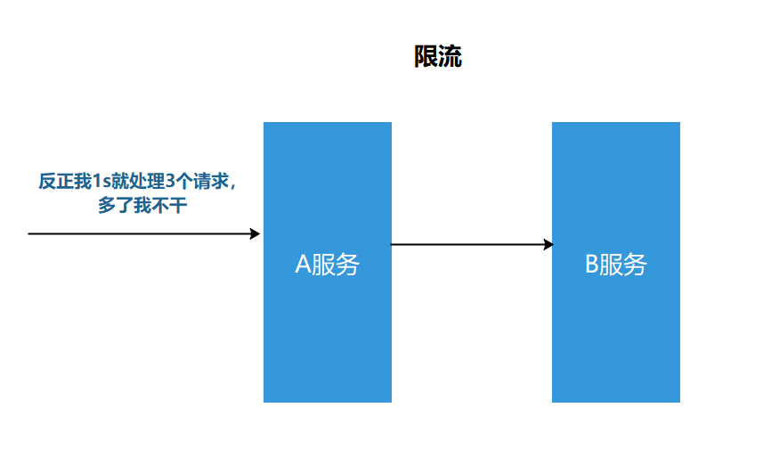
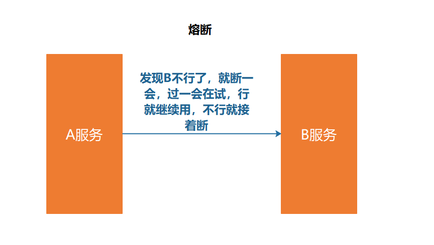
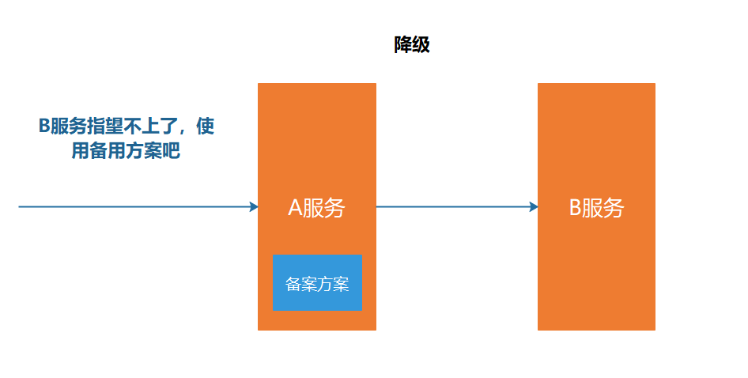

# 服务容错

## 1. 服务雪崩问题

在分布式系统中，由于网络原因或自身的原因，服务一般无法保证100%可用，如果一旦一个服务出现问题，调用这个服务就会出现线程阻塞的情况，此时若有大量的请求涌入，就会出现多条线程阻塞等待，进而导致服务瘫痪。

由于服务和服务之间的依赖性，故障会传播，会对整个微服务系统造成灾难性的严重后果，这就是服务故障的“雪崩效应”。



雪崩效应发生的原因多种多样，有不合理的容量设计，或者是高并发下某一个方法出现了响应变慢，亦或是某台机器的资源耗尽，我们无法完全杜绝雪崩的源头的发生，只有做好足够的容错，保证在一个服务发生问题，不会影响到其他服务的正常运行。

## 2. 常见的容错方案

要防止雪崩的扩散，我们就要做好服务的容错，容错说白了就是保护自己不被猪队友拖垮的一些措施，下面介绍常见的服务容错思路和组件。

### 2.1常见的容错思路

常见的容错思路有隔离，超时，限流，熔断，降级这几种。

#### 2.1.1 隔离

它是指将系统按照一定的原则划分为若干个服务模块，各个模块之间相互独立，无强依赖。

当有故障发生时，能将问题和影响隔离在某个模块内部，而不扩散风险，不波及其他模块，不影响整体的系统服务。

常见的隔离方式有：**线程池隔离**和**信号量隔离**。



线程池隔离中，一旦某个服务挂了，只会影响其中分配的连接，不会影响别的服务的执行，有限的分配连接。



信号量隔离，设置了接收连接的上限，适用于可以快速返回的服务。

#### 2.1.2 超时

在上游服务调用下游服务的时候，设置一个最大响应时间，如果超过这个时间，下游未做反应，就断开请求，释放掉线程。



#### 2.1.3 限流

限流就是限制系统的输入和输出流量，已达到保护系统的目的。为了保证系统的稳固运行，一旦达到需要限制的阈值，就需要限制流量并采取少量限制措施以完成限制流量的目的。



#### 2.1.4 熔断

在互联网系统中，当下游服务因访问压力过大而响应变慢或失败，上游系统为了保护系统整体的可用性，可以暂时切断对下游服务的调用。这种牺牲局部，保全整体的措施就叫做熔断。



服务熔断一般有三种状态：

1. 熔断关闭状态(closed)

   服务没有故障时，熔断器所处的状态，对调用方的调用不做任何限制

2. 熔断开启状态

   后续对该服务接口的调用不在经过网络，直接执行本地的fallback方法

3. 半熔断状态

   尝试恢复服务调用，允许有限的流量调用该服务，并监控调用成功率。如果成功率达到预期，则说明服务已恢复，进入熔断关闭状态；如果成功率依旧很低，则重新进入熔断开启状态。

   

#### 2.1.5 降级 

降级其实就是为服务提供一个拖底方案，一旦服务无法正常调用，就使用托底方案。



## 3. 限流实现

### 3.1 常见的限流算法

#### 计数器

> 计数器是一种最简单限流算法，其原理就是：在一段时间间隔内，对请求进行计数，与阀值进行比较判断是否需要限流，每结束一个时间间隔时，都会将计数器清零。
>  计数器算法存在“时间临界点”缺陷，比如每一分钟限制100个请求，可以在00:00:00-00:00:58秒里面都没有请求，在00:00:59瞬间发送100个请求，这个对于计数器算法来是允许的，然后在00:01:00再次发送100个请求，意味着在短短1s内发送了200个请求，如果量更大呢，系统可能会承受不住瞬间流量，导致系统崩溃。

#### 滑动窗口

> 滑动窗口算法的思想主要来源于Tcp协议，即将一个大的时间窗口分成多个小窗口，每次大窗口向后滑动一个小窗口，并保证大的窗口内流量不会超出最大值，这种实现比固定窗口的流量曲线更加平滑。
>  对于上述计数器算法存在的不足，对于滑动时间窗口，我们可以把1s的时间窗口划分成10个小窗口，或者想象窗口有10个时间片, 每个时间片统计自己片内100ms的请求数量。每过100ms，都有一个新的时间片加入窗口，早于当前时间1s的时间片滑出窗口，窗口内最多维护10个时间片。
>  虽然滑动窗口的使用，可以对时间临界问题有一定的优化，但从根本上而言，其实该算法并没有真正地解决固定窗口算法的临界突发流量问题。

#### 漏桶

> 在介绍漏桶算法前，我们可以回忆一下，一个小学数学上的经典问题，有一个水池，有一个进水口，一个出水口，进水速度为x，出水速度为y，问多久可以把水池注满，相信这个问题大家都不陌生。简单来说漏桶算法，就是这道小学数学题，但是我们并不需要求解，首先想象有一个木桶，桶的容量是固定的。当有请求到来时先放到木桶中，处理请求时则以固定的速度从木桶中取出请求即可，如果木桶已经满了，可以直接返回请求频率超限的错误或进行一些其他处理，算法的好处是，流量一直是以一种均匀的速度在被消费，十分适合某些业务场景。
>  因为流入请求的速率是不固定的，但流出的速率是恒定的，所以当系统面对突发流量时会有大量的请求失败。这就导致，在类似于电商抢购、微博热点、过年红包等场景中，该算法并不适用。

#### 令牌桶

> 令牌桶有点像反方向的"漏桶"，它是以恒定的速度往木桶里加入令牌，木桶满了则不再加入令牌。服务收到请求时尝试从木桶中取出一个令牌，如果能够得到令牌则继续执行后续的业务逻辑。如果没有得到令牌，直接返回请求频率超限的错误或进行一些其他处理，不继续执行后续的业务逻辑。
>  同时由于向木桶中添加令牌的速度是恒定的，且木桶的容量是有上限等，所以单位时间内系统能够处理的请求数量也是可控的，从而起到限流的目的。假设加入令牌的速度为 100/s，桶的容量为500，那么在请求比较的少的时候，木桶可以先积攒一些令牌（最多500个）。当有突发流量时，可以一下把木桶内的令牌都取出，也就是500的并发，之后就需要等到有新的令牌加入后，才可以进行新的业务处理了。

### 3.2 go官方限流器：golang.org/x/time/rate

> golang官方提供的扩展库里就自带了限流算法的实现，即 golang.org/x/time/rate ,该限流器也是基于令牌桶实现的。time/rate包中使用 Limiter 类型对限流器进行了定义，所有限流功能都是基于 Limiter 实现的，其结构如下：


```go
type Limiter struct {
 mu     sync.Mutex
 limit  Limit
 burst  int // 令牌桶的大小
 tokens float64
 last time.Time // 上次更新tokens的时间
 lastEvent time.Time // 上次发生限速器事件的时间（通过或者限制都是限速器事件）
}
```

- limit：字段表示往桶里放token的速率，它的类型是Limit（int64）。limit字段，既可以指定每秒向桶中放入token的数量，也可以指定向桶中放入token的时间间隔
- burst: 令牌桶的大小
- tokens: 桶中的令牌
- last: 上次往桶中放入token的时间
- lastEvent：上次触发限流事件的时间

> 代码示例：

```go
package main

import (
    "fmt"
    "time"

    "golang.org/x/net/context"
    "golang.org/x/time/rate"
)

func main() {
    wait()
    allow()
    release()
}

func wait() {
    limiter := rate.NewLimiter(10, 100)
    fmt.Println(limiter.Limit(), limiter.Burst())

    c, _ := context.WithCancel(context.TODO())
    for {
        limiter.Wait(c)
        time.Sleep(200 * time.Millisecond)
        fmt.Println(time.Now().Format("2016-01-02 15:04:05.000"))
    }
}

func allow() {
    limit := rate.Every(100 * time.Millisecond)
    limiter := rate.NewLimiter(limit, 10)
    
    for {
        if limiter.AllowN(time.Now(), 2) {
            fmt.Println(time.Now().Format("2016-01-02 15:04:05.000"))
        } else {
            time.Sleep(6 * time.Second)
        }
    }
}

func release() {
    limiter := rate.NewLimiter(10, 100)
    for {
        r := limiter.ReserveN(time.Now(), 20)
        time.Sleep(r.Delay())
        fmt.Println(time.Now().Format("2016-01-02 15:04:05.000"))
    }
}
```

#### 初始化

> rate.NewLimiter 有两个参数，第一个参数是 r Limit，设置的是限流器Limiter的limit字段，代表每秒可以向桶中放入多少个 token，第二个参数是 b int，b 代表桶的大小，也就是限流器 Limiter 的burst字段。
>  对于 wait() 例子而言，其构造出的限流器的令牌桶大小为100,并以每秒10个Token的速率向桶中放置Token。同时除了给 r Limit 参数直接指定每秒产生的 Token 个数外，还可以使用 Every 方法来指定向桶中放置 Token 的时间间隔，如例子allow()，代表每 100ms 向桶中放入一个 Token。

#### 使用方式

> Limiter 提供了三类方法供程序消费 Token，可以每次消费一个 Token，也可以一次性消费多个 Token。每种方法代表了当 Token 不足时，各自不同的对应手段，可以阻塞等待桶中Token补充，也可以直接返回取Token失败。

- Wait/WaitN

```go
func (lim *Limiter) Wait(ctx context.Context) (err error)
func (lim *Limiter) WaitN(ctx context.Context, n int) (err error)
```

> Wait 实际上就是 WaitN(ctx,1)，当使用 Wait 方法消费 Token 时，如果此时桶内 Token 数组不足 (小于 N)，那么 Wait 方法将会阻塞一段时间，直至 Token 满足条件，若 Token 数量充足则直接返回。这里可以看到，Wait 方法有一个 context 参数。我们可以设置 context 的 Deadline 或者 Timeout，来决定此次 Wait 的最长时间，具体可以参考示例 wait()。

- Allow/AllowN

```go
func (lim *Limiter) Allow() bool
func (lim *Limiter) AllowN(now time.Time, n int) bool
```

> Allow 实际上就是 AllowN(time.Now(),1)，AllowN 方法表示，截止到某一时刻，目前桶中 token 数目是否大于 n 个，若满足则返回 true，同时从桶中消费 n 个 token。若不满足，直接返回false。

- Reserve/ReserveN

```go
func (lim *Limiter) Reserve() *Reservation
func (lim *Limiter) ReserveN(now time.Time, n int) *Reservation
```

> Reserve 相当于 ReserveN(time.Now(),1)，ReserveN 的用法相对复杂一些，当调用完成后，无论 Token 是否充足，都会返回一个 Reservation 的指针对象。我们可以通过调用该对象的Delay()方法得到一个需要等待的时间，时间到后即可进行业务处理。若不想等待，则可以调用Cancel()方法，该方法会将 Token 归还。

#### 动态调整速率和桶大小

> Limiter 支持创建后动态调整速率和桶的大小，我们可以根据现有环境和条件的不同，动态地改变 Token 桶大小和生成速率。


```go
func (lim *Limiter) SetLimit(newLimit Limit) {}
func (lim *Limiter) SetBurst(newBurst int) {}
```

### 3.3 限流中间件实现

~~~go
go get golang.org/x/time/rate
~~~

~~~go
package limiter

import (
	"context"
	"github.com/mszlu521/msgo/ms"
	"golang.org/x/time/rate"
	"log"
	"net/http"
	"time"
)

func RateLimiter(limit, cap int) ms.MiddlewareFunc {
	l := rate.NewLimiter(rate.Limit(limit), cap)
	return func(next ms.HandlerFunc) ms.HandlerFunc {
		return func(ctx *ms.Context) {
			timeCtx, cancel := context.WithTimeout(context.Background(), time.Duration(1)*time.Second)
			defer cancel()
			err := l.WaitN(timeCtx, 1)
			log.Println("rateLimiter: ", err)
			if err != nil {
				ctx.String(http.StatusForbidden, "限流了")
				return
			}
			next(ctx)
		}
	}
}

~~~

tcp:

~~~go
//添加限流
	ctx, cancel := context.WithTimeout(context.Background(), s.LimiterTimeOut)
	if err := s.Limiter.WaitN(ctx, 1); err != nil {
		if err != nil {
			//这应该写回一个默认的限流响应
			log.Println(err)
			cancel()
			rsp := &MsRpcResponse{
				RequestId:     -1,
				Code:          500,
				Msg:           err.Error(),
				CompressType:  msg.Header.CompressType,
				SerializeType: msg.Header.SerializeType,
			}
			msConn.rspChan <- rsp
			return
		}
	}
~~~

~~~go

type MsTcpServer struct {
	listener       net.Listener
	Host           string
	Port           int
	Network        string
	serviceMap     map[string]interface{}
	NacosConfig    register.NacosConfig
	OpenLimiter    bool
	Limiter        *rate.Limiter
	LimiterTimeOut time.Duration
}
func (s *MsTcpServer) SetLimiter(limit int, cap int) {
	s.Limiter = rate.NewLimiter(rate.Limit(limit), cap)
}
~~~

~~~go
register.RegisterService(client, config)
	tcpServer.OpenLimiter = true
	tcpServer.SetLimiter(1, 1)
	tcpServer.LimiterTimeOut = time.Duration(200) * time.Millisecond
~~~


## 4. 熔断实现

逻辑：请求成功一次，计算成功一次，连续成功一次，失败一次 计算失败一次 连续失败一次

当连续失败大于阈值 则打开断路器，打开状态，当超过一段时间，设置为半开状态，当连续成功大于阈值，则设置为关闭状态。

~~~go
package breaker

import (
	"errors"
	"fmt"
	"sync"
	"time"
)

type State int

const (
	StateClosed State = iota
	StateHalfOpen
	StateOpen
)

var (
	ErrTooManyRequests = errors.New("too many requests")
	ErrOpenState       = errors.New("circuit breaker is open")
)

func (s State) String() string {
	switch s {
	case StateClosed:
		return "closed"
	case StateHalfOpen:
		return "half-open"
	case StateOpen:
		return "open"
	default:
		return fmt.Sprintf("unknown state: %d", s)
	}
}

type Counts struct {
	Requests             uint32 //请求数量
	TotalSuccesses       uint32 //总成功数
	TotalFailures        uint32 //总失败数
	ConsecutiveSuccesses uint32 //连续成功数量
	ConsecutiveFailures  uint32 //连续失败数量
}

func (c *Counts) onRequest() {
	c.Requests++
}

func (c *Counts) onSuccess() {
	c.TotalSuccesses++
	c.ConsecutiveSuccesses++
	c.ConsecutiveFailures = 0
}

func (c *Counts) onFailure() {
	c.TotalFailures++
	c.ConsecutiveFailures++
	c.ConsecutiveSuccesses = 0
}

func (c *Counts) clear() {
	c.Requests = 0
	c.TotalSuccesses = 0
	c.TotalFailures = 0
	c.ConsecutiveSuccesses = 0
	c.ConsecutiveFailures = 0
}

type Settings struct {
	Name          string                                  //名字
	MaxRequests   uint32                                  //最大请求数
	Interval      time.Duration                           //间隔时间
	Timeout       time.Duration                           //超时时间
	ReadyToTrip   func(counts Counts) bool                //执行熔断
	OnStateChange func(name string, from State, to State) //状态变更
	IsSuccessful  func(err error) bool                    //是否成功
}

//CircuitBreaker 断路器
type CircuitBreaker struct {
	name          string                                  //名字
	maxRequests   uint32                                  //最大请求数 当连续请求成功数大于此时 断路器关闭
	interval      time.Duration                           //间隔时间
	timeout       time.Duration                           //超时时间
	readyToTrip   func(counts Counts) bool                //是否执行熔断
	isSuccessful  func(err error) bool                    //是否成功
	onStateChange func(name string, from State, to State) //状态变更

	mutex      sync.Mutex
	state      State     //状态
	generation uint64    //代 状态变更 new一个
	counts     Counts    //数量
	expiry     time.Time //到期时间 检查是否从开到半开
}

func NewCircuitBreaker(st Settings) *CircuitBreaker {
	cb := new(CircuitBreaker)

	cb.name = st.Name
	cb.onStateChange = st.OnStateChange

	if st.MaxRequests == 0 {
		cb.maxRequests = 1
	} else {
		cb.maxRequests = st.MaxRequests
	}

	if st.Interval <= 0 {
		cb.interval = defaultInterval
	} else {
		cb.interval = st.Interval
	}

	if st.Timeout <= 0 {
		cb.timeout = defaultTimeout
	} else {
		cb.timeout = st.Timeout
	}

	if st.ReadyToTrip == nil {
		cb.readyToTrip = defaultReadyToTrip
	} else {
		cb.readyToTrip = st.ReadyToTrip
	}

	if st.IsSuccessful == nil {
		cb.isSuccessful = defaultIsSuccessful
	} else {
		cb.isSuccessful = st.IsSuccessful
	}

	cb.toNewGeneration(time.Now())

	return cb
}

const defaultInterval = time.Duration(0) * time.Second
const defaultTimeout = time.Duration(60) * time.Second

//连续失败五次 执行熔断
func defaultReadyToTrip(counts Counts) bool {
	return counts.ConsecutiveFailures > 5
}

func defaultIsSuccessful(err error) bool {
	return err == nil
}

// Name returns the name of the CircuitBreaker.
func (cb *CircuitBreaker) Name() string {
	return cb.name
}

// State returns the current state of the CircuitBreaker.
func (cb *CircuitBreaker) State() State {
	cb.mutex.Lock()
	defer cb.mutex.Unlock()

	now := time.Now()
	state, _ := cb.currentState(now)
	return state
}

// Counts returns internal counters
func (cb *CircuitBreaker) Counts() Counts {
	cb.mutex.Lock()
	defer cb.mutex.Unlock()

	return cb.counts
}

func (cb *CircuitBreaker) Execute(req func() (any, error)) (any, error) {
	generation, err := cb.beforeRequest()
	if err != nil {
		return nil, err
	}

	defer func() {
		e := recover()
		if e != nil {
			cb.afterRequest(generation, false)
			panic(e)
		}
	}()

	result, err := req()
	cb.afterRequest(generation, cb.isSuccessful(err))
	return result, err
}

func (cb *CircuitBreaker) beforeRequest() (uint64, error) {
	cb.mutex.Lock()
	defer cb.mutex.Unlock()

	now := time.Now()
	state, generation := cb.currentState(now)

	if state == StateOpen {
		return generation, ErrOpenState
	} else if state == StateHalfOpen && cb.counts.Requests >= cb.maxRequests {
		return generation, ErrTooManyRequests
	}

	cb.counts.onRequest()
	return generation, nil
}

func (cb *CircuitBreaker) afterRequest(before uint64, success bool) {
	cb.mutex.Lock()
	defer cb.mutex.Unlock()

	now := time.Now()
	state, generation := cb.currentState(now)
	if generation != before {
		return
	}

	if success {
		cb.onSuccess(state, now)
	} else {
		cb.onFailure(state, now)
	}
}

func (cb *CircuitBreaker) onSuccess(state State, now time.Time) {
	switch state {
	case StateClosed:
		cb.counts.onSuccess()
	case StateHalfOpen:
		cb.counts.onSuccess()
		if cb.counts.ConsecutiveSuccesses >= cb.maxRequests {
			cb.setState(StateClosed, now)
		}
	}
}

func (cb *CircuitBreaker) onFailure(state State, now time.Time) {
	switch state {
	case StateClosed:
		cb.counts.onFailure()
		if cb.readyToTrip(cb.counts) {
			cb.setState(StateOpen, now)
		}
	case StateHalfOpen:
		cb.setState(StateOpen, now)
	}
}

func (cb *CircuitBreaker) currentState(now time.Time) (State, uint64) {
	switch cb.state {
	case StateClosed:
		if !cb.expiry.IsZero() && cb.expiry.Before(now) {
			cb.toNewGeneration(now)
		}
	case StateOpen:
		if cb.expiry.Before(now) {
			cb.setState(StateHalfOpen, now)
		}
	}
	return cb.state, cb.generation
}

func (cb *CircuitBreaker) setState(state State, now time.Time) {
	if cb.state == state {
		return
	}

	prev := cb.state
	cb.state = state

	cb.toNewGeneration(now)

	if cb.onStateChange != nil {
		cb.onStateChange(cb.name, prev, state)
	}
}

func (cb *CircuitBreaker) toNewGeneration(now time.Time) {
	cb.generation++
	cb.counts.clear()

	var zero time.Time
	switch cb.state {
	case StateClosed:
		if cb.interval == 0 {
			cb.expiry = zero
		} else {
			cb.expiry = now.Add(cb.interval)
		}
	case StateOpen:
		cb.expiry = now.Add(cb.timeout)
	default: // StateHalfOpen
		cb.expiry = zero
	}
}

~~~

## 5. 降级实现

~~~go
generation, err := cb.beforeRequest()
	if err != nil {
		//执行降级方案
		if cb.fallBack != nil {
			return cb.fallBack(err)
		}
		return nil, err
	}
~~~

~~~go
	st.FallBack = func(err error) (any, error) {
		//查询商品
		goods := model.Goods{Id: 1000, Name: "商品中心9002降级方案商品"}
		return goods, nil
	}
~~~

