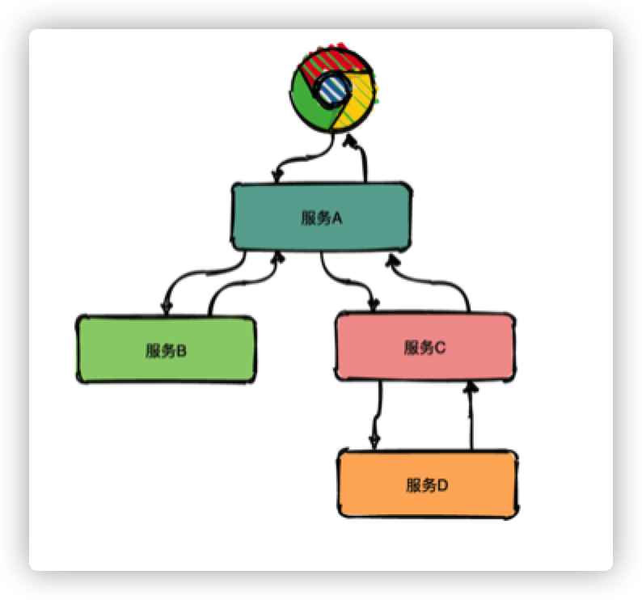
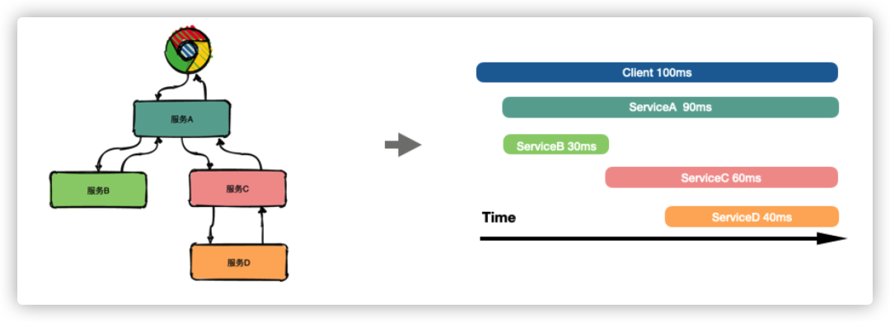
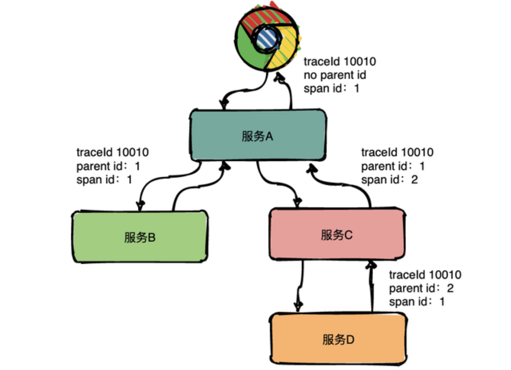
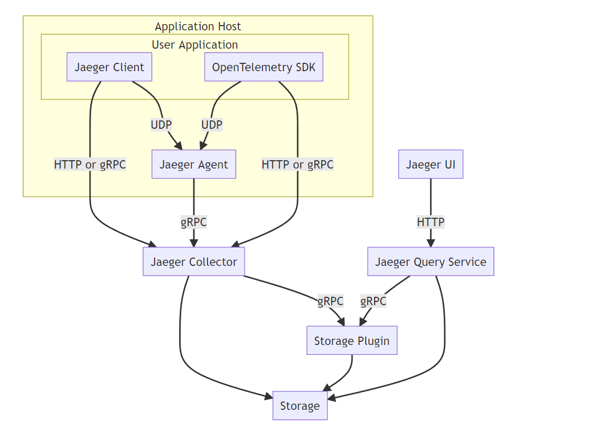
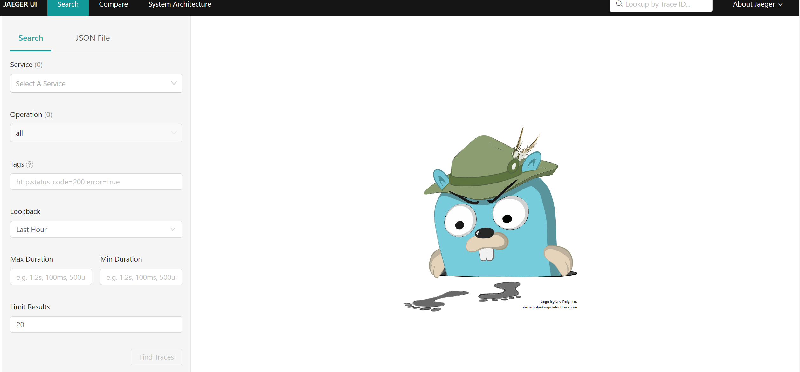
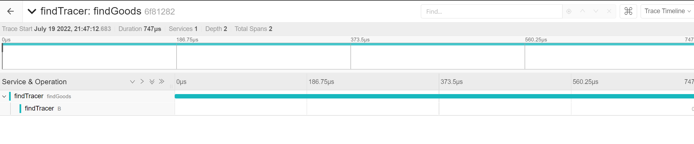
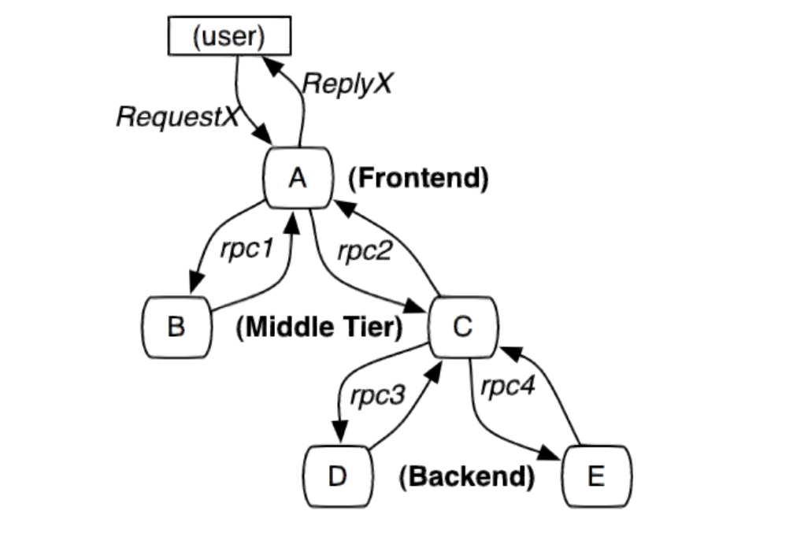
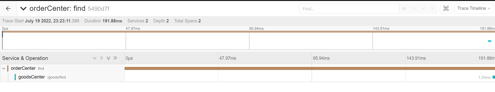

# 链路追踪

在分布式、微服务架构下，应用一个请求往往贯穿多个分布式服务，这给应用的故障排查、性能优化带来新的挑战。分布式链路追踪作为解决分布式应用可观测问题的重要技术，愈发成为分布式应用不可缺少的基础设施

## 1. 为什么需要分布式链路追踪系统

在分布式架构下，当用户从浏览器客户端发起一个请求时，后端处理逻辑往往贯穿多个分布式服务，这时会浮现很多问题，比如：

* 请求整体耗时较长，具体慢在哪个服务？
* 请求过程中出错了，具体是哪个服务报错？
* 某个服务的请求量如何，接口成功率如何？




回答这些问题变得不是那么简单，我们不仅仅需要知道某一个服务的接口处理统计数据，还需要了解两个服务之间的接口调用依赖关系，只有建立起整个请求在多个服务间的时空顺序，才能更好的帮助我们理解和定位问题，而这，正是分布式链路追踪系统可以解决的。


## 2. 分布式链路追踪系统如何帮助我们

分布式链路追踪技术的核心思想：在用户一次分布式请求服务的调⽤过程中，将请求在所有子系统间的调用过程和时空关系追踪记录下来，还原成调用链路集中展示，信息包括各个服务节点上的耗时、请求具体到达哪台机器上、每个服务节点的请求状态等等。



如上图所示，通过分布式链路追踪构建出完整的请求链路后，可以很直观地看到请求耗时主要耗费在哪个服务环节，帮助我们更快速聚焦问题。

同时，还可以对采集的链路数据做进一步的分析，从而可以建立整个系统各服务间的依赖关系、以及流量情况，帮助我们更好地排查系统的循环依赖、热点服务等问题。

## 3. 分布式链路追踪系统核心概念

在分布式链路追踪系统中，最核心的概念，便是链路追踪的数据模型定义，主要包括 Trace 和 Span。



其中，Trace 是一个逻辑概念，表示一次（分布式）请求经过的所有局部操作（Span）构成的一条完整的有向无环图，其中所有的 Span 的 TraceId 相同。

Span 则是真实的数据实体模型，表示一次(分布式)请求过程的一个步骤或操作，代表系统中一个逻辑运行单元，Span 之间通过嵌套或者顺序排列建立因果关系。Span 数据在采集端生成，之后上报到服务端，做进一步的处理。其包含如下关键属性：

* Name：操作名称，如一个 RPC 方法的名称，一个函数名
* StartTime/EndTime：起始时间和结束时间，操作的生命周期
* ParentSpanId：父级 Span 的 ID
* Attributes：属性，一组 <K,V> 键值对构成的集合
* Event：操作期间发生的事件
* SpanContext：Span 上下文内容，通常用于在 Span 间传播，其核心字段包括 TraceId、SpanId
  

**分布式链路追踪系统的核心任务是：围绕 Span 的生成、传播、采集、处理、存储、可视化、分析，构建分布式链路追踪系统。**

## 4. Jaeger

地址：https://github.com/jaegertracing/jaeger

Jaeger 是受到 [Dapper](https://research.google/pubs/pub36356/) 和 [OpenZipkin](https://zipkin.io/) 启发的由 [Uber Technologies](https://uber.github.io/) 作为开源发布的分布式跟踪系统。

Jaeger 用于监视和诊断基于微服务的分布式系统，包括：

- 分布式上下文传播
- 分布式传输监控
- 根本原因分析
- 服务依赖性分析
- 性能/延迟优化

Uber 发表了一篇博客文章 [Evolving Distributed Tracing at Uber](https://eng.uber.com/distributed-tracing/)，文中解释了 Jaeger 在**架构选择**方面的历史和原因。Jaeger 的创建者 [Yuri Shkuro](https://www.shkuro.com/) 还出版了一本书 [Mastering Distributed Tracing](https://www.shkuro.com/books/2019-mastering-distributed-tracing/)，该书深入介绍了 Jaeger 设计和操作的许多方面，以及一般的分布式跟踪。

**功能特性**

* 高可伸缩性
* 兼容 OpenTracing
* 多种存储后端支持
* 现代化Web UI
* 云原生部署
* 可观测性，支持[Prometheus](https://prometheus.io/)
* 安全性



`Jaeger` 的全链路追踪功能主要由三个角色完成:

- `client`：负责全链路上各个调用点的计时、采样，并将 `tracing` 数据发往本地 `agent`。
- `agent`：负责收集 `client` 发来的 `tracing` 数据，并以 `gRPC` 协议转发给 `collector`。
- `collector`：负责搜集所有 `agent` 上报的 `tracing` 数据，统一存储。

## 5. 应用

使用Jaeger之前，需要先部署：

~~~shell
# docker pull jaegertracing/all-in-one
# docker run -d -p 5775:5775/udp -p 16686:16686 -p 14250:14250 -p 14268:14268 jaegertracing/all-in-one:latest
~~~

 访问：16686端口，即可访问UI页面



~~~go
go get -u github.com/uber/jaeger-client-go/
~~~

~~~go
package tracer

import (
	"github.com/opentracing/opentracing-go"
	"github.com/uber/jaeger-client-go/config"
	"io"
)

func CreateTracer(serviceName string, samplerConfig *config.SamplerConfig, reporter *config.ReporterConfig, options ...config.Option) (opentracing.Tracer, io.Closer, error) {
	var cfg = config.Configuration{
		ServiceName: serviceName,
		Sampler:     samplerConfig,
		Reporter:    reporter,
	}
	tracer, closer, err := cfg.NewTracer(options...)
	return tracer, closer, err
}

~~~


### 5.1 Sampler 配置

sampler 配置代码示例：

```go
		Sampler: &config.SamplerConfig{
			Type:  jaeger.SamplerTypeConst,
			Param: 1,
		}
```

这个 sampler 可以使用 `config.SamplerConfig`，通过 `type`、`param` 两个字段来配置采样器。

**为什么要配置采样器？**

因为服务中的请求千千万万，如果每个请求都要记录追踪信息并发送到 Jaeger 后端，那么面对高并发时，记录链路追踪以及推送追踪信息消耗的性能就不可忽视，会对系统带来较大的影响。当我们配置 sampler 后，jaeger 会根据当前配置的采样策略做出采样行为。

SamplerConfig 结构体中的字段 Param 是设置采样率或速率，要根据 Type 而定。

下面对其关系进行说明：

| Type            | Param   | 说明                                                         |
| --------------- | ------- | ------------------------------------------------------------ |
| "const"         | 0或1    | 采样器始终对所有 tracer 做出相同的决定；要么全部采样，要么全部不采样 |
| "probabilistic" | 0.0~1.0 | 采样器做出随机采样决策，Param 为采样概率                     |
| "ratelimiting"  | N       | 采样器一定的恒定速率对tracer进行采样，Param=2.0，则限制每秒采集2条 |
| "remote"        | 无      | 采样器请咨询Jaeger代理以获取在当前服务中使用的适当采样策略。 |

`sampler.Type="remote"`/`sampler.Type=jaeger.SamplerTypeRemote` 是采样器的默认值，当我们不做配置时，会从 Jaeger 后端中央配置甚至动态地控制服务中的采样策略。

### 5.2 Reporter 配置

看一下 ReporterConfig 的定义。

```go
type ReporterConfig struct {
    QueueSize                  int `yaml:"queueSize"`
    BufferFlushInterval        time.Duration
    LogSpans                   bool   `yaml:"logSpans"`
    LocalAgentHostPort         string `yaml:"localAgentHostPort"`
    DisableAttemptReconnecting bool   `yaml:"disableAttemptReconnecting"`
    AttemptReconnectInterval   time.Duration
    CollectorEndpoint          string            `yaml:"collectorEndpoint"`
    User                       string            `yaml:"user"`
    Password                   string            `yaml:"password"`
    HTTPHeaders                map[string]string `yaml:"http_headers"`
}
```

Reporter 配置客户端如何上报追踪信息的，所有字段都是可选的。

这里我们介绍几个常用的配置字段。

- QUEUESIZE，设置队列大小，存储采样的 span 信息，队列满了后一次性发送到 jaeger 后端；defaultQueueSize 默认为 100；
- BufferFlushInterval 强制清空、推送队列时间，对于流量不高的程序，队列可能长时间不能满，那么设置这个时间，超时可以自动推送一次。对于高并发的情况，一般队列很快就会满的，满了后也会自动推送。默认为1秒。
- LogSpans 是否把 Log 也推送，span 中可以携带一些日志信息。
- LocalAgentHostPort 要推送到的 Jaeger agent，默认端口 6831，是 Jaeger 接收压缩格式的 thrift 协议的数据端口。
- CollectorEndpoint 要推送到的 Jaeger Collector，用 Collector 就不用 agent 了。

例如通过 http 上传 trace：

```yaml
		Reporter: &config.ReporterConfig{
			LogSpans:           true,
			CollectorEndpoint: "http://127.0.0.1:14268/api/traces",
		},
```

### 5.3 单进程使用

~~~go
g.Get("/findTracer", func(ctx *ms.Context) {
		createTracer, closer, err := tracer.CreateTracer("findTracer",
			&config.SamplerConfig{
				Type:  jaeger.SamplerTypeConst,
				Param: 1,
			},
			&config.ReporterConfig{
				LogSpans:          true,
				CollectorEndpoint: "http://192.168.200.100:14268/api/traces",
			}, config.Logger(jaeger.StdLogger),
		)
		if err != nil {
			log.Println(err)
		}
		defer closer.Close()
		goods := model.Goods{Id: 1000, Name: "商品中心9002findTracer商品"}
		span := createTracer.StartSpan("findGoods")
		defer span.Finish()
		B(createTracer, span)
		ctx.JSON(http.StatusOK, &model.Result{Code: 200, Msg: "success", Data: goods})
	})

func B(t opentracing.Tracer, p opentracing.Span) {
	//这是B服务
	log.Println("B...")
	span := t.StartSpan("B", opentracing.ChildOf(p.Context()))
	defer span.Finish()
}

~~~



### 5.4 分布式使用



A、B 两个进程，A 通过 HTTP 调用 B 时，通过 Http Header 携带 trace 信息(称为上下文)，然后 B 进程接收后，解析出来，在创建 trace 时跟传递而来的 上下文关联起来。

`inject` 函数打包上下文到 Header 中，而 `extract` 函数则将其解析出来。

~~~go

func CreateTracerHeader(serviceName string, header http.Header, samplerConfig *config.SamplerConfig, reporter *config.ReporterConfig, options ...config.Option) (opentracing.Tracer, io.Closer, opentracing.SpanContext, error) {
	var cfg = config.Configuration{
		ServiceName: serviceName,
		Sampler:     samplerConfig,
		Reporter:    reporter,
	}
	tracer, closer, err := cfg.NewTracer(options...)
	// 继承别的进程传递过来的上下文
	spanContext, _ := tracer.Extract(opentracing.HTTPHeaders,
		opentracing.HTTPHeadersCarrier(header))

	return tracer, closer, spanContext, err
}

func Tracer(serviceName string, samplerConfig *config.SamplerConfig, reporter *config.ReporterConfig, options ...config.Option) ms.MiddlewareFunc {

	return func(next ms.HandlerFunc) ms.HandlerFunc {
		return func(ctx *ms.Context) {
			// 使用 opentracing.GlobalTracer() 获取全局 Tracer
			tracer, closer, spanContext, _ := CreateTracerHeader(serviceName, ctx.R.Header, samplerConfig, reporter, options...)
			defer closer.Close()
			// 生成依赖关系，并新建一个 span、
			// 这里很重要，因为生成了  References []SpanReference 依赖关系
			startSpan := tracer.StartSpan(ctx.R.URL.Path, ext.RPCServerOption(spanContext))
			defer startSpan.Finish()
			// 记录 tag
			// 记录请求 Url
			ext.HTTPUrl.Set(startSpan, ctx.R.URL.Path)
			// Http Method
			ext.HTTPMethod.Set(startSpan, ctx.R.Method)
			// 记录组件名称
			ext.Component.Set(startSpan, "Msgo-Http")

			// 在 header 中加上当前进程的上下文信息
			ctx.R = ctx.R.WithContext(opentracing.ContextWithSpan(ctx.R.Context(), startSpan))
			next(ctx)
			// 继续设置 tag
			ext.HTTPStatusCode.Set(startSpan, uint16(ctx.StatusCode))
		}
	}
}

~~~


~~~go

type HttpClientSession struct {
	*MsHttpClient
	ReqHandler func(req *http.Request)
}

func (c *MsHttpClient) NewSession() *HttpClientSession {
	return &HttpClientSession{c, nil}
}

~~~

~~~go
createTracer, closer, err := tracer.CreateTracer("orderCenter",
		&config.SamplerConfig{
			Type:  jaeger.SamplerTypeConst,
			Param: 1,
		},
		&config.ReporterConfig{
			LogSpans:          true,
			CollectorEndpoint: "http://192.168.200.100:14268/api/traces",
		}, config.Logger(jaeger.StdLogger),
	)
	if err != nil {
		log.Println(err)
	}
	defer closer.Close()

g.Get("/find", func(ctx *ms.Context) {
		span := createTracer.StartSpan("find")
		defer span.Finish()
		//查询商品
		v := &model.Result{}
		session := client.NewSession()
		session.ReqHandler = func(req *http.Request) {
			// 
			ext.SpanKindRPCClient.Set(span)
			createTracer.Inject(span.Context(), opentracing.HTTPHeaders, opentracing.HTTPHeadersCarrier(req.Header))
		}
		bytes, err := session.Do("goodsService", "Find").(*service.GoodsService).Find(nil)
		if err != nil {
			ctx.Logger.Error(err)
		}
		fmt.Println(string(bytes))
		json.Unmarshal(bytes, v)
		ctx.JSON(http.StatusOK, v)
	})
~~~

~~~go
engine.Use(tracer.Tracer("goodsCenter", &config.SamplerConfig{
		Type:  jaeger.SamplerTypeConst,
		Param: 1,
	},
		&config.ReporterConfig{
			LogSpans:          true,
			CollectorEndpoint: "http://192.168.200.100:14268/api/traces",
		}, config.Logger(jaeger.StdLogger)))
~~~


 


## 6. 结语

先结束

微服务框架 工具集 

核心 RPC web服务的基础上 加上rpc 有了分布式应用系统的基础

面临分布式系统 很多问题，解决 1. 拆分服务 流行最小化拆分 （独立拆分 尽量可以独立维护） 微服务

微服务架构

服务发现，网关，服务治理，服务容错等等策略

形成一个一个完整的工具集，便于使用  框架产品 微服务框架

分布式事务，分布式锁等等

https://dtm.pub/，国人开发的

分布式锁：redis实现（lua保证原子性） etcd实现分布式锁 （raft实现了分布式系统的一致性）